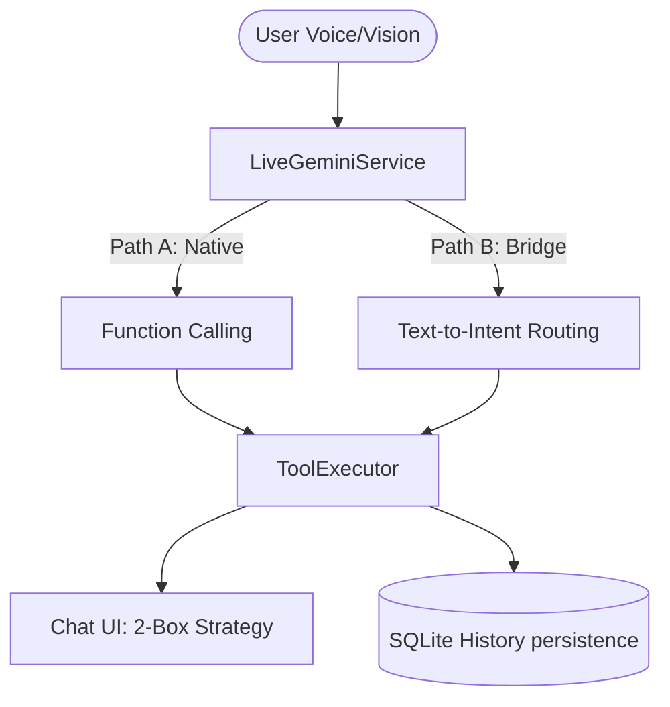

# 🧱 Architecture Overview

ระบบใช้สถาปัตยกรรม **Dual-Path Routing** ในการเชื่อมต่อเครื่องมือกับ Gemini Live API (WebSocket)

## 🧩 ผังการทำงาน (System Flow)

### รายละเอียดเส้นทาง (Routing)
- **Path A (Native)**: ใช้สำหรับเครื่องมือที่ Gemini รองรับแบบดั้งเดิม (Direct Function Calling)
- **Path B (Bridge)**: ใช้สำหรับเครื่องมือที่มีความซับซ้อน หรือต้องการการประมวลผลล่วงหน้าก่อนส่งให้ AI (ผ่าน [[LiveToolBridge]])

---
**Links**: [[index]] | [[memory_strategy]] | [[vision_system]] | [[LiveToolBridge]]
