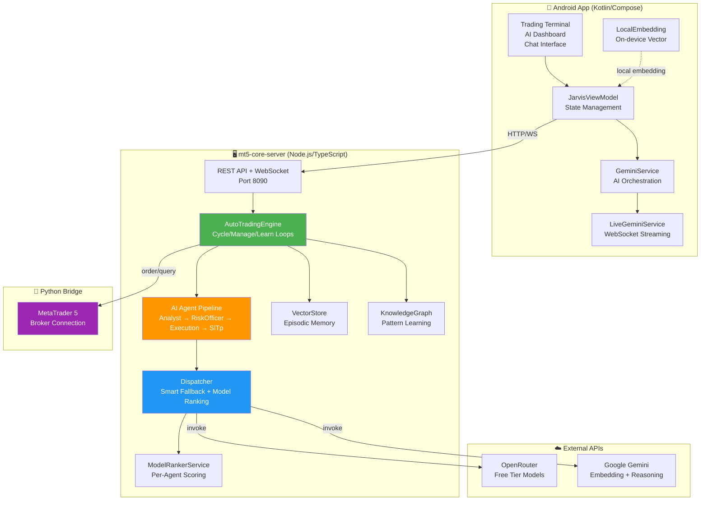
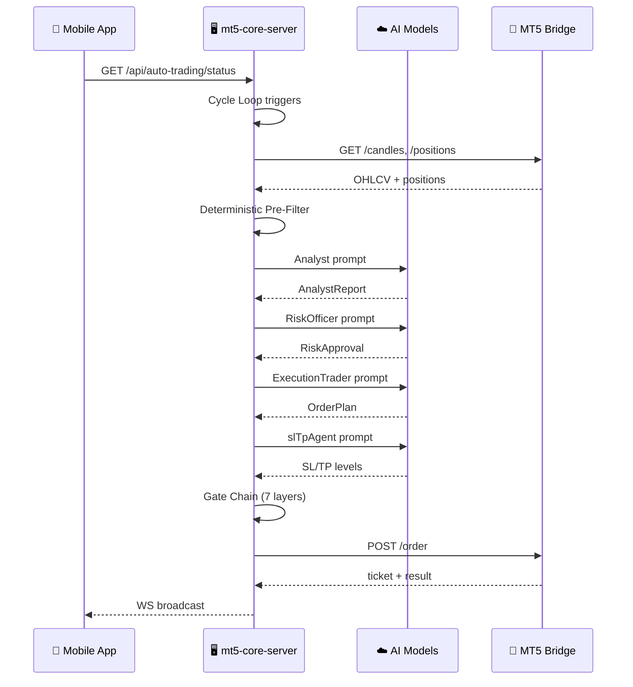

# 🧱 Architecture Overview

ภาพรวมสถาปัตยกรรมของ **PersonalAIBot (JARVIS)** — Professional AI Trading Platform

> อัพเดท: 2026-05-01

---

## 🏗️ System Architecture


```mermaid
graph TD
    subgraph "📱 Android App (Kotlin/Compose)"
        UI["Trading Terminal<br/>AI Dashboard<br/>Chat Interface"]
        VM["JarvisViewModel<br/>State Management"]
        GS["GeminiService<br/>AI Orchestration"]
        LGS["LiveGeminiService<br/>WebSocket Streaming"]
        EMB["LocalEmbedding<br/>On-device Vector"]
    end

    subgraph "🖥️ mt5-core-server (Node.js/TypeScript)"
        API["REST API + WebSocket<br/>Port 8090"]
        AE["AutoTradingEngine<br/>Cycle/Manage/Learn Loops"]
        AGT["AI Agent Pipeline<br/>Analyst → RiskOfficer → Execution → SlTp"]
        DSP["Dispatcher<br/>Smart Fallback + Model Ranking"]
        MR["ModelRankerService<br/>Per-Agent Scoring"]
        VS["VectorStore<br/>Episodic Memory"]
        KG["KnowledgeGraph<br/>Pattern Learning"]
    end

    subgraph "🐍 Python Bridge"
        MT5["MetaTrader 5<br/>Broker Connection"]
    end

    subgraph "☁️ External APIs"
        OR["OpenRouter<br/>Free Tier Models"]
        GM["Google Gemini<br/>Embedding + Reasoning"]
    end

    UI --> VM --> GS
    GS --> LGS
    VM -->|HTTP/WS| API
    API --> AE
    AE --> AGT
    AGT --> DSP
    DSP --> MR
    DSP -->|invoke| OR
    DSP -->|invoke| GM
    AE --> VS
    AE --> KG
    AE -->|order/query| MT5
    EMB -.->|local embedding| VM

    style AE fill:#4CAF50,color:#fff
    style AGT fill:#FF9800,color:#fff
    style DSP fill:#2196F3,color:#fff
    style MT5 fill:#9C27B0,color:#fff
```

---

## 🔑 Key Components

### Mobile App (Android)
| Component | หน้าที่ | เอกสาร |
|-----------|--------|--------|
| **JarvisViewModel** | State orchestration, UI binding | [[JarvisViewModel]] |
| **GeminiService** | AI model connection + tool routing | [[GeminiService]] |
| **LiveGeminiService** | Real-time WebSocket streaming | [[LiveGeminiService]] |
| **LiveToolBridge** | Bridge live interaction → tools | [[LiveToolBridge]] |
| **LocalEmbeddingSystem** | On-device vector embedding | [[LocalEmbeddingSystem]] |
| **Trading Terminal** | Chart, positions, watchlist UI | [[Changelog_2026-05-01_Mobile_App_Complete]] |

### mt5-core-server (Node.js)
| Component | หน้าที่ | เอกสาร |
|-----------|--------|--------|
| **AutoTradingEngine** | 3 loops: Cycle, Manage, Learn | [[04_AutoTrading_Workflow]] |
| **AI Agent Pipeline** | 4 agents: Analyst → Risk → Exec → SlTp | [[18_V20_Agent_Coordination_Audit]] |
| **Dispatcher** | Model resolution + Smart Fallback | [[Smart_Fallback_and_Token_Management]] |
| **ModelRankerService** | Per-agent scoring + blacklist | [[17_PerAgent_ModelRanking_V20]] |
| **VectorStore** | Episodic memory (4000+ snapshots) | [[memory_strategy]] |
| **Risk Gates** | 7-layer gate chain | [[15_Cluster_Trading_Logic_V17.2]] |

### External Dependencies
| Service | หน้าที่ | เอกสาร |
|---------|--------|--------|
| **OpenRouter** | Free tier LLM models | [[multi_provider_architecture]] |
| **Google Gemini** | Embedding + reasoning | [[gemini-api-dev]] |
| **MetaTrader 5** | Broker execution via Python bridge | [[11_MT5_Full_Agent_Control_V17]] |

---

## 🔄 Data Flow


```mermaid
sequenceDiagram
    participant App as 📱 Mobile App
    participant Server as 🖥️ mt5-core-server
    participant AI as ☁️ AI Models
    participant Broker as 🐍 MT5 Bridge

    App->>Server: GET /api/auto-trading/status
    Server->>Server: Cycle Loop triggers
    Server->>Broker: GET /candles, /positions
    Broker-->>Server: OHLCV + positions
    Server->>Server: Deterministic Pre-Filter
    Server->>AI: Analyst prompt
    AI-->>Server: AnalystReport
    Server->>AI: RiskOfficer prompt
    AI-->>Server: RiskApproval
    Server->>AI: ExecutionTrader prompt
    AI-->>Server: OrderPlan
    Server->>AI: slTpAgent prompt
    AI-->>Server: SL/TP levels
    Server->>Server: Gate Chain (7 layers)
    Server->>Broker: POST /order
    Broker-->>Server: ticket + result
    Server-->>App: WS broadcast
```

---

## 📁 Directory Structure

```
PersonalAIBot/
├── app/                          # Android app (Kotlin/Compose)
│   └── src/main/java/com/skyliner2008/jarvis/
├── mt5-core-server/              # Node.js trading server
│   └── src/
│       ├── services/auto/        # AutoTrading engine
│       │   ├── agents/           # AI Agents (analyst, risk, exec, sltp)
│       │   ├── providers/        # Dispatcher + model invocation
│       │   ├── core/             # ModelRanker, CircuitBreaker
│       │   └── types.ts          # Shared types
│       ├── routes/               # REST API endpoints
│       └── index.ts              # Server bootstrap
├── mt5-bridge/                   # Python MT5 connector
└── .obsidian-wiki/               # This knowledge base
```

---

**Links**: [[index]] | [[memory_strategy]] | [[vision_system]] | [[04_AutoTrading_Workflow]] | [[multi_provider_architecture]] | [[Trading_Intelligence_MOC]]
