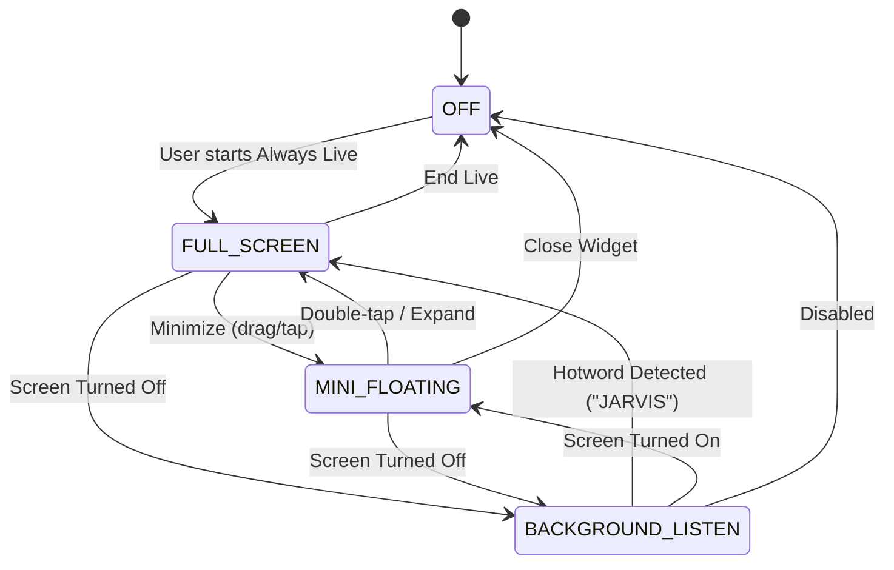

# Always AI Live Mode (2026-09-06)

Always AI Live Mode elevates PersonalAIBot to a continuous, companion-level AI that operates seamlessly across full-screen interactions, floating overlays over other apps, and background wake-on-call even when the device is locked or screen is off.

---

## Architecture Overview

---

## 1. Mode Breakdown

### 1.1 Full-Screen Live Mode (`AlwaysLiveScreen.kt`)
- **Centerpiece Robot Avatar**: Animated 3D-styled robot avatar (`JarvisAvatar.kt`) rendered natively via Compose Canvas with zero 3D-engine overhead.
- **Audio Visualizer Ring**: 36-bar reactive circular audio visualizer pulsing around the avatar based on microphone RMS / audio level.
- **Dynamic Emotion Background**: Shifts ambiance gradient according to AI emotional state (Cyan for idle/listening, Gold/Green for happy, Crimson for alert/error, Deep Navy for sleeping).
- **Control Bar**:
  - Mic toggle (with animated pulse indicator)
  - Camera toggle (front/rear lens integration for Vision)
  - Minimize button (collapses into Mini Floating Robot)
  - End session button

### 1.2 Mini Floating Robot Overlay (`FloatingWidgetService.kt`)
- **Evolution from Text Bubble**: Replaced simple static bubble with a full `ComposeView` embedding the animated mini `JarvisAvatar` (~80dp).
- **Gestures**:
  - **Drag**: Move freely around the screen with physics-based snap-to-edge on release.
  - **Single Tap**: Focus / bring MainActivity to foreground.
  - **Double Tap**: Instantly expand from mini overlay into Full-Screen Always Live mode.
  - **Long Press (>600ms)**: Toggle live voice streaming.
- **Service Lifecycle**: Implemented `ServiceLifecycleOwner` implementing `LifecycleOwner` and `SavedStateRegistryOwner` to support Jetpack Compose inside an Android Foreground Service.
- **Fallback**: Graceful fallback to classic View layout if system overlay prevents ComposeView initialization.

### 1.3 Background Wake-on-Call / Hotword (`HotwordDetector.kt`)
- **Duty-Cycle Audio Listening**: Uses low-power `AudioRecord` at 8 kHz mono with periodic duty cycles (e.g. 2s listen, 1s sleep) to conserve battery during background standby.
- **RMS Energy VAD**: Analyzes Root-Mean-Square audio energy with a calibrated threshold and minimum duration filter to reject transient clicks and background noise.
- **Wake-from-Sleep**:
  - `PARTIAL_WAKE_LOCK`: Keeps CPU active for low-power audio detection when screen is off.
  - Screen Wake (`ACQUIRE_CAUSES_WAKEUP` + `turnScreenOn` / `showWhenLocked` in `MainActivity`): Automatically awakens display and presents full-screen AI interface over lock screen upon hotword trigger.

---

## 2. JARVIS Robot Avatar & 10 Emotion States

The robot avatar features responsive micro-animations (breathing, blinking, head bounce, visor pulse, antenna beacon, floating heart/sparkle particles, and "Zzz" sleep indicators):

| Emotion State | Visual Cue | Visor / Glow Color | Facial Expression |
| :--- | :--- | :--- | :--- |
| `IDLE` | Subtle breathing & eye blink | Cyan (`0xFF00E5FF`) | Neutral wide round eyes |
| `LISTENING` | Fast antenna beacon & expanding ripples | Deep Cyan (`0xFF00B0FF`) | Focused attentive eyes |
| `THINKING` | Rotating gears / orbital rings | Purple (`0xFF7C4DFF`) | Shifting pupils |
| `SPEAKING` | Animated audio waveform mouth | Amber (`0xFFFFB300`) | Dynamic mouth waves |
| `HAPPY` | Subtle bounce & sparkle particles | Neon Cyan / Mint (`0xFF00E676`) | Inverted arc smiling eyes (⌒ ⌒) |
| `EXCITED` | Fast bounce & energy ring | Bright Gold (`0xFFFFD700`) | Star-shaped pupils |
| `SAD` | Lowered head & droopy eyes | Cool Steel Blue (`0xFF607D8B`) | Inverted mouth curve |
| `ANGRY` | Alert beacon & rapid pulse | Crimson Red (`0xFFFF1744`) | Slanted aggressive visor |
| `LOVE` | Floating heart particles | Hot Pink (`0xFFFF4081`) | Heart-shaped eyes (♥ ♥) |
| `SLEEPING` | Dim glow & floating "Zzz" particles | Dark Lavender (`0xFF3F51B5`) | Closed horizontal lines (- -) |

---

## 3. State Management (`AlwaysLiveManager.kt`)

`AlwaysLiveManager` serves as the central singleton coordinator:
- Coordinates state transitions across `OFF`, `FULL_SCREEN`, `MINI_FLOATING`, and `BACKGROUND_LISTEN`.
- Listens to system broadcasts (`ACTION_SCREEN_OFF`, `ACTION_SCREEN_ON`).
- Routes AI events (`JarvisAutomationService`, `JarvisViewModel`) to avatar emotions and performs real-time sentiment keyword detection on spoken responses.
- Safe `destroy()` lifecycle cleanup releasing all WakeLocks, AudioRecords, and broadcast receivers.

---

## 5. Virtual Desk Pet Sound Architecture (2026-09-11)

### 5.1 Procedural Speech Cadence SFX (`RobotSoundEngine.kt`, `RobotSoundPlayer.kt`)
- **Elimination of Spoken Sound Words**: `PET_LIVE_SYSTEM_PROMPT` enforces Rule 2 ("STRICT - NO SPOKEN SOUND WORDS"), forbidding the model from uttering verbal onomatopoeia like "ปิ๊บๆ" or "beep beep".
- **Hardware-Synthesized PCM Sine Wave Generators**:
  - `CHIRP_START`: Dual rising sine chirp (1200Hz $\rightarrow$ 1800Hz, 85ms) played on speech chunk arrival.
  - `CHIRP_END`: Falling frequency glide (1600Hz $\rightarrow$ 900Hz, 120ms) on sentence completion.
  - `ACKNOWLEDGE`: Confirmation tone (1000Hz $\rightarrow$ 1500Hz).
  - `SPARKLE`: Pentatonic chime pair (2000Hz + 2500Hz).

### 5.2 Continuous Looping Ambient Sound FX Engine (`AmbientSoundEngine.kt`, `AmbientSoundPlayer.kt`)
- **Zero-CPU Hardware Looping**:
  - Utilizes Android `AudioTrack` in `MODE_STATIC` with `setLoopPoints(0, samples.size, -1)` for seamless, artifact-free looping in AudioFlinger.
  - Implements a 50ms circular crossfade at loop boundaries to eliminate audio pops and clicks.
- **8 Dynamic Atmospheric Themes**:
  - `RAINY` (pink noise low-pass + rainfall drops), `NIGHT` (55Hz sub-bass + crickets), `SUNNY` (432Hz sine drone + bird chirps), `SAKURA` (gentle wind sweeps), `MATRIX` (60Hz hum + digital pulses), `LOVE_BG` (528Hz Solfeggio warm chord pulses), `THUNDER` (low rumble + rolling storm swell), and `DEFAULT` (soft cybernetic room tone).
- **Dynamic Audio Ducking**:
  - Automatically attenuates ambient sound from `0.18f` to `0.04f` during active AI speech, restoring volume upon completion.

---

## 6. LOOI-Style Living Robot Head & Adaptive Split-Screen Dialogue (2026-09-12)

### 6.1 "The Phone IS the Head" (Edge-to-Edge Living OLED Visor)
- **Elimination of Fake Hardware Frames**: Ceramic chassis, metallic ears, and visor bezels were eliminated in `PetRobotHeadAvatar.kt`. The physical phone screen becomes the robot's living face plate.
- **Visual Features**:
  - **Dynamic Squircle Eyes**: High-luminance neon squircles with outer ambient radial glow, inner specular sheen, and dynamic scaling/perspective distortion driven by gaze tracking.
  - **Expressive Tilting Eyebrows**: Brows rotate and shift in height corresponding to cognitive states (Thinking, Angry, Sad, Listening).
  - **5-Bar Microphone Waveform Mouth**: Animated reactive equalizer bars pulsing to live audio level and speech cadence.
- **True Fullscreen Immersive Mode**: Status bars and navigation bars are hidden on entry via `WindowInsetsControllerCompat`, with edge swipes revealing transient bars.

### 6.2 Adaptive Split-Screen Dialogue Layout
- **Landscape**: When speech or status messages occur, the living face smoothly glides to the left (`-0.24f` offset, `0.82` scale) via physics spring animations, opening space for the frosted acrylic `PetDialogueCard` on the right.
- **Portrait**: The face glides upward (`-0.19f` offset, `0.84` scale), presenting `PetDialogueCard` at the bottom.
- **Idle / Clear**: When speech ceases, the face glides back to center at 100% scale.
- **Dynamic Touch Mapping**: Touch interaction coordinates (gaze follow, forehead petting, cheek poke, tickle) dynamically adjust to the shifted face origin.

### 6.3 52-Prop & Sticker Vector Catalog
- Expanded `PropType` to 52 procedural vector props categorized into Reactions, Daily Life/Food, Nature/Weather, and Tech/Tools. Props render with scale/translation pinned to the robot head.

### 6.4 Dynamic SVG Path Parser System (Runtime Vector Prop & Magic Creator)
- **Problem Solved**: Built-in 52 props require code compilation to modify or expand. Dynamic SVG Path Parser empowers Gemini AI (Live Mode, Tool Calling, or Chat) to create custom vector props on the fly without app recompilation.
- **Architecture**:
  - `DynamicVectorProp.kt`: Data model defining `id`, `name`, `svgPath`, `fillColor`, `strokeColor`, `strokeWidth`, `position` (`FOREHEAD`, `LEFT_EYE`, `RIGHT_EYE`, `CHEEKS`, `CHIN`, `FLOATING_LEFT`, `FLOATING_RIGHT`), `sizeDp`, `offsetXRatio`, `offsetYRatio`, and `animation`.
  - `DynamicPropRenderer.kt`: Uses `androidx.compose.ui.graphics.vector.PathParser().parsePathString().toNodes().toPath()` with `remember(prop.svgPath)` caching to eliminate parsing costs at 60/120 FPS.
  - **Auto-Fit Normalization**: Measures `path.getBounds()` and scales/centers vector to `sizeDp` regardless of the canvas dimensions Gemini drew upon.
  - **Infinite Animations**: Drives `FLOAT_BOB`, `PULSE`, `ROTATE_CONTINUOUS`, `SWAY`, and `STATIC` via Compose `rememberInfiniteTransition`.
  - **Tool & Persona Integration**: Exposes `device_custom_prop` with `action` (`add`, `remove`, `clear`). Pet Mode rule 11 in `JarvisPersona.kt` guides Gemini Live to invent custom vector items whenever the user asks for hats, masks, crowns, wings, or props.

---

## 7. Virtual Desk Pet Revolution: Jelly Physics, Settings Dialog, 5-Slot Face Recognition & Tamagotchi Engine (2026-09-12)

### 7.1 Facial & Physics Animations (Jelly Feel, Clean Idle & Screensaver Tricks)
- **Rubber Ball / Jelly Dynamics (`PetRobotHeadAvatar.kt`)**:
  - Replaced rigid squircle drawing with animated squash and stretch factors (`squashX`, `squashY`) pulsing through spring physics.
  - Added dual specular highlights: a glossy rounded pill at the top-left and an energetic sparkle dot at the bottom-right for a tactile, jelly-like 3D appearance.
- **Clean Idle State**:
  - In normal standby (`IDLE`), eyebrows and mouth are completely hidden. Only curious, glowing neon squircle eyes scan and inspect the environment, eliminating visual noise.
- **Conditional Eyebrows**:
  - Eyebrows are conditionally rendered ONLY during expressive cognitive/emotional states (`THINKING`, `ANGRY`, `CONFUSED`, `SAD`, `LISTENING`), remaining hidden during `IDLE`, `HAPPY`, `LOVE`, `WINK`, and `SLEEPING`.
- **Dynamic Mouth Expressions**:
  - Active audio equalizer waveform when speaking, cute pucker 'O' mouth (`drawPuckerMouth`) on `POUT`, cheerful curved smile on `HAPPY`/`LOVE`, and flat line on `SAD`/`ANGRY`.
- **Screensaver Eye Tricks (`EyeTrickState`)**:
  - Triggered after configurable idle duration (15s, 25s, 45s, 60s):
    - `PING_PONG_BOUNCE`: Eyes bounce off display edges like a ping-pong ball.
    - `TIRED_BOUNCE`: Eyes droop and squish heavily with jelly physics before recovering.
    - `SNOOKER_SHOT`: Left eye acts as a cue ball, sliding across and colliding with the right eye!

### 7.2 Clean UI & Settings Dialog (`PetSettingsDialog.kt`, `AlwaysLiveScreen.kt`)
- **Zero-Clutter Default HUD**:
  - Debug badges (`🐾`, `🎭`, `🌀`, `👀`) are hidden by default behind `showDebugHud == true`.
- **Interactive Settings Modal (`⚙️ ตั้งค่า`)**:
  - Accessible via the top bar `⚙️ ตั้งค่า` button with 3 dedicated tabs:
    - **General / Debug**: Toggle Debug HUD, set Screensaver delay chips (15s, 25s, 45s, 60s), review physics/sound notes.
    - **Face Slots**: Manage 5 face identity slots (Slot 1–5), enroll current face from live camera preview, edit nicknames ("บอส", "แม่"), or delete enrolled profiles.
    - **Tamagotchi Needs**: Live gauges for Satiety, Energy, Hygiene, Happiness, Stress, Affection Level (Lv 1–10), Personality Traits (Hyper/Calm, Clingy/Independent), and Quick Care action buttons (Feed 🍖, Clean 🧼, Play 🎾, Sleep 💤).

### 7.3 5-Slot Face Recognition & 7 Hand Gesture Detections (`PetFaceProfile.kt`, `PetVisionDetector.kt`, `PetGesture.kt`)
- **5-Slot On-Device Face Recognition**:
  - Computes normalized biometric landmark ratios (eye separation, nose-to-mouth ratio, mouth aspect ratio, jaw contour) on device via ML Kit.
  - Compares with enrolled templates using Euclidean distance ($D < 0.12$ match threshold) with zero cloud biometric transmission.
  - Rule 12 in `JarvisPersona.kt` guides Gemini Live to warmly greet registered users by their custom nicknames.
- **7 Hand Gesture Detections**:
  - Computer vision heuristic classifiers outside face bounds detecting: `HIGH_FIVE`, `OK`, `BYE`, `NO`, `V_SIGN`, `THUMBS_UP`, `THUMBS_DOWN`.
  - Triggers matching procedural robot SFX, facial expressions, and Tamagotchi affection boosts.
  - **Spam Prevention & Multi-Frame Edge Latch Engine**:
    - Non-gesture skin clusters (such as holding the device or resting hands) are strictly classified as `HandGesture.NONE`.
    - Requires candidate gesture confirmation across $\ge 3$ consecutive frames (~240ms) to filter transient visual noise.
    - Operates as an edge-triggered latch: emits exactly ONE trigger event when entered, ignoring continuous holds until hand lowers (NONE for $>800\text{ms}$).
    - Double-layered cooldown (3.5s in detector, 3.0s/5.0s in controller) preventing repeated sounds or animation flapping.

### 7.4 Tamagotchi Psychology & Physical Needs Engine (`PetNeedsState.kt`, `PetModeController.kt`)
- **Biological & Emotional Dynamics**:
  - Autonomous background decay loop periodically updates Satiety, Energy, Hygiene, Happiness, and Stress.
  - Care interactions directly nurture relationship metrics: Affection Level (Lv 1 Stranger $\rightarrow$ Lv 5 Friend $\rightarrow$ Lv 8 Best Friend $\rightarrow$ Lv 10 Soulmate), Obedience, Activity Level, and Sociability.
  - Persona Rule 13 connects physical needs to spoken conversation, allowing the pet robot to naturally request food, express sleepiness, or celebrate bonding with the user.

### 7.5 Robust Voice Mode Activation & Zero-Disconnection Persona Handover (2026-09-12)
- **Problem & Root Cause**:
  - เมื่อผู้ใช้สั่งด้วยเสียงว่า `"เปิดโหมดสัตว์เลี้ยง"` กลางเซสชัน Live Voice ตัวโมเดลอาจส่ง `action="toggle"` หรือ `action="open"`
  - ในโค้ดเดิม สาขา `"toggle"` ตรวจพบว่าแอปอยู่ใน `FULL_SCREEN` แล้ว จึงเข้าใจผิดว่าเป็นการ Toggle ปิด และเรียก `MainActivity.instance?.closeAlwaysLive()` ส่งผลให้เซสชันหลุดทันที
  - นอกจากนี้ ใน `JarvisViewModel.setAlwaysLiveProfile()` มีการเรียก `voice.restartVoiceSession()` ซึ่งตัดการเชื่อมต่อ WebSocket และปิดไมโครโฟนเพื่อ Reconnect
- **Architectural Solution**:
  1. **Strict Activation Safeguard (`DeviceControlExecutor.kt`)**:
     - แยกคำสั่งปิด (`isExplicitOff`: "off", "ปิด", "stop", "disable", "exit", "ออก", "close") ออกจากคำสั่งเปิด/สลับอย่างเด็ดขาด
     - เมื่อตรวจพบ `isPetMode` หรือ `isDriveMode` จะถือว่าเป็นคำสั่งเปิด/สลับโปรไฟล์เสมอ (`AlwaysLiveProfile.PET` / `DRIVE`) และไม่มีทางสั่ง `closeAlwaysLive()` เด็ดขาด
     - คำสั่งเปิดทุกรูปแบบ (`"on"`, `"open"`, `"start"`, `"enable"`, `"switch"`, `"change"`, `"เข้า"`, `"เริ่ม"`, `"pet"`) จะขยายเข้าสู่ Full-Screen ทันที
  2. **In-Session Persona Handover Without Reconnect (`JarvisViewModel.kt`)**:
     - ยกเลิกการรีสตาร์ทเซสชัน WebSocket กลางคัน
     - ปรับจูนเสียงหุ่นยนต์อัตโนมัติ (`voice.setRobotVoiceEnabled(true)`) และยิง Prompt สลับ Persona เข้าสู่เซสชันที่เชื่อมต่ออยู่ทันทีด้วย `orchestrator.sendLiveRealtimeText(...)`
     - ไมโครโฟนและสตรีมเสียง PCM ทำงานต่อเนื่อง 100% ไร้รอยต่อ
  3. **Debounced Local Fast-Path (`VoiceController.kt`)**:
     - ป้องกันการสตรีมข้อความ Transcription หลาย Chunk ติดกันยิงคำสั่งเปิด/ปิดซ้ำซ้อน ด้วย Cooldown 1.5 วินาที
  4. **Immediate UI Thread Profile Sync (`MainActivity.expandAlwaysLive`)**:
     - ส่ง `AlwaysLiveProfile` เข้าสู่ `expandAlwaysLive(profile)` เพื่ออัปเดตทั้ง `AlwaysLiveManager` และ Compose State บน UI Thread ทันที ป้องกัน Race Condition

### 7.6 Pet System Overhaul: State Machine Matrix, Holographic Hand Overlay & Sidebar Panel
- **Pet State Machine Matrix (`PetStateMachine.kt`)**:
  - ประมวลผลอารมณ์จากความต้องการทางกายภาพ (Needs) และความถี่ของสัมผัส ด้วย Anti-spam ring buffer ป้องกันการกดรัว
  - อารมณ์ใหม่: `SURPRISED` (ตาเบิกกว้าง 1.25x คิ้วโก่ง ปากอ้า 'O') และ `BORED` (ตาหรี่ 0.42x คิ้วลู่ต่ำ ขีดเปลือกตา ปากเฉียง)
- **Holographic Hand Overlay (`HolographicHandOverlay.kt`)**:
  - มือโฮโลแกรมเวกเตอร์เรืองแสงสีฟ้า Cyan (#00F0FF) พร้อมสะเก็ดดาววิบวับที่ปลายนิ้ว เคลื่อนไหวลูบหัว จิ้มแก้ม เกาคาง ตามตำแหน่งสัมผัสจริง
- **Slide-out Pet Needs Sidebar (`PetNeedsSidebarPanel.kt`)**:
  - ลิ้นชักสไลด์จากขอบขวาพร้อมฟิสิกส์สปริง แสดงหลอดค่าสถานะ 5 ค่า, Mood Badge, Care Actions (อาหาร, อาบน้ำ, เล่น, นอน) และสถิติ Memory
- **Persistent Pet Memory (`PetMemory.kt`)**:
  - จัดเก็บสถิติตลอดชีวิต (อายุ, จำนวนครั้งที่ดูแล, สถิติความสุข, สิ่งที่ชอบที่สุด) ถาวรลง SQLite

### 7.7 Motion Sickness, Acoustic Disturbance & Enraged Fight-Back Missile Barrage
- **Motion Sickness Matrix (`PetMotionDetector.kt`, `PetMotionBridge.kt`)**:
  - *Shake*: เขย่าเบาๆ $\rightarrow$ มึน เวียนหัว (`DIZZY`). เขย่ามากๆ ต่อเนื่อง (>3 ครั้งใน 4 วิ) $\rightarrow$ โกรธ (`ANGRY`) และสะสม Rage (+35f).
  - *Boat Rocking*: เอียงซ้าย-ขวาสลับไปมาต่อเนื่องภายใต้แรงโน้มถ่วงต่ำ (<1.6G) เหมือนนั่งเรือ $\rightarrow$ เมาเรือ มึน เวียนหัว (`DIZZY`).
  - *Table Thump*: ตรวจจับแรงกระแทกฉับพลัน ($\Delta G > 1.25G$) เมื่อทุบโต๊ะ $\rightarrow$ Pet ตกใจสะดุ้งสุดตัว (`SURPRISED`).
- **Acoustic Disturbance (`AlwaysLiveScreen.kt`, `PetStateMachine.kt`)**:
  - ไมโครโฟนตรวจจับเสียงดัง (`audioLevel > 0.68f`): ตะโกนครั้งแรก $\rightarrow$ ตกใจ (`SURPRISED`), ตะคอกซ้ำๆ $\rightarrow$ เศร้า ร้องไห้ (`SAD`).
- **Enraged Fight-Back Mode (`PetRobotHeadAvatar.kt`, `MissileBarrageOverlay.kt`, `RobotSoundEngine.kt`)**:
  - เมื่อ Rage สะสมครบ 100% $\rightarrow$ เข้าสู่สถานะ `ENRAGED` ("😡💥 โกรธจัด!")
  - ใบหน้าตาขวางสีแดงเพลิง คิ้วรูปตัว V ขมวด 24 องศา ฟันซิกแซกแหลมคม 6 หยัก ไอน้ำร้อนพุ่งออกจากหัว
  - ยิงสลุตจรวดมิสซายการ์ตูน 5 ลูก (หัวแดง ลำตัวขาว ครีบแดง ไฟท้ายส้ม หน้าต่างฟ้า) พุ่งใส่หน้าจอ สเกลขยายจาก 0.4x จนระเบิดเต็มจอที่ 1.9x
    - ระเบิดตูมตาม (Screen Blast) ลูกไฟขยายตัว, คลื่นกระแทก Shockwave, สะเก็ดไฟ 45 ทิศทาง, แฟลชหน้าจอ, และจอภาพสั่นสะเทือน (Screen Shake)
    - สังเคราะห์เสียงจริงแบบ Procedural PCM 16-bit: `MISSILE_LAUNCH` (Pitch sweep 300Hz $\rightarrow$ 2000Hz + White noise) และ `EXPLOSION` (Sub-bass kick 85Hz $\rightarrow$ 25Hz + Exponential noise burst) โดยไม่ต้องใช้ asset ภายนอก

### 7.8 Pet Care Specific Audio & Portrait Split-Screen Dashboard (2026-09-12)
- **Procedural Care Sound Effects (`RobotSoundEngine.kt`, `RobotSoundPlayer.kt`)**:
  - `CRUNCH_EAT`: สังเคราะห์เสียงเคี้ยวอาหารกรุบกรอบ 3 คำต่อเนื่อง (~80ms gap, 340Hz $\rightarrow$ 110Hz sweep, 950Hz resonant noise) เมื่อให้อาหาร 🍖
  - `BUBBLE_POP`: สังเคราะห์เสียงฟองสบู่และหยดน้ำแตก 5 ลูกไต่คอร์ดขึ้น (650Hz $\rightarrow$ 2400Hz) พร้อม Harmonic Resonance สดใส เมื่ออาบน้ำ 🧼
  - `BELL_TOY`: สังเคราะห์เสียงกระดิ่งทองเหลืองสองโน้ต (G6 1568Hz + C7 2093Hz) พร้อม Inharmonic Overtone 2.76x และ Tremolo 13Hz เมื่อชวนเล่น 🎾
- **Portrait Split-Screen Dashboard (`AlwaysLiveScreen.kt`, `PetNeedsSidebarPanel.kt`)**:
  - **แนวตั้ง (`!isLandscape`)**: แบ่งหน้าจอด้วย `Column`:
    - **ส่วนบน (52% / `weight(1.08f)`)**: Living Pet Robot Head Avatar พร้อมระบบสัมผัสและลากสายตาเต็มรูปแบบ (Gaze tracking, ลูบหน้าผาก, เกาคาง, จั๊กจี้, จิ้มแก้ม, กล้องลืมตา PIP, และปุ่มมุมบน) โดยซ่อนปุ่ม "🐾 สถานะ" ในแถบเครื่องมือเนื่องจากมีแท็บสถานะแสดงอยู่ข้างล่างแล้ว
    - **ส่วนล่าง (48% / `weight(0.92f)`)**: แดชบอร์ดสถานะถาวร (`PetNeedsDashboardContent`) พื้นหลัง Dark Card สไตล์ OLED ขอบมนบน 24dp พร้อมแถบ Handle ให้ความรู้สึกโมเดิร์น ควบคุมดูแลสัตว์เลี้ยงได้ทันที
  - **แนวนอน (`isLandscape`)**: แสดง Pet เต็มจอสำหรับวางตั้งโต๊ะเป็น Desk Companion และมีปุ่ม "🐾 สถานะ" เลื่อนเปิด `PetNeedsSidebarPanel` จากขอบขวาเหมือนเดิม

### 7.9 Auto AI Camera Scan, Eye-Overlay Circular Viewfinder & Robust 2-Turn Vision Flow (2026-09-13)
- **Hands-Free Vision Activation (`VoiceController.kt`, `LiveToolBridge.kt`)**:
  - ผู้ใช้ไม่ต้องกดปุ่มเปิดกล้องเอง สั่งด้วยเสียงธรรมชาติ เช่น *"นี่คืออะไร"*, *"ดูนี่หน่อย"*, *"ช่วยดู"*, *"อ่านนี่"*, *"ฉันถืออะไรอยู่"*, *"ฉันโชว์กี่นิ้ว"*
  - เชื่อมโยงตรงสู่ `PetVisionBridge.requestEyeOpen(true)` เพื่อสั่งเปิดตาแสกนทันที
  - เมื่อ Gemini Live เรียก Tool `vision_activate` จะกระตุ้นเปิดตาและสตรีมวิดีโอทันทีเช่นกัน
- **Eye-Overlay Circular Viewfinder (`PetEyeScannerOverlay` ใน `AlwaysLiveScreen.kt`)**:
  - แปลงหน้าต่างกล้องจากกล่องสี่เหลี่ยมมุมล่างขวา เป็นภาพทรงกลม (`CircleShape`) ทาบลงบนดวงตาของสัตว์เลี้ยงพอดีเป๊ะทั้งแนวตั้งและแนวนอน
  - **ตาขวา (Right Eye - Cyber Optical Lens)**: กล้องสดความละเอียดสูงพร้อมขอบเรืองแสงนีออน Cyan, วงแหวน Aperture หมุนวน, เส้นสแกน Scanline, และป้าย AR Bounding Box
  - **ตาซ้าย (Left Eye - Holographic Radar Scanner)**: เรดาร์กวาด 360 องศา, วงศูนย์กลางเป้าหมาย, จุด Blip วัตถุที่ตรวจพบ, และป้ายสถานะ `[SCANNING...]` / `[🔒 LOCKED N]`
- **Zero-Asset Procedural Cyber Radar Sound (`RobotSoundEngine.kt`, `RobotSoundPlayer.kt`)**:
  - `SCAN_RADAR`: สังเคราะห์คลื่นเสียง 16-bit PCM Ascending Sweep (1400Hz $\rightarrow$ 2600Hz) พร้อม 35Hz Sinusoidal FM Modulation และเสียงสะท้อนไฮเทค (~420ms) ดังขึ้นเมื่อเปิดตาแสกน
- **Robust 2-Turn Real-Time Vision Architecture (`LiveToolBridge.kt`, `JarvisPersona.kt`)**:
  - แก้ปัญหา Turn-1 Hallucination (เดาสุ่มก่อนกล้องโฟกัส) และ 1-Turn Lag:
    - **Turn 1 (Intro Phrase)**: เมื่อเปิดกล้อง สั่งให้ AI พูดเปิดตัวสั้นๆ 1 ประโยค (เช่น *"ไหนขอน้องจาวิสดูก่อนนะฮับบอส..."*) โดยห้ามเดาสุ่ม ระหว่างนี้กล้องจะโฟกัสและปั๊มภาพสด 2-3 เฟรมเข้าสู่โมเดล
    - **Turn 2 (Real Visual Answer)**: เมื่อ Turn 1 พูดจบ ระบบส่ง `sendRealtimeText` กระตุ้น AI วิเคราะห์ภาพสดและตอบทันทีอย่างแม่นยำ พร้อมเรียก `vision_deactivate` ปิดกล้อง
    - **Turn 2 Auto-Close Fallback**: หากโมเดลลืมเรียกปิดกล้อง ระบบจะสั่งปิดกล้องและพับตาลงอัตโนมัติหลังพูดจบ 1.0 วินาที
- **Portrait UI Polish (`AlwaysLiveScreen.kt`)**:
  - เพิ่มปุ่ม Pinned Exit (`X`) บนมุมขวาบนในโหมดแนวตั้ง ให้สามารถออกจาก Pet Mode ได้ทุกสถานการณ์
  - ปรับปุ่มโหมดควบคุม (รูปรถ) ให้มีขนาดกะทัดรัด ไอคอนเดี่ยวสมส่วนเท่ากับปุ่มเครื่องมืออื่นๆ
  - แถบเมนูด้านบนจัดวางแบบ Responsive ไม่ตกหล่นหรือซ้อนทับกัน

