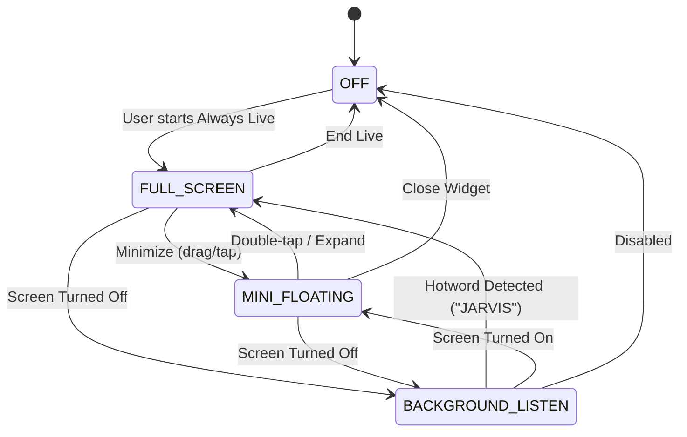

# Always AI Live Mode (2026-09-06)

Always AI Live Mode elevates PersonalAIBot to a continuous, companion-level AI that operates seamlessly across full-screen interactions, floating overlays over other apps, and background wake-on-call even when the device is locked or screen is off.

---

## Architecture Overview

---

## 1. Mode Breakdown

### 1.1 Full-Screen Live Mode (`AlwaysLiveScreen.kt`)
- **Centerpiece Robot Avatar**: Animated 3D-styled robot avatar (`JarvisAvatar.kt`) rendered natively via Compose Canvas with zero 3D-engine overhead.
- **Audio Visualizer Ring**: 36-bar reactive circular audio visualizer pulsing around the avatar based on microphone RMS / audio level.
- **Dynamic Emotion Background**: Shifts ambiance gradient according to AI emotional state (Cyan for idle/listening, Gold/Green for happy, Crimson for alert/error, Deep Navy for sleeping).
- **Control Bar**:
  - Mic toggle (with animated pulse indicator)
  - Camera toggle (front/rear lens integration for Vision)
  - Minimize button (collapses into Mini Floating Robot)
  - End session button

### 1.2 Mini Floating Robot Overlay (`FloatingWidgetService.kt`)
- **Evolution from Text Bubble**: Replaced simple static bubble with a full `ComposeView` embedding the animated mini `JarvisAvatar` (~80dp).
- **Gestures**:
  - **Drag**: Move freely around the screen with physics-based snap-to-edge on release.
  - **Single Tap**: Focus / bring MainActivity to foreground.
  - **Double Tap**: Instantly expand from mini overlay into Full-Screen Always Live mode.
  - **Long Press (>600ms)**: Toggle live voice streaming.
- **Service Lifecycle**: Implemented `ServiceLifecycleOwner` implementing `LifecycleOwner` and `SavedStateRegistryOwner` to support Jetpack Compose inside an Android Foreground Service.
- **Fallback**: Graceful fallback to classic View layout if system overlay prevents ComposeView initialization.

### 1.3 Background Wake-on-Call / Hotword (`HotwordDetector.kt`)
- **Duty-Cycle Audio Listening**: Uses low-power `AudioRecord` at 8 kHz mono with periodic duty cycles (e.g. 2s listen, 1s sleep) to conserve battery during background standby.
- **RMS Energy VAD**: Analyzes Root-Mean-Square audio energy with a calibrated threshold and minimum duration filter to reject transient clicks and background noise.
- **Wake-from-Sleep**:
  - `PARTIAL_WAKE_LOCK`: Keeps CPU active for low-power audio detection when screen is off.
  - Screen Wake (`ACQUIRE_CAUSES_WAKEUP` + `turnScreenOn` / `showWhenLocked` in `MainActivity`): Automatically awakens display and presents full-screen AI interface over lock screen upon hotword trigger.

---

## 2. LOOI Robot Avatar & 29 Emotion States (`PetRobotHeadAvatar.kt`)

The pet avatar implements a **2D Vector Minimalist Neon Cyan Style** on solid OLED black (`#000000`) matching the official LOOI robot moodset sheet. It utilizes pure Canvas rendering with shallow 2D depth: a bottom shadow layer (`#004D6B`) offset Y = +5dp underneath bright neon cyan eyes (`#00F5FF`) with soft edge glows.

### 2.1 Continuous Motion & Seamless Emotion Transition Engine
- **Disney Anticipation Squash & Stretch**: 350ms curve (`1f - 0.08f * sin(p * π)`) where eyes squish before morphing into new shapes.
- **Progressive Shape Morphing**:
  - `eyeSlantProgress`: Smooth angle transition from 0° (flat squircle) to steep slanted wedge (angry).
  - `fangsProgress`: White fangs slide down dynamically (`slideY = (1f - p) * -14dp`).
  - `angerVeinProgress`: Red anger vein (💢) expands outward on temple.
  - `sadProgress`: Drooping eyes (-8° / +8°), tear slide, and frown arc expansion.
- **Dual-Layer Cross-Fade**: Blends outgoing shape `alpha = 1 - p` with incoming shape `alpha = p` when geometry diverges completely.

### 2.2 Complete 29 Emotion Matrix

| Emotion State | Visual Cue | Primary Color | Facial Expression & Props |
| :--- | :--- | :--- | :--- |
| `IDLE` | Subtle breathing & blink | Neon Cyan (`0xFF00F5FF`) | Dual squircle eyes, shallow depth, clean black |
| `HAPPY` | Bouncing smiling arc | Neon Cyan (`0xFF00F5FF`) | Inverted arc smiling eyes (⌒ ⌒) |
| `ANGRY` | Slanted wedge eyes + fangs | Crimson Red (`0xFFFF3B5C`) | Inward slanted wedge, white fangs (v v), anger vein (💢) |
| `SLEEPING` | Dim glow & floating Zzz | Neon Cyan (`0xFF00F5FF`) | Rounded horizontal slits (— —), floating Zzz letters |
| `CONFUSED` | Curious asymmetrical gaze | Neon Cyan (`0xFF00F5FF`) | Left slit (—), right tilted wedge (12°), question mark (?) |
| `WINK` | Playful wink with star | Neon Cyan (`0xFF00F5FF`) | Left squircle, right sleeping slit, golden sparkle star (✦) |
| `DEAD` | Cyber reboot / KO | Neon Cyan (`0xFF00F5FF`) | Dual bold cross eyes (X X) with shadow layer |
| `LAUGHING` | Joyful laughter | Neon Cyan (`0xFF00F5FF`) | Minimalist inward closed laughing eyes (> <) |
| `MUSIC` | Listening to tunes | Neon Cyan (`0xFF00F5FF`) | Dual squircle eyes + over-ear gold & dark headphones 🎧 |
| `VR_MODE` | Spatial computing & movies | Neon Cyan (`0xFF00F5FF`) | Apple Vision Pro curved headset + striped popcorn bucket 🍿 |
| `DIVING` | Underwater exploration | Neon Cyan (`0xFF00F5FF`) | Snorkel mask + amber breathing tube + air bubbles 🤿 |
| `EVIL` | Mischievous villain | Crimson Red (`0xFFFF3B5C`) | Slanted red eyes + white fangs + purple devil icon 😈 |
| `FOCUSED` | Laser target scanning | Neon Cyan (`0xFF00F5FF`) | Sharp inward wedge eyes + synthwave perspective grid |
| `EXCITED` | High energy anticipation | Neon Cyan (`0xFF00F5FF`) | Outward fan eyes + dual golden sparkle stars (✦ ✦) |
| `SHY` | Cute embarrassment | Neon Cyan (`0xFF00F5FF`) | Squircle eyes + triple slanted pink blush lines (/// ///) |
| `SURPRISED` | Sudden shock / alert | Electric Cyan (`0xFF00F5FF`)| 1.25x wide-open eyes + bright red exclamation mark (!) |
| `DISGUSTED` | Grossed out / smells bad | Neon Cyan (`0xFF00F5FF`) | Closed laughing eyes (> <) + open trash bin + trash icon 🗑️ |
| `CAMERA_MODE`| Photography / capture | Neon Cyan (`0xFF00F5FF`) | Dual sleeping slits (— —) + orange DSLR camera 📷 |
| `EATING` | Snack time | Neon Cyan (`0xFF00F5FF`) | Squircle eyes + layered sesame seed mini burger 🍔 |
| `DRINKING` | Cheers / refreshment | Neon Cyan (`0xFF00F5FF`) | Squircle eyes + golden frothy cold beer mug 🍺 |
| `SAD` | Melancholy sorrow | Soft Sky Blue (`0xFF80D8FF`) | Drooping slanted eyes, sliding tear drop, curved frown |
| `LOVE` | Deep affection | Hot Pink (`0xFFFF4081`) | Floating glowing hearts (♥ ♥) + warm smile |
| `THINKING` | AI reasoning / cogitation | Neon Cyan (`0xFF00F5FF`) | Shifting pupils + stylized hand touching chin |
| `POUT` | Playful sulk | Hot Pink (`0xFFFF4081`) | Radial blush cheeks + pucker 'O' mouth |
| `DIZZY` | Nausea / shaken | Neon Cyan (`0xFF00F5FF`) | Dual cross eyes + wavy path mouth |
| `BORED` | Low energy waiting | Slate Gray (`0xFF90A4AE`) | Half-lidded drooping eyes + flat sigh line |
| `ENRAGED` | Maximum fury / fight-back | Burning Red (`0xFFFF1744`) | Deep V angular eyes + yellow slit pupils + zigzag teeth + steam puffs |
| `LISTENING` | Voice stream active | Neon Cyan (`0xFF00F5FF`) | Attentive wide eyes, ready to receive |
| `SPEAKING` | Voice playback active | Amber Gold (`0xFFFFB300`) | 5-bar dynamic audio waveform mouth equalizer |

### 2.3 LOOI Robot 50 Moodset Catalog & Voice Verification Navigation (`LooiMoodsetCatalog.kt`)

To allow users to rapidly verify and interact with all 50 robot moodsets from both reference sheets, `LooiMoodsetCatalog` provides a centralized index linking voice commands to exact page numbers and emotions:

- **Sheet 1 (Pages 1-20) — LOOI 20 MOODSET**:
  1. `Normal` (IDLE), 2. `Happy` (HAPPY), 3. `Angry` (ANGRY), 4. `Sleepy` (SLEEPING), 5. `Curious` (CONFUSED), 6. `Wink` (WINK), 7. `Dead` (DEAD), 8. `Laughing` (LAUGHING), 9. `Music` (MUSIC), 10. `VR Mode` (VR_MODE), 11. `Diving` (DIVING), 12. `Evil` (EVIL), 13. `Focused` (FOCUSED), 14. `Excited` (EXCITED), 15. `Shy` (SHY), 16. `Surprised` (SURPRISED), 17. `Disgusted` (DISGUSTED), 18. `Camera Mode` (CAMERA_MODE), 19. `Eating` (EATING), 20. `Drinking` (DRINKING).
- **Sheet 2 (Pages 21-50) — LOOI 30 ADDITIONAL MOODSET**:
  21. `Confused` (CONFUSED), 22. `Sick` (SICK), 23. `Rich` (RICH), 24. `Crying` (CRYING), 25. `Reading` (READING), 26. `Gaming` (GAMING), 27. `Traveling` (TRAVELING), 28. `Working` (WORKING), 29. `Cold` (COLD), 30. `Hot` (HOT), 31. `Detective` (DETECTIVE), 32. `Cooking` (COOKING), 33. `Art Mode` (ART_MODE), 34. `Space` (SPACE), 35. `Party` (PARTY), 36. `Dreaming` (DREAMING), 37. `Exhausted` (EXHAUSTED), 38. `Electric` (ELECTRIC), 39. `Sneaky` (SNEAKY), 40. `In Love` (LOVE), 41. `Romantic` (ROMANTIC), 42. `Hero` (HERO), 43. `Glitched` (GLITCHED), 44. `Magic` (MAGIC), 45. `Sporty` (SPORTY), 46. `Scientist` (SCIENTIST), 47. `Scared` (SCARED), 48. `Warrior` (WARRIOR), 49. `Low Battery` (LOW_BATTERY), 50. `Thinking` (THINKING).

#### Voice Commands & Verification Pacing
- **Individual Page Command**: Users say `"หน้าที่ 1"` through `"หน้าที่ 50"` (also supports Thai numerals `"หน้าที่ ๑".."หน้าที่ ๕๐"`, spoken words `"หน้าที่หนึ่ง".."หน้าที่ห้าสิบ"`, or `/avatar 1..50`).
  - Automatically switches to Pet Mode.
  - Plays the characteristic sound effect (`RobotSoundPlayer`).
  - Displays the moodset for **4.5 seconds** (within the 3-5 second constraint) with clear status text, then automatically reverts to normal standby.
- **Continuous All-Moodset Inspection**: Users say `"หน้าทั้งหมด"`, `"เล่นทุกหน้า"`, `"แสดง moodset ทั้งหมด"`, or `"all moods"` (or `/avatar all`).
  - Cycles through all 50 moodsets sequentially.
  - Displays each page for **4.0 seconds** (within the 3-5 second constraint) with live status and sound effects.
  - Returns to normal idle after completing the full loop.

---

## 3. State Management (`AlwaysLiveManager.kt`)

`AlwaysLiveManager` serves as the central singleton coordinator:
- Coordinates state transitions across `OFF`, `FULL_SCREEN`, `MINI_FLOATING`, and `BACKGROUND_LISTEN`.
- Listens to system broadcasts (`ACTION_SCREEN_OFF`, `ACTION_SCREEN_ON`).
- Routes AI events (`JarvisAutomationService`, `JarvisViewModel`) to avatar emotions and performs real-time sentiment keyword detection on spoken responses.
- Safe `destroy()` lifecycle cleanup releasing all WakeLocks, AudioRecords, and broadcast receivers.

---

## 5. Virtual Desk Pet Sound Architecture (2026-09-11)

### 5.1 Procedural Speech Cadence SFX (`RobotSoundEngine.kt`, `RobotSoundPlayer.kt`)
- **Elimination of Spoken Sound Words**: `PET_LIVE_SYSTEM_PROMPT` enforces Rule 2 ("STRICT - NO SPOKEN SOUND WORDS"), forbidding the model from uttering verbal onomatopoeia like "ปิ๊บๆ" or "beep beep".
- **Hardware-Synthesized PCM Sine Wave Generators**:
  - `CHIRP_START`: Dual rising sine chirp (1200Hz $\rightarrow$ 1800Hz, 85ms) played on speech chunk arrival.
  - `CHIRP_END`: Falling frequency glide (1600Hz $\rightarrow$ 900Hz, 120ms) on sentence completion.
  - `ACKNOWLEDGE`: Confirmation tone (1000Hz $\rightarrow$ 1500Hz).
  - `SPARKLE`: Pentatonic chime pair (2000Hz + 2500Hz).

### 5.2 Continuous Looping Ambient Sound FX Engine (`AmbientSoundEngine.kt`, `AmbientSoundPlayer.kt`)
- **Zero-CPU Hardware Looping**:
  - Utilizes Android `AudioTrack` in `MODE_STATIC` with `setLoopPoints(0, samples.size, -1)` for seamless, artifact-free looping in AudioFlinger.
  - Implements a 50ms circular crossfade at loop boundaries to eliminate audio pops and clicks.
- **8 Dynamic Atmospheric Themes**:
  - `RAINY` (pink noise low-pass + rainfall drops), `NIGHT` (55Hz sub-bass + crickets), `SUNNY` (432Hz sine drone + bird chirps), `SAKURA` (gentle wind sweeps), `MATRIX` (60Hz hum + digital pulses), `LOVE_BG` (528Hz Solfeggio warm chord pulses), `THUNDER` (low rumble + rolling storm swell), and `DEFAULT` (soft cybernetic room tone).
- **Dynamic Audio Ducking**:
  - Automatically attenuates ambient sound from `0.18f` to `0.04f` during active AI speech, restoring volume upon completion.

---

## 6. LOOI-Style Living Robot Head & Adaptive Split-Screen Dialogue (2026-09-12)

### 6.1 "The Phone IS the Head" (Edge-to-Edge Living OLED Visor)
- **Elimination of Fake Hardware Frames**: Ceramic chassis, metallic ears, and visor bezels were eliminated in `PetRobotHeadAvatar.kt`. The physical phone screen becomes the robot's living face plate.
- **Visual Features**:
  - **Dynamic Squircle Eyes**: High-luminance neon squircles with outer ambient radial glow, inner specular sheen, and dynamic scaling/perspective distortion driven by gaze tracking.
  - **Expressive Tilting Eyebrows**: Brows rotate and shift in height corresponding to cognitive states (Thinking, Angry, Sad, Listening).
  - **5-Bar Microphone Waveform Mouth**: Animated reactive equalizer bars pulsing to live audio level and speech cadence.
- **True Fullscreen Immersive Mode**: Status bars and navigation bars are hidden on entry via `WindowInsetsControllerCompat`, with edge swipes revealing transient bars.

### 6.2 Adaptive Split-Screen Dialogue Layout
- **Landscape**: When speech or status messages occur, the living face smoothly glides to the left (`-0.24f` offset, `0.82` scale) via physics spring animations, opening space for the frosted acrylic `PetDialogueCard` on the right.
- **Portrait**: The face glides upward (`-0.19f` offset, `0.84` scale), presenting `PetDialogueCard` at the bottom.
- **Idle / Clear**: When speech ceases, the face glides back to center at 100% scale.
- **Dynamic Touch Mapping**: Touch interaction coordinates (gaze follow, forehead petting, cheek poke, tickle) dynamically adjust to the shifted face origin.

### 6.3 52-Prop & Sticker Vector Catalog
- Expanded `PropType` to 52 procedural vector props categorized into Reactions, Daily Life/Food, Nature/Weather, and Tech/Tools. Props render with scale/translation pinned to the robot head.

### 6.4 Dynamic SVG Path Parser System (Runtime Vector Prop & Magic Creator)
- **Problem Solved**: Built-in 52 props require code compilation to modify or expand. Dynamic SVG Path Parser empowers Gemini AI (Live Mode, Tool Calling, or Chat) to create custom vector props on the fly without app recompilation.
- **Architecture**:
  - `DynamicVectorProp.kt`: Data model defining `id`, `name`, `svgPath`, `fillColor`, `strokeColor`, `strokeWidth`, `position` (`FOREHEAD`, `LEFT_EYE`, `RIGHT_EYE`, `CHEEKS`, `CHIN`, `FLOATING_LEFT`, `FLOATING_RIGHT`), `sizeDp`, `offsetXRatio`, `offsetYRatio`, and `animation`.
  - `DynamicPropRenderer.kt`: Uses `androidx.compose.ui.graphics.vector.PathParser().parsePathString().toNodes().toPath()` with `remember(prop.svgPath)` caching to eliminate parsing costs at 60/120 FPS.
  - **Auto-Fit Normalization**: Measures `path.getBounds()` and scales/centers vector to `sizeDp` regardless of the canvas dimensions Gemini drew upon.
  - **Infinite Animations**: Drives `FLOAT_BOB`, `PULSE`, `ROTATE_CONTINUOUS`, `SWAY`, and `STATIC` via Compose `rememberInfiniteTransition`.
  - **Tool & Persona Integration**: Exposes `device_custom_prop` with `action` (`add`, `remove`, `clear`). Pet Mode rule 11 in `JarvisPersona.kt` guides Gemini Live to invent custom vector items whenever the user asks for hats, masks, crowns, wings, or props.

---

## 7. Virtual Desk Pet Revolution: Jelly Physics, Settings Dialog, 5-Slot Face Recognition & Tamagotchi Engine (2026-09-12)

### 7.1 Facial & Physics Animations (Jelly Feel, Clean Idle & Screensaver Tricks)
- **Rubber Ball / Jelly Dynamics (`PetRobotHeadAvatar.kt`)**:
  - Replaced rigid squircle drawing with animated squash and stretch factors (`squashX`, `squashY`) pulsing through spring physics.
  - Added dual specular highlights: a glossy rounded pill at the top-left and an energetic sparkle dot at the bottom-right for a tactile, jelly-like 3D appearance.
- **Clean Idle State**:
  - In normal standby (`IDLE`), eyebrows and mouth are completely hidden. Only curious, glowing neon squircle eyes scan and inspect the environment, eliminating visual noise.
- **Conditional Eyebrows**:
  - Eyebrows are conditionally rendered ONLY during expressive cognitive/emotional states (`THINKING`, `ANGRY`, `CONFUSED`, `SAD`, `LISTENING`), remaining hidden during `IDLE`, `HAPPY`, `LOVE`, `WINK`, and `SLEEPING`.
- **Dynamic Mouth Expressions**:
  - Active audio equalizer waveform when speaking, cute pucker 'O' mouth (`drawPuckerMouth`) on `POUT`, cheerful curved smile on `HAPPY`/`LOVE`, and flat line on `SAD`/`ANGRY`.
- **Screensaver Eye Tricks (`EyeTrickState`)**:
  - Triggered after configurable idle duration (15s, 25s, 45s, 60s):
    - `PING_PONG_BOUNCE`: Eyes bounce off display edges like a ping-pong ball.
    - `TIRED_BOUNCE`: Eyes droop and squish heavily with jelly physics before recovering.
    - `SNOOKER_SHOT`: Left eye acts as a cue ball, sliding across and colliding with the right eye!

### 7.2 Clean UI & Settings Dialog (`PetSettingsDialog.kt`, `AlwaysLiveScreen.kt`)
- **Zero-Clutter Default HUD**:
  - Debug badges (`🐾`, `🎭`, `🌀`, `👀`) are hidden by default behind `showDebugHud == true`.
- **Interactive Settings Modal (`⚙️ ตั้งค่า`)**:
  - Accessible via the top bar `⚙️ ตั้งค่า` button with 3 dedicated tabs:
    - **General / Debug**: Toggle Debug HUD, set Screensaver delay chips (15s, 25s, 45s, 60s), review physics/sound notes.
    - **Face Slots**: Manage 5 face identity slots (Slot 1–5), enroll current face from live camera preview, edit nicknames ("บอส", "แม่"), or delete enrolled profiles.
    - **Tamagotchi Needs**: Live gauges for Satiety, Energy, Hygiene, Happiness, Stress, Affection Level (Lv 1–10), Personality Traits (Hyper/Calm, Clingy/Independent), and Quick Care action buttons (Feed 🍖, Clean 🧼, Play 🎾, Sleep 💤).

### 7.3 5-Slot Face Recognition & 7 Hand Gesture Detections (`PetFaceProfile.kt`, `PetVisionDetector.kt`, `PetGesture.kt`)
- **5-Slot On-Device Face Recognition**:
  - Computes normalized biometric landmark ratios (eye separation, nose-to-mouth ratio, mouth aspect ratio, jaw contour) on device via ML Kit.
  - Compares with enrolled templates using Euclidean distance ($D < 0.12$ match threshold) with zero cloud biometric transmission.
  - Rule 12 in `JarvisPersona.kt` guides Gemini Live to warmly greet registered users by their custom nicknames.
- **7 Hand Gesture Detections**:
  - Computer vision heuristic classifiers outside face bounds detecting: `HIGH_FIVE`, `OK`, `BYE`, `NO`, `V_SIGN`, `THUMBS_UP`, `THUMBS_DOWN`.
  - Triggers matching procedural robot SFX, facial expressions, and Tamagotchi affection boosts.
  - **Spam Prevention & Multi-Frame Edge Latch Engine**:
    - Non-gesture skin clusters (such as holding the device or resting hands) are strictly classified as `HandGesture.NONE`.
    - Requires candidate gesture confirmation across $\ge 3$ consecutive frames (~240ms) to filter transient visual noise.
    - Operates as an edge-triggered latch: emits exactly ONE trigger event when entered, ignoring continuous holds until hand lowers (NONE for $>800\text{ms}$).
    - Double-layered cooldown (3.5s in detector, 3.0s/5.0s in controller) preventing repeated sounds or animation flapping.

### 7.4 Tamagotchi Psychology & Physical Needs Engine (`PetNeedsState.kt`, `PetModeController.kt`)
- **Biological & Emotional Dynamics**:
  - Autonomous background decay loop periodically updates Satiety, Energy, Hygiene, Happiness, and Stress.
  - Care interactions directly nurture relationship metrics: Affection Level (Lv 1 Stranger $\rightarrow$ Lv 5 Friend $\rightarrow$ Lv 8 Best Friend $\rightarrow$ Lv 10 Soulmate), Obedience, Activity Level, and Sociability.
  - Persona Rule 13 connects physical needs to spoken conversation, allowing the pet robot to naturally request food, express sleepiness, or celebrate bonding with the user.

### 7.5 Robust Voice Mode Activation & Zero-Disconnection Persona Handover (2026-09-12)
- **Problem & Root Cause**:
  - เมื่อผู้ใช้สั่งด้วยเสียงว่า `"เปิดโหมดสัตว์เลี้ยง"` กลางเซสชัน Live Voice ตัวโมเดลอาจส่ง `action="toggle"` หรือ `action="open"`
  - ในโค้ดเดิม สาขา `"toggle"` ตรวจพบว่าแอปอยู่ใน `FULL_SCREEN` แล้ว จึงเข้าใจผิดว่าเป็นการ Toggle ปิด และเรียก `MainActivity.instance?.closeAlwaysLive()` ส่งผลให้เซสชันหลุดทันที
  - นอกจากนี้ ใน `JarvisViewModel.setAlwaysLiveProfile()` มีการเรียก `voice.restartVoiceSession()` ซึ่งตัดการเชื่อมต่อ WebSocket และปิดไมโครโฟนเพื่อ Reconnect
- **Architectural Solution**:
  1. **Strict Activation Safeguard (`DeviceControlExecutor.kt`)**:
     - แยกคำสั่งปิด (`isExplicitOff`: "off", "ปิด", "stop", "disable", "exit", "ออก", "close") ออกจากคำสั่งเปิด/สลับอย่างเด็ดขาด
     - เมื่อตรวจพบ `isPetMode` หรือ `isDriveMode` จะถือว่าเป็นคำสั่งเปิด/สลับโปรไฟล์เสมอ (`AlwaysLiveProfile.PET` / `DRIVE`) และไม่มีทางสั่ง `closeAlwaysLive()` เด็ดขาด
     - คำสั่งเปิดทุกรูปแบบ (`"on"`, `"open"`, `"start"`, `"enable"`, `"switch"`, `"change"`, `"เข้า"`, `"เริ่ม"`, `"pet"`) จะขยายเข้าสู่ Full-Screen ทันที
  2. **In-Session Persona Handover Without Reconnect (`JarvisViewModel.kt`)**:
     - ยกเลิกการรีสตาร์ทเซสชัน WebSocket กลางคัน
     - ปรับจูนเสียงหุ่นยนต์อัตโนมัติ (`voice.setRobotVoiceEnabled(true)`) และยิง Prompt สลับ Persona เข้าสู่เซสชันที่เชื่อมต่ออยู่ทันทีด้วย `orchestrator.sendLiveRealtimeText(...)`
     - ไมโครโฟนและสตรีมเสียง PCM ทำงานต่อเนื่อง 100% ไร้รอยต่อ
  3. **Debounced Local Fast-Path (`VoiceController.kt`)**:
     - ป้องกันการสตรีมข้อความ Transcription หลาย Chunk ติดกันยิงคำสั่งเปิด/ปิดซ้ำซ้อน ด้วย Cooldown 1.5 วินาที
  4. **Immediate UI Thread Profile Sync (`MainActivity.expandAlwaysLive`)**:
     - ส่ง `AlwaysLiveProfile` เข้าสู่ `expandAlwaysLive(profile)` เพื่ออัปเดตทั้ง `AlwaysLiveManager` และ Compose State บน UI Thread ทันที ป้องกัน Race Condition

### 7.6 Pet System Overhaul: State Machine Matrix, Holographic Hand Overlay & Sidebar Panel
- **Pet State Machine Matrix (`PetStateMachine.kt`)**:
  - ประมวลผลอารมณ์จากความต้องการทางกายภาพ (Needs) และความถี่ของสัมผัส ด้วย Anti-spam ring buffer ป้องกันการกดรัว
  - อารมณ์ใหม่: `SURPRISED` (ตาเบิกกว้าง 1.25x คิ้วโก่ง ปากอ้า 'O') และ `BORED` (ตาหรี่ 0.42x คิ้วลู่ต่ำ ขีดเปลือกตา ปากเฉียง)
- **Holographic Hand Overlay (`HolographicHandOverlay.kt`)**:
  - มือโฮโลแกรมเวกเตอร์เรืองแสงสีฟ้า Cyan (#00F0FF) พร้อมสะเก็ดดาววิบวับที่ปลายนิ้ว เคลื่อนไหวลูบหัว จิ้มแก้ม เกาคาง ตามตำแหน่งสัมผัสจริง
- **Slide-out Pet Needs Sidebar (`PetNeedsSidebarPanel.kt`)**:
  - ลิ้นชักสไลด์จากขอบขวาพร้อมฟิสิกส์สปริง แสดงหลอดค่าสถานะ 5 ค่า, Mood Badge, Care Actions (อาหาร, อาบน้ำ, เล่น, นอน) และสถิติ Memory
- **Persistent Pet Memory (`PetMemory.kt`)**:
  - จัดเก็บสถิติตลอดชีวิต (อายุ, จำนวนครั้งที่ดูแล, สถิติความสุข, สิ่งที่ชอบที่สุด) ถาวรลง SQLite

### 7.7 Motion Sickness, Acoustic Disturbance & Enraged Fight-Back Missile Barrage
- **Motion Sickness Matrix (`PetMotionDetector.kt`, `PetMotionBridge.kt`)**:
  - *Shake*: เขย่าเบาๆ $\rightarrow$ มึน เวียนหัว (`DIZZY`). เขย่ามากๆ ต่อเนื่อง (>3 ครั้งใน 4 วิ) $\rightarrow$ โกรธ (`ANGRY`) และสะสม Rage (+35f).
  - *Boat Rocking*: เอียงซ้าย-ขวาสลับไปมาต่อเนื่องภายใต้แรงโน้มถ่วงต่ำ (<1.6G) เหมือนนั่งเรือ $\rightarrow$ เมาเรือ มึน เวียนหัว (`DIZZY`).
  - *Table Thump*: ตรวจจับแรงกระแทกฉับพลัน ($\Delta G > 1.25G$) เมื่อทุบโต๊ะ $\rightarrow$ Pet ตกใจสะดุ้งสุดตัว (`SURPRISED`).
- **Acoustic Disturbance (`AlwaysLiveScreen.kt`, `PetStateMachine.kt`)**:
  - ไมโครโฟนตรวจจับเสียงดัง (`audioLevel > 0.68f`): ตะโกนครั้งแรก $\rightarrow$ ตกใจ (`SURPRISED`), ตะคอกซ้ำๆ $\rightarrow$ เศร้า ร้องไห้ (`SAD`).
- **Enraged Fight-Back Mode (`PetRobotHeadAvatar.kt`, `MissileBarrageOverlay.kt`, `RobotSoundEngine.kt`)**:
  - เมื่อ Rage สะสมครบ 100% $\rightarrow$ เข้าสู่สถานะ `ENRAGED` ("😡💥 โกรธจัด!")
  - ใบหน้าตาขวางสีแดงเพลิง คิ้วรูปตัว V ขมวด 24 องศา ฟันซิกแซกแหลมคม 6 หยัก ไอน้ำร้อนพุ่งออกจากหัว
  - ยิงสลุตจรวดมิสซายการ์ตูน 5 ลูก (หัวแดง ลำตัวขาว ครีบแดง ไฟท้ายส้ม หน้าต่างฟ้า) พุ่งใส่หน้าจอ สเกลขยายจาก 0.4x จนระเบิดเต็มจอที่ 1.9x
    - ระเบิดตูมตาม (Screen Blast) ลูกไฟขยายตัว, คลื่นกระแทก Shockwave, สะเก็ดไฟ 45 ทิศทาง, แฟลชหน้าจอ, และจอภาพสั่นสะเทือน (Screen Shake)
    - สังเคราะห์เสียงจริงแบบ Procedural PCM 16-bit: `MISSILE_LAUNCH` (Pitch sweep 300Hz $\rightarrow$ 2000Hz + White noise) และ `EXPLOSION` (Sub-bass kick 85Hz $\rightarrow$ 25Hz + Exponential noise burst) โดยไม่ต้องใช้ asset ภายนอก

### 7.8 Pet Care Specific Audio & Portrait Split-Screen Dashboard (2026-09-12)
- **Procedural Care Sound Effects (`RobotSoundEngine.kt`, `RobotSoundPlayer.kt`)**:
  - `CRUNCH_EAT`: สังเคราะห์เสียงเคี้ยวอาหารกรุบกรอบ 3 คำต่อเนื่อง (~80ms gap, 340Hz $\rightarrow$ 110Hz sweep, 950Hz resonant noise) เมื่อให้อาหาร 🍖
  - `BUBBLE_POP`: สังเคราะห์เสียงฟองสบู่และหยดน้ำแตก 5 ลูกไต่คอร์ดขึ้น (650Hz $\rightarrow$ 2400Hz) พร้อม Harmonic Resonance สดใส เมื่ออาบน้ำ 🧼
  - `BELL_TOY`: สังเคราะห์เสียงกระดิ่งทองเหลืองสองโน้ต (G6 1568Hz + C7 2093Hz) พร้อม Inharmonic Overtone 2.76x และ Tremolo 13Hz เมื่อชวนเล่น 🎾
- **Portrait Split-Screen Dashboard (`AlwaysLiveScreen.kt`, `PetNeedsSidebarPanel.kt`)**:
  - **แนวตั้ง (`!isLandscape`)**: แบ่งหน้าจอด้วย `Column`:
    - **ส่วนบน (52% / `weight(1.08f)`)**: Living Pet Robot Head Avatar พร้อมระบบสัมผัสและลากสายตาเต็มรูปแบบ (Gaze tracking, ลูบหน้าผาก, เกาคาง, จั๊กจี้, จิ้มแก้ม, กล้องลืมตา PIP, และปุ่มมุมบน) โดยซ่อนปุ่ม "🐾 สถานะ" ในแถบเครื่องมือเนื่องจากมีแท็บสถานะแสดงอยู่ข้างล่างแล้ว
    - **ส่วนล่าง (48% / `weight(0.92f)`)**: แดชบอร์ดสถานะถาวร (`PetNeedsDashboardContent`) พื้นหลัง Dark Card สไตล์ OLED ขอบมนบน 24dp พร้อมแถบ Handle ให้ความรู้สึกโมเดิร์น ควบคุมดูแลสัตว์เลี้ยงได้ทันที
  - **แนวนอน (`isLandscape`)**: แสดง Pet เต็มจอสำหรับวางตั้งโต๊ะเป็น Desk Companion และมีปุ่ม "🐾 สถานะ" เลื่อนเปิด `PetNeedsSidebarPanel` จากขอบขวาเหมือนเดิม

### 7.9 Auto AI Camera Scan, Eye-Overlay Circular Viewfinder & Robust 2-Turn Vision Flow (2026-09-13)
- **Hands-Free Vision Activation (`VoiceController.kt`, `LiveToolBridge.kt`)**:
  - ผู้ใช้ไม่ต้องกดปุ่มเปิดกล้องเอง สั่งด้วยเสียงธรรมชาติ เช่น *"นี่คืออะไร"*, *"ดูนี่หน่อย"*, *"ช่วยดู"*, *"อ่านนี่"*, *"ฉันถืออะไรอยู่"*, *"ฉันโชว์กี่นิ้ว"*
  - เชื่อมโยงตรงสู่ `PetVisionBridge.requestEyeOpen(true)` เพื่อสั่งเปิดตาแสกนทันที
  - เมื่อ Gemini Live เรียก Tool `vision_activate` จะกระตุ้นเปิดตาและสตรีมวิดีโอทันทีเช่นกัน
- **Eye-Overlay Circular Viewfinder (`PetEyeScannerOverlay` ใน `AlwaysLiveScreen.kt`)**:
  - แปลงหน้าต่างกล้องจากกล่องสี่เหลี่ยมมุมล่างขวา เป็นภาพทรงกลม (`CircleShape`) ทาบลงบนดวงตาของสัตว์เลี้ยงพอดีเป๊ะทั้งแนวตั้งและแนวนอน
  - **ตาขวา (Right Eye - Cyber Optical Lens)**: กล้องสดความละเอียดสูงพร้อมขอบเรืองแสงนีออน Cyan, วงแหวน Aperture หมุนวน, เส้นสแกน Scanline, และป้าย AR Bounding Box
  - **ตาซ้าย (Left Eye - Holographic Radar Scanner)**: เรดาร์กวาด 360 องศา, วงศูนย์กลางเป้าหมาย, จุด Blip วัตถุที่ตรวจพบ, และป้ายสถานะ `[SCANNING...]` / `[🔒 LOCKED N]`
- **Zero-Asset Procedural Cyber Radar Sound (`RobotSoundEngine.kt`, `RobotSoundPlayer.kt`)**:
  - `SCAN_RADAR`: สังเคราะห์คลื่นเสียง 16-bit PCM Ascending Sweep (1400Hz $\rightarrow$ 2600Hz) พร้อม 35Hz Sinusoidal FM Modulation และเสียงสะท้อนไฮเทค (~420ms) ดังขึ้นเมื่อเปิดตาแสกน
- **Robust 2-Turn Real-Time Vision Architecture (`LiveToolBridge.kt`, `JarvisPersona.kt`)**:
  - แก้ปัญหา Turn-1 Hallucination (เดาสุ่มก่อนกล้องโฟกัส) และ 1-Turn Lag:
    - **Turn 1 (Intro Phrase)**: เมื่อเปิดกล้อง สั่งให้ AI พูดเปิดตัวสั้นๆ 1 ประโยค (เช่น *"ไหนขอน้องจาวิสดูก่อนนะฮับบอส..."*) โดยห้ามเดาสุ่ม ระหว่างนี้กล้องจะโฟกัสและปั๊มภาพสด 2-3 เฟรมเข้าสู่โมเดล
    - **Turn 2 (Real Visual Answer)**: เมื่อ Turn 1 พูดจบ ระบบส่ง `sendRealtimeText` กระตุ้น AI วิเคราะห์ภาพสดและตอบทันทีอย่างแม่นยำ พร้อมเรียก `vision_deactivate` ปิดกล้อง
    - **Turn 2 Auto-Close Fallback**: หากโมเดลลืมเรียกปิดกล้อง ระบบจะสั่งปิดกล้องและพับตาลงอัตโนมัติหลังพูดจบ 1.0 วินาที
- **Portrait UI Polish (`AlwaysLiveScreen.kt`)**:
  - เพิ่มปุ่ม Pinned Exit (`X`) บนมุมขวาบนในโหมดแนวตั้ง ให้สามารถออกจาก Pet Mode ได้ทุกสถานการณ์
  - ปรับปุ่มโหมดควบคุม (รูปรถ) ให้มีขนาดกะทัดรัด ไอคอนเดี่ยวสมส่วนเท่ากับปุ่มเครื่องมืออื่นๆ
  - แถบเมนูด้านบนจัดวางแบบ Responsive ไม่ตกหล่นหรือซ้อนทับกัน

---

## 8. Modular Architecture, Dedicated Drive Mode & KMP Compatibility (2026-09-13)

### 8.1 God Object Decomposition
- **`AlwaysLiveScreen.kt` Refactor**:
  - เดิมเป็น God Composable ขนาด 2,471 บรรทัดที่รวม UI ของทั้ง 3 โหมดไว้ในที่เดียว
  - แยกออกเป็น 3 โมดูลย่อยที่รับผิดชอบหน้าที่เฉพาะ:
    1. **`PetModeScreen.kt`** (~800 บรรทัด): โหมดสัตว์เลี้ยงโต๊ะทำงาน (`PetModeContent`, `PetDialogueCard`, `PetDetectionBadge`, `PetEyeScannerOverlay`, `PetNeedsDashboardContent`)
    2. **`DriveModeScreen.kt`** (~570 บรรทัด): โหมดขับขี่และควบคุมอัจฉริยะ (`DriveModeContent`, `DriveTelemetryHeader`, `DriveNotificationReaderBar`, `DriveActionRow`, Two-pane landscape)
    3. **`AvatarEmotionColors.kt`** (~80 บรรทัด): ฟังก์ชันรวมศูนย์สำหรับแปลง `AvatarEmotion` เป็นสี Aura/Primary, Secondary, และ StatusPill
  - `AlwaysLiveScreen.kt` ลดขนาดเหลือ ~730 บรรทัด ทำหน้าที่เป็น Clean Profile Router และ Host Sub-Composables
- **Profile Architecture Consolidation**:
  - ยืนยันโครงสร้างโปรไฟล์ตามข้อกำหนดผู้ใช้:
    - 🚗 **ขับขี่ / ควบคุม (`DRIVE` / `CONTROL`)**: โหมดผู้ช่วยอัจฉริยะสำหรับการขับขี่ สั่งการรถ นำทาง และควบคุมสื่อ
    - 🐾 **สัตว์เลี้ยง (`PET`)**: หุ่นยนต์จำลองสัตว์เลี้ยงตั้งโต๊ะ (Desk Pet)

### 8.2 Full Drive & Control Mode Architecture (`DriveBridge.kt`, `DriveModeController.kt`)
- **`DriveBridge` (commonMain)**:
  - สะพานเชื่อมโยงข้อมูลแบบ StateFlow สำหรับ Compose Multiplatform:
    - `telemetry`: StateFlow<DriveTelemetry> (ความเร็ว GPS `speedKmh`, ที่อยู่/ถนน `address`, ละติจูด/ลองจิจูด, สถานะ `isMoving`)
    - `mediaState`: StateFlow<MediaPlaybackState> (ชื่อเพลง, ศิลปิน, แอปผู้เล่น, สถานะกำลังเล่น)
    - `recentNotificationText`: StateFlow<String?> (ข้อความแจ้งเตือนล่าสุด)
  - รองรับ Callback สั่งการ: `onPlayPause`, `onNextTrack`, `onPrevTrack`, `onReadNotifications`, `onStartNavigation`
- **`DriveModeController` (commonMain)**:
  - ควบคุมการกระทำต่างๆ จาก Composable UI สู่แพลตฟอร์มอย่างเป็นระเบียบ
- **Android Platform Integration (`AlwaysLiveManager.kt`)**:
  - `LocationProvider`: ติดตามความเร็วรถแบบ Real-time และแปลงพิกัดเป็นชื่อถนนอัตโนมัติ (Geocoding)
  - `MediaInfoProvider` + `AudioManager.dispatchMediaKeyEvent`: เล่น/หยุด/เปลี่ยนเพลงรองรับ Spotify, YouTube Music ฯลฯ
  - `NotificationBridge` + `VoiceManager`: อ่านข้อความแจ้งเตือนสำคัญ 3 รายการล่าสุดด้วยเสียงสังเคราะห์ TTS แบบ Hands-free
  - `Intent(ACTION_VIEW, "google.navigation:q=...")`: ทางลัดเปิด Google Maps ระบบนำทางทันทีเพียงคลิกเดียว

### 8.3 Battery & CPU Power Management
- **Conditional Background Camera Vision (`shouldRunBackgroundVision`)**:
  - ใน `PetModeScreen.kt` เพิ่มเงื่อนไขหยุดการประมวลผลกล้องพื้นหลังเมื่อสัตว์เลี้ยงหลับ (`SLEEPING`) หรือเมื่อไม่มี processor รับภาพ ช่วยประหยัดแบตเตอรี่และลดภาระ CPU อย่างมีนัยสำคัญ

### 8.4 KMP & iOS Compatibility
- กำจัดการใช้งาน `System.currentTimeMillis()` ใน `commonMain` ทั้งหมด โดยเปลี่ยนเป็น `kotlinx.datetime.Clock.System.now().toEpochMilliseconds()` ในทุกไฟล์:
  - `PetModeController.kt`, `PetStateMachine.kt`, `PetMemory.kt`, `PetVisionTargetTracker.kt`, `PetNeedsState.kt`, `AlwaysLiveScreen.kt`, `DriveBridge.kt`
- ป้องกันข้อผิดพลาดในการคอมไพล์บนเป้าหมาย iOS ตามมาตรฐาน Kotlin Multiplatform

### 8.5 Voice Intent Routing & Structured Sentiment (Phase 2)
- **Voice Intent Guards (`LiveToolBridge.kt`)**:
  - `isMediaRequest`: ดักจับคำสั่งเพลง Redirect สู่ `device_media_control`
  - `isNavigationRequest`: ดักจับคำสั่งนำทาง Redirect สู่ `device_navigate`
  - `isNotificationRequest`: ดักจับคำสั่งแจ้งเตือน Redirect สู่ `device_notification_read`
  - `isLocationOrSpeedRequest`: ดักจับคำถามความเร็ว/พิกัด Redirect สู่ `device_location`
- **Structured Sentiment Parser (`AlwaysLiveManager.kt`)**:
  - รองรับแท็กอารมณ์ `[EMOTION]` จาก AI เช่น `[HAPPY]`, `[LOVE]`, `[SAD]`, `[EXCITED]`, `[SURPRISED]`, `[BORED]`
  - รองรับ Piped Command syntax `HAPPY|props=...`, `SPEAKING|...`
  - ขยายคลังคำ Sentiment ภาษาไทยและอังกฤษครอบคลุมทุก 17 อารมณ์ของ Avatar

### 8.6 Driving Safety, Smart Parking Memory & Low-Glare Night Mode (Phase 3)
- **Speed Limit Alert & Over-speed Monitoring (`DriveBridge.kt`, `DriveModeScreen.kt`)**:
  - เพิ่ม `speedLimitKmh: Float = 120f` และ `isSpeeding: Boolean` ใน `DriveTelemetry`
  - ป้าย `MAX 120` บน Speedometer HUD สามารถแตะเพื่อวนเปลี่ยนขีดจำกัดความเร็วได้ทันที (80 $\rightarrow$ 90 $\rightarrow$ 100 $\rightarrow$ 110 $\rightarrow$ 120 กม./ชม.)
  - เมื่อความเร็วรถเกินขีดจำกัดที่ตั้งไว้:
    - Speedometer ตัวเลขและกรอบเปลี่ยนเป็นสี Crimson Red สว่างสดใส
    - แสดงป้ายแจ้งเตือนเรืองแสงสีแดง `⚠️ ขับขี่เกินความเร็วที่กำหนด (X KM/H) กรุณาลดความเร็ว` เตือนผู้ขับขี่ให้ลดความเร็วเพื่อความปลอดภัย
- **Smart Parking Location Memory (`DriveBridge.kt`, `DriveModeController.kt`, `DriveModeScreen.kt`, `LiveToolBridge.kt`)**:
  - เพิ่มโมเดล `ParkingLocation(latitude, longitude, address, timestamp)` และ StateFlow `parkingLocation`
  - ปุ่มด่วน `🅿️ บันทึก/จำจุดจอดรถตรงนี้` ในแผงควบคุมสื่อ: เพียงกดครั้งเดียวจะบันทึกพิกัด GPS และชื่อถนนปัจจุบันเป็นจุดจอด
  - เมื่อบันทึกแล้ว: แสดงการ์ดจุดจอดสีน้ำเงิน Indigo พร้อมปุ่ม `🗺️ นำทางไปรถ` (เปิด Google Maps นำทางกลับไปยังพิกัดรถทันที) และปุ่มกากบาท `✖` ลบข้อมูล
  - เสียงสั่งการอัจฉริยะ (Voice Intent Routing):
    - สั่ง *"จำที่จอดรถ"*, *"บันทึกที่จอดรถ"*, *"จอดรถตรงนี้"* $\rightarrow$ ระบบบันทึกพิกัดอัตโนมัติและตอบรับยืนยัน
    - ถาม *"รถจอดอยู่ที่ไหน"*, *"หาที่จอดรถ"*, *"where did I park"* $\rightarrow$ รายงานพิกัดจุดจอดให้ทราบทันที
- **Low-Glare Night Driving Mode (`DriveBridge.kt`, `DriveModeScreen.kt`)**:
  - ปุ่มสลับโหมดกลางคืน `🌙 / 🕶️` บนแถบ Speedometer HUD หรือสั่งด้วยเสียง *"เปิดโหมดกลางคืน"*, *"ลดแสงสะท้อน"*
  - ปรับการแสดงผลเพื่อไม่ให้รบกวนสายตาของผู้ขับขี่ในความมืด:
    - พื้นหลังด้านหลังปรับเป็น Pure OLED Pitch Black (`#000000`)
    - หรี่แสง Ambient Aura ลงเหลือเพียง 0.04f และลดขนาดลง 20%
    - ลดความสว่างและ Pulse ของ AudioVisualizerRing ลง 65%
    - ปรับพื้นหลัง Card เป็นสีดำสนิทลึก (`Color(0xFF08080C).copy(alpha = 0.88f)`)
- **Unit Tests Coverage**:
  - `DriveModeTest.kt` ครอบคลุมการคำนวณความเร็วเกิน, การบันทึก-ล้างจุดจอดรถ, การเปิด-ปิดโหมดกลางคืน, และ Voice Intent Detection ผ่าน 100%

### 8.7 Smart Scene Archetype Engine & Handcrafted Built-in Props (Phase 4 / 2026-09-13)
- **Deprecating Crude Dynamic SVG Path Parser**:
  - ยกเลิกระบบ Dynamic SVG Path Parser เดิมที่สร้างเวกเตอร์ไม่สวยงาม สัดส่วนบิดเบี้ยว และตำแหน่งไม่ตรงจุด
  - ย้ายการแสดงผลทั้งหมดมาสู่คลังพร็อพสำเร็จรูปคุณภาพสูง 55 ชนิดที่วาดด้วย Compose Canvas โดยตรง (`PetPropsOverlay.kt`)
  - ลบ Tool `device_custom_prop` ออกจาก Gemini Tool Declarations และเพิ่มพารามิเตอร์ `scene` ใน `device_avatar_emotion`
- **15 Smart Scene Archetypes across 4 Categories (`PetSceneEngine.kt`)**:
  - **กิจกรรม (Activity)**: `EATING`, `DRINKING`, `BATH_CLEAN`, `PLAY_GAMING`, `STUDY_WORK`
  - **มีมไวรัล (Viral Meme)**: `MEME_THUG_LIFE` (แว่นดำสุดเท่ Deal With It), `MEME_RICH` (เศรษฐีคริปโตเหรียญทองลอย), `MEME_ROYAL` (มงกุฎทองราชา/เจ้าหญิง)
  - **ตลกขบขัน (Comedy)**: `COMEDY_FIRE` (ไฟไหม้ตูดวิ่งพล่าน), `COMEDY_THUNDER` (โดนฟ้าผ่าตัวสั่นตาลาย), `COMEDY_SOUL_OUT` (วิญญาณหลุดกะโหลกลอย)
  - **อารมณ์ขั้นสุด (Dramatic Emotion)**: `ANGRY_MISSILE` (โกรธจัดยิงจรวด 5 ลูกถล่มจอ), `SUPER_LOVE` (ปิ๊งรักหัวใจพุ่งเป็นชุด), `DRAMATIC_CRY` (อกหักน้ำตานอง), `CELEBRATION` (ปาร์ตี้พลุเฉลิมฉลอง)
- **Dual Invocation Strategy (Smart Random vs. Specific Override)**:
  - **Default Smart Random**: เมื่อแตะปุ่ม เช่น ให้อาหาร 🍖 (`feedPet()`) หรือสั่ง *"กินข้าว"* ระบบจะสุ่มอาหาร 1 ใน 5 เมนู (เบอร์เกอร์, พิซซ่า, เค้ก, ไอศกรีม, ป๊อปคอร์น) พร้อมจัดฉากหลังตามเวลาจริง
  - **Specific Override**: เมื่อสั่งเจาะจงด้วยเสียง เช่น *"ขอดื่มกาแฟหน่อย"* $\rightarrow$ AI เรียกฉาก `DRINKING` พร้อมระบุไอเทมเป็น `COFFEE` ทันที, *"ใส่แว่นตาหน่อย"* $\rightarrow$ AI เรียกฉาก `MEME_THUG_LIFE` พร้อมแว่นตาดำ `SUNGLASSES`
- **Time-Aware Environmental Context (`resolveSmartBackground`)**:
  - 06:00 - 16:59: แดดจ้ากลางวัน (`SUNNY`)
  - 17:00 - 19:59: พระอาทิตย์ตกดินกลีบซากุระปลิว (`SAKURA`)
  - 20:00 - 05:59: ท้องฟ้ายามดึกดาวกะพริบ (`NIGHT`)
- **Pacing & 3-Act Animation Timing (3.8s – 5.0s)**:
  - แก้ไขปัญหาฉากเล่นเร็วเกินไปจนผู้ใช้มองไม่ทัน โดยออกแบบโครงสร้าง 3 องก์:
    - องก์ 1 (Build-up): แสดงอารมณ์ ควันพวยพุ่ง เสียงเตือนภัย
    - องก์ 2 (Action): วัตถุลอย/จรวดพุ่งในมิติ 3D สวยงามชัดเจน
    - องก์ 3 (Impact & Settle): ระเบิด แสงแฟลช และ Coroutine Timer ปรับคืนสู่ Pure Dark OLED IDLE อย่างนุ่มนวล

### 8.8 Facial Geometry Spatial Anchoring & Living Physics Props (Phase 4 Polish / 2026-09-13)
- **Facial Geometry Spatial Anchoring (`PetFaceGeometry`)**:
  - แก้ปัญหาไอเทมหลุดขอบจอด้านบน หรือลอยสูงเกือบพ้นจอ (`UMBRELLA` เดิมลอยติดขอบจอบน):
    - `foreheadY = cY - eyeDiameter * 0.65f`: กำหนดให้ไอเทมบนศีรษะ (ร่ม, มงกุฎ, เหงื่อตก, เครื่องหมายคำถาม) วางอยู่ **เหนือดวงตาขึ้นไปเพียงนิดเดียว** อย่างเป็นธรรมชาติ ไม่ว่าหน้าจอจะเป็น Portrait 20:9 หรือ Landscape 16:9
    - `mouthY = cY + eyeDiameter * 0.58f`: กำหนดตำแหน่งอาหาร เครื่องดื่ม และอุปกรณ์ถือ (เบอร์เกอร์, พิซซ่า, แก้วกาแฟ, โน้ตบุ๊ก) ให้อยู่ระดับปาก/สองมือล่าง
    - `leftTempleX / rightTempleX = cX +/- eyeDiameter * 0.85f`: กำหนดตำแหน่งขมับซ้าย-ขวาสำหรับแว่นตาและหยดเหงื่อ
- **Vivid Living Physics & Animation Overhaul (`PetPropsOverlay.kt`)**:
  - เปลี่ยนจากเวกเตอร์นิ่งๆ ไร้ชีวิตชีวา ให้มีระบบฟิสิกส์แอนิเมชันสมจริง:
    - `UmbrellaProp`: สเกลกว้าง 175dp แคนูปีโค้งไล่เฉดสี + เม็ดฝนตกกระทบ 4 เม็ดพร้อมระลอกคลื่น Splash
    - `BurgerProp`: ขนมปังโรยงา 88dp, ผักกาดหอม, เชดด้าชีสเยิ้มหยด, เนื้อเบอร์เกอร์ย่าง, ควันไอความร้อนลอยพวยพุ่ง และจังหวะเคี้ยวเด้งดึ๋ง
    - `PizzaProp`: แป้งพิซซ่าขอบกรอบ 56dp, เปปเปอโรนี, มอสซาเรลล่าชีสยืดเยิ้มหยดย้อยตามแรงโน้มถ่วง
    - `PopcornProp`: ถังป๊อปคอร์นลายทาง 68dp โคลงเคลงสั่นดุ๊กดิ๊ก พร้อมเม็ดข้าวโพดคั่วกระโดดเด้งลอย Parabolic Trajectory
    - `CoffeeProp` / `TeaCupProp` / `BeerProp` / `BobaTeaProp`: ควันไอร้อนลอยเอื่อย, ฟองเบียร์ล้นฟู่นุ่ม, ไข่มุกบะหมี่/ชานมส่ายกวัดแกว่ง
    - `CrownProp`: มงกุฎกษัตริย์ 94dp ประดับทับทิม-ไพลิน พร้อมประกายเพชรวิบวับหมุน 360 องศา
    - `LaptopProp` & `GamingControllerProp`: เทอร์มินัลแล็ปท็อปสตรีมโค้ดไซเบอร์สีเขียว Matrix และจอยเกมไฟ LED แถบสีฟ้าหายใจ
- **16th Smart Archetype: `RAIN_UMBRELLA`**:
  - เพิ่มฉากกางร่มกันฝนในวันที่ฝนตกหรือเมื่อผู้ใช้ขอร่ม (`PropType.UMBRELLA` + `PropType.RAIN_DROPS`, พื้นหลัง `RAINY`)
- **Codified Clumsy Pet Personality (Rule 14 in `JarvisPersona.kt`)**:
  - เมื่อผู้ใช้ทักหรือแซวเรื่องหยิบของผิด (เช่น *"นี่มันป๊อปคอร์น ไม่ใช่เบอร์เกอร์นะ"*, *"หยิบผิดแล้ว"*):
    - สัตว์เลี้ยงจะทำท่าตกใจ งงงวย อายเขิน (`CONFUSED` / `SWEAT_DROP` / `TILT_LEFT`)
    - ตอบรับอย่างน่ารักและยอมรับความโก๊ะ ("แงง นึกว่าบอสอยากกินอันนี้ซะอีก... เผลอหยิบผิดถังเฉยเลย แหะๆ")
    - สลับเปลี่ยนไอเทมเป็นชิ้นที่ถูกต้องทันที สร้างเสน่ห์ความผูกพันสไตล์ทามาก็อตจิ
- **Unit Test Coverage (`PetModeTest.kt`)**:
  - ทดสอบ `detectSpecificPropFromText` แยกแยะอาหาร/เครื่องดื่มจากคำพูด
  - ทดสอบการสลับฉาก `RAIN_UMBRELLA`
  - ทดสอบลำดับความสำคัญของ Specific Prop Override ผ่านฉลุย 100%

### 8.9 LOOI Robot: 20 Moodset (Neon Cyan Style) & Continuous Motion Morphing (2026-09-13)
- **สไตล์ 2D Vector Minimalist**:
  - พื้นหลัง Pure OLED Black (`#000000`) ไร้ 3D หนักเครื่อง
  - ตาสควีร์เคิลนีออนไซแอน (`#00F5FF`) ซ้อนเลเยอร์เงา Dark Cyan (`#004D6B`) เยื้อง Y = +5dp ให้มิติ 2D Shallow Depth
- **12 อารมณ์แรกของ LOOI Moodset**:
  - `DEAD` (ตา X X), `LAUGHING` (ตา > <), `MUSIC` (หูฟังครอบหัว), `VR_MODE` (แว่น VR + ป๊อปคอร์น), `DIVING` (หน้ากากดำน้ำ + ท่อหายใจ), `EVIL` (ตาแดงเขี้ยว + ปิศาจม่วง), `FOCUSED` (ตาลิ่ม + กริดเลเซอร์), `SHY` (แก้มชมพู ///), `DISGUSTED` (ตาหยี + ถังขยะ), `CAMERA_MODE` (ตาขีด + ไอคอนกล้องส้ม), `EATING` (เบอร์เกอร์คั่นกลาง), `DRINKING` (แก้วเบียร์คั่นกลาง)
- **Continuous Motion Morphing Engine**:
  - *Disney Anticipation Squash & Stretch* (350ms curve) ยุบตัวก่อนเด้ง
  - *Progressive Parameter Morphing* (`eyeSlantProgress`, `fangsProgress`, `angerVeinProgress`, `sadProgress`)
  - *Dual-Layer Cross-Fade Rendering* ซ้อนทับการเปลี่ยนรูปตาอย่างไร้รอยต่อ

### 8.10 LOOI Robot: 30 Additional Moodset & 50-Preset Total Verification (2026-09-13)
- **ขยายสู่ 56 Avatar Emotions & 96 Interactive Props**:
  - เพิ่ม 27 อารมณ์ใหม่ครอบคลุมชีต 30 Additional Moodset:
    - แถวที่ 1: `CONFUSED` (ตาสควีร์เคิลคลื่น `~ ~`, ปากคลื่น, `¿` และ `??`), `SICK` (ปรอทวัดไข้แก้ว), `RICH` (ตา $$ + ถุงเงิน + เหรียญทองร่วง), `LOVE` (In Love: ตาหัวใจชมพูโต ♥♥), `CRYING` (น้ำตาไหลพราก)
    - แถวที่ 2: `THINKING` (ฟองความคิด 💭), `READING` (แว่นเหลี่ยม + หนังสือเปิด), `GAMING` (หูฟังเกมมิ่ง + จอยเกม), `TRAVELING` (หมวกบัคเก็ต + พาสปอร์ต + ลูกโลก), `WORKING` (แว่นกลม + แล็ปท็อป + กาแฟ)
    - แถวที่ 3: `COLD` (ตาสั่น + น้ำแข็งย้อย + เกล็ดหิมะ), `HOT` (เหงื่อไหล + คลื่นความร้อน + พระอาทิตย์), `DETECTIVE` (หมวก Fedora + แว่นขยาย), `COOKING` (หมวกเชฟ + กระทะ + ตะหลิว), `ART_MODE` (หมวกเบเรต์ + จานสี)
    - แถวที่ 4: `SPACE` (หมวกนักบินอวกาศ + ดาวโคจร), `PARTY` (หมวกปาร์ตี้ + แตร + คอนเฟตติ), `DREAMING` (เมฆฝัน + Zzz), `EXHAUSTED` (ตาหนักลู่ + ลิ้นห้อย + เหงื่อหยด), `ELECTRIC` (ตาสายฟ้า ⚡ + ประกายไฟ)
    - แถวที่ 5: `SNEAKY` (หน้ากากโจร + ตาเหลือบข้าง), `ROMANTIC` (แก้มชมพูระเรื่อ ///, ปากจูบ '3', คาบดอกกุหลาบแดง 🌹), `HERO` (หน้ากากซูเปอร์ฮีโร่มีปีก + ตาเปล่งประกาย), `GLITCHED` (Scanlines + RGB Shift), `MAGIC` (หมวกพ่อมดม่วง + ไม้กายสิทธิ์ดาว)
    - แถวที่ 6: `SPORTY` (ผ้าคาดศีรษะสามสี + ลูกบาส), `SCIENTIST` (แว่นแล็บ + ขวดบีกเกอร์เคมีฟู่), `SCARED` (ตากลมจิ๋วสั่นสะท้าน + ผีหลอน), `WARRIOR` (ผ้าคาดหัวแดงตราทอง + ดาบคู่), `LOW_BATTERY` (ตาหรี่ริบหรี่ + แบตเตอรี่แดงกะพริบ)
- **การแยกแยะ In Love กับ Romantic อย่างชัดเจน**:
  - *In Love* (Cell 4): ตารูปหัวใจดวงโตสีชมพูนีออน (`♥♥`) แมปกับ `AvatarEmotion.LOVE`
  - *Romantic* (Cell 22): ดวงตาสควีร์เคิลหวาน + ขีดแก้มชมพูระเรื่อ `///` + ปากจูบ `3` + คาบดอกกุหลาบแดง `🌹` ไว้ที่ปาก แมปกับ `AvatarEmotion.ROMANTIC`
- **โครงสร้างแยกไฟล์ `PetRobotMoodsetDraw.kt`**: รวม 27 ฟังก์ชันวาด Canvas สำหรับชุดอารมณ์เสริม แยกเป็นโมดูลาร์สะอาดตา ไม่ทำให้ไฟล์หลักบวม และผ่านการทดสอบ Unit Tests ทั้ง 281 รายการ 100%

