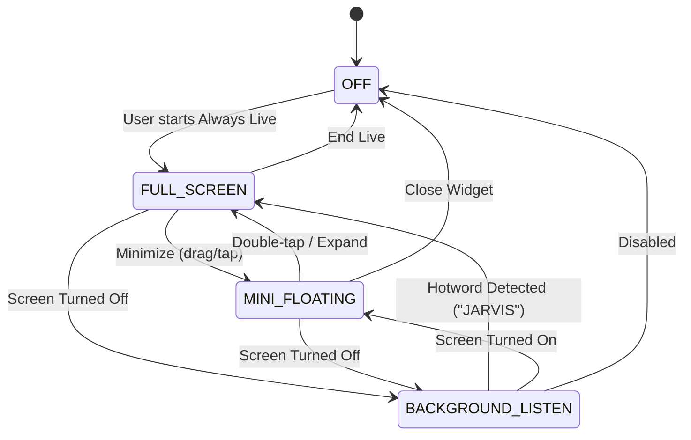

# Always AI Live Mode (2026-09-06)

Always AI Live Mode elevates PersonalAIBot to a continuous, companion-level AI that operates seamlessly across full-screen interactions, floating overlays over other apps, and background wake-on-call even when the device is locked or screen is off.

---

## Architecture Overview

---

## 1. Mode Breakdown

### 1.1 Full-Screen Live Mode (`AlwaysLiveScreen.kt`)
- **Centerpiece Robot Avatar**: Animated 3D-styled robot avatar (`JarvisAvatar.kt`) rendered natively via Compose Canvas with zero 3D-engine overhead.
- **Audio Visualizer Ring**: 36-bar reactive circular audio visualizer pulsing around the avatar based on microphone RMS / audio level.
- **Dynamic Emotion Background**: Shifts ambiance gradient according to AI emotional state (Cyan for idle/listening, Gold/Green for happy, Crimson for alert/error, Deep Navy for sleeping).
- **Control Bar**:
  - Mic toggle (with animated pulse indicator)
  - Camera toggle (front/rear lens integration for Vision)
  - Minimize button (collapses into Mini Floating Robot)
  - End session button

### 1.2 Mini Floating Robot Overlay (`FloatingWidgetService.kt`)
- **Evolution from Text Bubble**: Replaced simple static bubble with a full `ComposeView` embedding the animated mini `JarvisAvatar` (~80dp).
- **Gestures**:
  - **Drag**: Move freely around the screen with physics-based snap-to-edge on release.
  - **Single Tap**: Focus / bring MainActivity to foreground.
  - **Double Tap**: Instantly expand from mini overlay into Full-Screen Always Live mode.
  - **Long Press (>600ms)**: Toggle live voice streaming.
- **Service Lifecycle**: Implemented `ServiceLifecycleOwner` implementing `LifecycleOwner` and `SavedStateRegistryOwner` to support Jetpack Compose inside an Android Foreground Service.
- **Fallback**: Graceful fallback to classic View layout if system overlay prevents ComposeView initialization.

### 1.3 Background Wake-on-Call / Hotword (`HotwordDetector.kt`)
- **Duty-Cycle Audio Listening**: Uses low-power `AudioRecord` at 8 kHz mono with periodic duty cycles (e.g. 2s listen, 1s sleep) to conserve battery during background standby.
- **RMS Energy VAD**: Analyzes Root-Mean-Square audio energy with a calibrated threshold and minimum duration filter to reject transient clicks and background noise.
- **Wake-from-Sleep**:
  - `PARTIAL_WAKE_LOCK`: Keeps CPU active for low-power audio detection when screen is off.
  - Screen Wake (`ACQUIRE_CAUSES_WAKEUP` + `turnScreenOn` / `showWhenLocked` in `MainActivity`): Automatically awakens display and presents full-screen AI interface over lock screen upon hotword trigger.

---

## 2. JARVIS Robot Avatar & 10 Emotion States

The robot avatar features responsive micro-animations (breathing, blinking, head bounce, visor pulse, antenna beacon, floating heart/sparkle particles, and "Zzz" sleep indicators):

| Emotion State | Visual Cue | Visor / Glow Color | Facial Expression |
| :--- | :--- | :--- | :--- |
| `IDLE` | Subtle breathing & eye blink | Cyan (`0xFF00E5FF`) | Neutral wide round eyes |
| `LISTENING` | Fast antenna beacon & expanding ripples | Deep Cyan (`0xFF00B0FF`) | Focused attentive eyes |
| `THINKING` | Rotating gears / orbital rings | Purple (`0xFF7C4DFF`) | Shifting pupils |
| `SPEAKING` | Animated audio waveform mouth | Amber (`0xFFFFB300`) | Dynamic mouth waves |
| `HAPPY` | Subtle bounce & sparkle particles | Neon Cyan / Mint (`0xFF00E676`) | Inverted arc smiling eyes (⌒ ⌒) |
| `EXCITED` | Fast bounce & energy ring | Bright Gold (`0xFFFFD700`) | Star-shaped pupils |
| `SAD` | Lowered head & droopy eyes | Cool Steel Blue (`0xFF607D8B`) | Inverted mouth curve |
| `ANGRY` | Alert beacon & rapid pulse | Crimson Red (`0xFFFF1744`) | Slanted aggressive visor |
| `LOVE` | Floating heart particles | Hot Pink (`0xFFFF4081`) | Heart-shaped eyes (♥ ♥) |
| `SLEEPING` | Dim glow & floating "Zzz" particles | Dark Lavender (`0xFF3F51B5`) | Closed horizontal lines (- -) |

---

## 3. State Management (`AlwaysLiveManager.kt`)

`AlwaysLiveManager` serves as the central singleton coordinator:
- Coordinates state transitions across `OFF`, `FULL_SCREEN`, `MINI_FLOATING`, and `BACKGROUND_LISTEN`.
- Listens to system broadcasts (`ACTION_SCREEN_OFF`, `ACTION_SCREEN_ON`).
- Routes AI events (`JarvisAutomationService`, `JarvisViewModel`) to avatar emotions and performs real-time sentiment keyword detection on spoken responses.
- Safe `destroy()` lifecycle cleanup releasing all WakeLocks, AudioRecords, and broadcast receivers.

---

## 4. Verification & Testing

- Unit test suite: `AlwaysLiveTest.kt` in `composeApp/src/commonTest/kotlin/com/example/personalaibot/`
- Validates:
  - 10 `AvatarEmotion` states and default configurations.
  - Immutable state updates and copy semantics.
  - Visual mapping uniqueness per emotion.
  - Thai & English sentiment keyword parsing.
  - Complete state transition paths for `AlwaysLiveManager`.
- Test execution: `gradlew :composeApp:testDebugUnitTest --tests "com.example.personalaibot.AlwaysLiveTest"` passes 100%.
