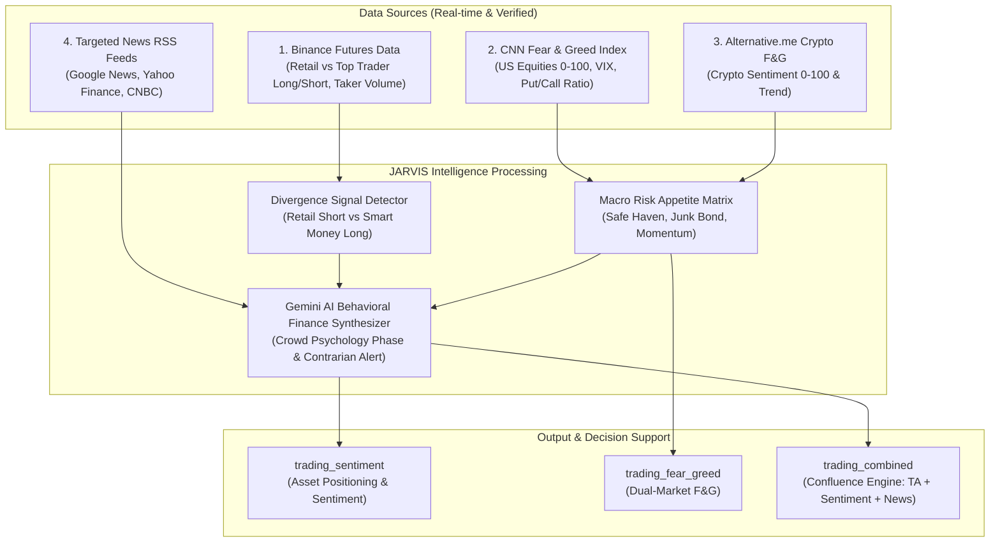

# 🗣️ 05_Sentiment & News (Multi-Source Sentiment Intelligence)

กราฟไม่ได้วิ่งด้วยเทคนิคเพียงอย่างเดียว "อารมณ์" (Emotion), "สถานะการถือครอง" (Positioning) และ "ข่าวสาร" (Narrative) คือเชื้อเพลิงที่ขับเคลื่อนและเร่งความเร็วของตลาด

---

## 🏗️ สถาปัตยกรรมระบบวิเคราะห์ Sentiment (Multi-Source Intelligence)

เดิมระบบพึ่งพาการสกัดข้อมูลจาก Reddit (`r/wallstreetbets`, `r/stocks`) ซึ่งประสบปัญหา HTTP 403 บ่อยครั้ง จึงได้ยกระดับเป็น **Multi-Source Sentiment Engine** ที่ดึงข้อมูลจากแหล่งข้อมูลจริงที่แม่นยำ 100%:



---

## 🐋 1. Derivatives Market Positioning (Crypto)
การวิเคราะห์สถานะพอร์ตสัญญาอนุพันธ์จริง (Derivatives Positioning) จาก Binance Futures:
- **Retail Long/Short Account Ratio**: สัดส่วนบัญชีรายย่อย (ว่าส่วนใหญ่อยู่ฝั่ง Long หรือ Short)
- **Top Trader Long/Short Position Ratio**: สัดส่วนมูลค่าพอร์ตของ Smart Money / Whales
- **Taker Buy/Sell Volume Ratio**: สัดส่วนปริมาณการเคาะขวา (Aggressive Market Buy) เทียบกับการเคาะซ้าย (Aggressive Market Sell)
- **Contrarian Divergence Signals**:
  - `🟢 Contrarian Bullish`: รายย่อย Short หนัก (>55-60%) ขณะที่ Top Traders ถือ Long (>65%) $\rightarrow$ สัญญาณเตรียมระเบิด Short Squeeze ลากกิน Stop Loss ฝั่ง Short
  - `🔴 Contrarian Bearish`: รายย่อยไล่ Long หนาแน่น (>60-70%) ขณะที่ Smart Money เริ่มดัก Short $\rightarrow$ ระวังโดนทุบล้างพอร์ต Long Squeeze
  - `📈 Strong Trend Following`: ทั้งรายย่อยและเจ้ามือถือสถานะทิศทางเดียวกันอย่างแข็งแกร่ง

---

## 🏛️ 2. Dual-Market Fear & Greed Index
รองรับการติดตามอารมณ์ความกลัวและความโลภ 2 ตลาดหลักของโลก:

### A. ตลาดคริปโต (Alternative.me)
- ค่า 0–100: Extreme Fear (0-24), Fear (25-44), Neutral (45-55), Greed (56-74), Extreme Greed (75-100)
- บันทึกอนุกรมเวลา (Historical Trend) ย้อนหลัง 7 วันเพื่อดูโมเมนตัมอารมณ์

### B. ตลาดหุ้นสหรัฐฯ (CNN Fear & Greed Index)
- ค่าดัชนีรวม 0–100 พร้อมข้อมูลเปรียบเทียบ (Previous Close, 1 Week, 1 Month, 1 Year)
- **7 ตัวชี้วัดย่อย (Sub-indicators)**:
  1. `market_momentum_sp500`: โมเมนตัม S&P 500 เทียบกับเส้นค่าเฉลี่ย 125 วัน
  2. `stock_price_strength`: หุ้นที่ทำ New 52-Week High vs Low
  3. `stock_price_breadth`: ปริมาณการซื้อขายสะสม (McClellan Volume Summation)
  4. `put_call_options`: อัตราส่วน CBOE Put/Call Options
  5. `market_volatility_vix`: ดัชนีความกลัว VIX เทียบกับเส้นค่าเฉลี่ย 50 วัน
  6. `junk_bond_demand`: ส่วนต่างผลตอบแทนหุ้นกู้ขยะเทียบกับพันธบัตรเกรดลงทุน (Credit Spread)
  7. `safe_haven_demand`: ความต้องการถือพันธบัตรรัฐบาลเทียบกับตลาดหุ้น (Risk-On vs Risk-Off)

---

## 📰 3. Real-Time Narratives & Gemini Behavioral Synthesis
- สกัดพาดหัวข่าวเจาะจงรายสินทรัพย์ (Crypto, US Stocks, ทองคำ XAUUSD, หุ้นไทย)
- วิเคราะห์ **Sentiment Bias Score (-1.0 ถึง +1.0)** พร้อมนับจำนวนพาดหัว Bullish vs Bearish
- Gemini จำแนกระยะจิตวิทยาฝูงชน (**Crowd Psychology Phase**):
  - *Euphoria (ตื่นเต้นสุดขีด / ไร้สติ)* $\rightarrow$ ระวังจุดจบคิว Distribution
  - *Complacency (ชะล่าใจ / คิดว่าย่อซื้อได้เสมอ)* $\rightarrow$ สัญญาณเตือนขาลงรอบใหญ่
  - *Skepticism (ระแวง / ขึ้นแบบไม่เชื่อ)* $\rightarrow$ มักเป็นช่วง Markup ที่แข็งแกร่ง
  - *Panic & Capitulation (สิ้นหวัง / ยอมแพ้)* $\rightarrow$ โซนสะสมของ Smart Money (Accumulation)

---

## 🎯 4. JARVIS Unified Master Sentiment Engine (`trading_sentiment`)
รวมศูนย์ Sentiment ทั้งหมดที่เคยแยกย่อย (News, Crypto F&G, CNN Stock F&G, Derivatives Positioning, Technical Consensus) ให้กลายเป็น **Master All-in-One Engine** ตัวเดียวที่แสดงผลลัพธ์ผ่าน **JARVIS Composite Sentiment Index (0–100)**:

### 📊 โครงสร้างคะแนน 4 เสาหลัก (4-Pillars Framework)
| เสาหลัก | น้ำหนัก | แหล่งข้อมูลและการประเมิน |
| :--- | :---: | :--- |
| **1. News & Social Bias** | 30% | Google News, Yahoo Finance, CoinDesk RSS (คะแนน Bias -1.0 ถึง +1.0 แปลงเป็น 0–100) |
| **2. Market Fear & Greed** | 25% | Alternative.me (คริปโต) / CNN Stock F&G 7 ตัวชี้วัดย่อย (หุ้น/ดัชนี/ทองคำ) |
| **3. Derivatives Positioning** | 30% | Binance Futures Retail vs Top Traders Long/Short Ratio + Taker Buy/Sell Volume Ratio |
| **4. Technical Consensus** | 15% | TradingView 1D Technical Consensus (Oscillators + Moving Averages Recommend Score) |

### 🎚️ Visual Meter Bar & ระดับความรู้สึก 5 Tiers
```text
[░░░░░░░░░░]  0 - 24 : 🥶 🔴 กลัวสุดขีด (Extreme Fear) — โซน Capitulation / สะสมของ
[███░░░░░░░] 25 - 44 : 😰 🟠 วิตกกังวล (Fear) — ความเสี่ยงลดลง ตลาดตั้งรับ
[█████░░░░░] 45 - 55 : ⚖️ 😐 เป็นกลาง (Neutral) — ไร้ทิศทาง รอปัจจัยใหม่
[███████░░░] 56 - 75 : 🟢 🚀 เชื่อมั่น / โลภ (Greed) — กระแสตลาดกำลังวิ่ง (Markup)
[██████████] 76 - 100: 🔥 🟢 โลภสุดขีด (Extreme Greed) — Euphoria ระวังโดนแจกของ (Distribution)
```

### 🌐 Global Macro Mode (โหมดวิเคราะห์ภาพรวมโลก)
เมื่อผู้ใช้ถามเรื่องอารมณ์ตลาดโดยไม่ระบุ Symbol หรือใส่ `all`/`macro` ระบบจะสลับเข้าสู่ Global Macro Sentiment โดยถ่วงน้ำหนัก:
- **CNN Stock Market Fear & Greed**: 60%
- **Crypto Market Fear & Greed**: 40%

---

## 💎 5. The Confluence Intelligence (`trading_combined`)
เมื่อนำ Technical Analysis (TA) + Multi-Source Sentiment + Financial News มาบรรจบกัน:
- **Strong Buy**: TA Bullish + Sentiment Bullish + Smart Money Long Positioning + ข่าวหนุน
- **Contrarian Alert**: หาก TA โอเวอร์บ็อต + ข่าวบวกสุดโต่ง แต่ Smart Money เริ่ม Short $\rightarrow$ ออกคำเตือน **Fakeout / Bull Trap** ทันที

---

> [!NOTE]
> **JARVIS Rule**: อารมณ์ตลาดที่ "สุดโต่งเกินไป" (Extreme Levels) คือจุดกลับตัวที่มี Risk/Reward คุ้มค่าที่สุดเสมอ อย่าไล่ตามฝูงชนในจุด Euphoria และอย่ากลัวที่จะหาจังหวะเข้าในจุด Capitulation

**Next**: [[06_The_Ultimate_Checklist_V12.5]]

---
**Links**: [[index]] | [[Trading_Intelligence_MOC]] | [[00_Tool_to_Strategy_Map]] | [[68_Stock_Fundamental_Financial_Engine]]
