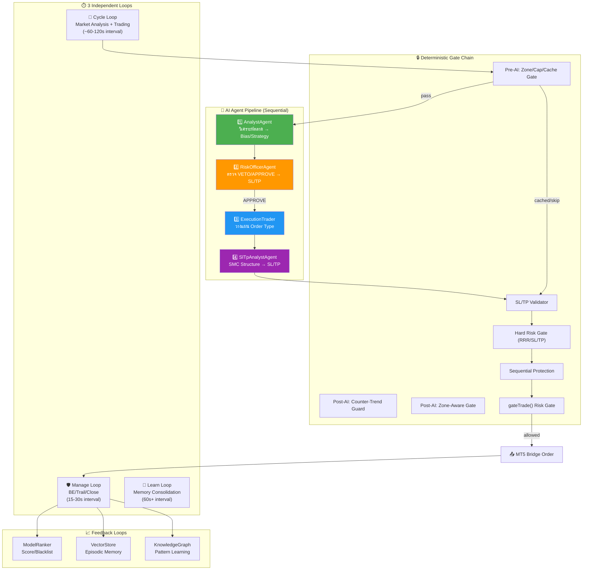
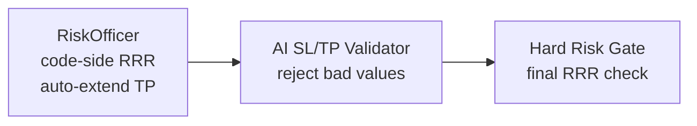

# 🔍 V20.0 Agent Coordination Audit Report
> ตรวจสอบ: 2026-05-01 13:58 | อัพเดทล่าสุด: 2026-05-01 14:11  
> สถานะ: **✅ ระบบเสถียร — Bugs ทั้งหมดแก้ไขแล้ว**

---

## 📊 สถาปัตยกรรมภาพรวม



---

## 🔄 Flow ทั้งหมดตามลำดับ

### Phase 0: Pre-Cycle Guards
| ลำดับ | ตัวตรวจ | หน้าที่ | ผลลัพธ์ |
|-------|---------|--------|---------|
| 0.1 | `isMarketOpen()` | ตรวจตลาดเปิด/ปิด | SLEEP mode / continue |
| 0.2 | `detectAndReviewClosedTrades()` | หาออเดอร์ที่ปิดแล้ว → PostMortem + Feedback | Update journal, vectorStore |
| 0.3 | `CircuitBreaker.check()` | Equity drawdown guard | PAUSE / continue |
| 0.4 | `NewsAnalyzer.updateNewsRisk()` | ข่าว HIGH impact | Block/reduce risk |

### Phase 1: Deterministic Pre-Filter (ต่อ symbol)
| ลำดับ | ตัวตรวจ | หน้าที่ | ทำงานกับ |
|-------|---------|--------|---------|
| 1.1 | `isSymbolTradable()` | ตรวจ symbol tradable | System |
| 1.2 | MTF Analysis (H4,H1,M15,M5) | `inferAnalysis()` ทุก TF | System |
| 1.3 | `deterministic()` | สรุป BUY/SELL/SKIP + confidence | System |
| 1.4 | Pre-AI Zone Gate | MTF Premium/Discount veto | System |
| 1.5 | Per-Symbol Cap Gate | `5/5` → SKIP LLM (token saving) | System |
| 1.6 | LLM Cache (strict + loose) | ซ้ำ stateHash → skip AI | System |
| 1.7 | Deterministic Fast-Path | confidence ≥70% → skip AI | System |

### Phase 2: AI Agent Pipeline (ถ้า phase 1 ไม่ SKIP)
| ลำดับ | Agent | Input | Output | Role ใน Ranker |
|-------|-------|-------|--------|----------------|
| 2.1 | **AnalystAgent** | MTF + correlations + memory | `AnalystReport` (bias, SL, TP, strategy, confidence) | `analyst` |
| 2.2 | **RiskOfficerAgent** | AnalystReport + account + positions | `RiskApproval` (APPROVE/VETO, adj SL/TP/volume) | `riskOfficer` |
| 2.3 | *Stale-Price Guard* | pipeline time vs price delta | SKIP ถ้า price moved > `stalePriceMaxPts` | — |
| 2.4 | **ExecutionTrader** | RiskApproval + market price | `OrderPlan` (MARKET/LIMIT, fillStrategy) | `executionTrader` |

### Phase 3: SL/TP Resolution
| ลำดับ | ตัวจัดการ | Input | Output | Priority |
|-------|----------|-------|--------|----------|
| 3.1 | **SlTpAnalystAgent** | SMC structures (H4→M5) + entry + ATR | `SlTpResult` (sl, tp, source) | Stage 1: Deterministic SMC → Stage 2: LLM Refinement |
| 3.2 | AI SL/TP Validator | aiDecision.sl/tp | Accept/Reject (wrong-side, distance, pct check) | — |
| 3.3 | **Resolution Chain** | `resolvedAiSl \|\| smcSl \|\| rawSl` | Final SL/TP | Priority: AI Pipeline > slTpAgent SMC > ATR |
| 3.4 | Dynamic SL Buffer | spread + min stops | Widen SL ถ้าใกล้เกินไป | — |
| 3.5 | TP Rescue | slDist × targetRrr + tick buffer | TP rescue ถ้า RRR ตก target | — |

### Phase 4: Post-AI Gate Chain
| ลำดับ | Gate | ตรวจอะไร | ผลลัพธ์ |
|-------|------|---------|---------|
| 4.1 | Counter-Trend Guard | BUY vs BEAR bias (volatile_breakout hard block) | SKIP |
| 4.2 | Zone-Aware Gate | BUY in PREMIUM / SELL in DISCOUNT | SKIP |
| 4.3 | FVG Alignment | SMC_FVG_SCALP ต้องอยู่ใน FVG | SKIP |
| 4.4 | **Hard Risk Gate** | RRR < minRRR (float-safe), SL < minSlPts, TP < minTpPts | SKIP |
| 4.5 | Heat Guard | cluster heat ≥ threshold → suppress defense override | Reduce defense |
| 4.6 | `gateTrade()` | Max positions, exposure, sequential protection, kelly, session throttle | SKIP + reason |

### Phase 5: Order Execution & Journal
| ลำดับ | ขั้นตอน | หน้าที่ |
|-------|---------|--------|
| 5.1 | `callBridge('POST', '/order')` | ส่งคำสั่งเทรดไป MT5 |
| 5.2 | `upsertJournal()` | บันทึก decision + ticket |
| 5.3 | Broadcast notification | แจ้งมือถือ |

### Phase 6: Trade Manager (Independent Loop)
| ลำดับ | ขั้นตอน | หน้าที่ |
|-------|---------|--------|
| 6.1 | Position audit | แสดง heat, R ทุกตำแหน่ง |
| 6.2 | Break-Even logic | ≥1R → SL ไป entry |
| 6.3 | Trail Stop | ≥1.5R → trail SL ตาม R |
| 6.4 | Partial close | ≥2R → ปิดบางส่วน |

### Phase 7: Feedback Loops
| ลำดับ | Feedback | เมื่อไหร่ | ใครได้ประโยชน์ |
|-------|----------|----------|---------------|
| 7.1 | `modelRankerService.recordExecution()` | ทุกครั้งที่ invoke model (ใน dispatcher เท่านั้น) | ทุก Agent — per-role scoring |
| 7.2 | `modelRankerService.recordContentFailure()` | LLM return empty/bad JSON | ทุก Agent — blacklist |
| 7.3 | `vectorStore.add(trade_outcome)` | เมื่อออเดอร์ปิด | AnalystAgent (memory priors) |
| 7.4 | `knowledgeGraph.addTradeInsight()` | เมื่อออเดอร์ปิด | Deterministic (pattern learning) |
| 7.5 | `recordSlTpAccuracy()` | ✅ PostMortem review — profitR>0 → +0.1, <-0.5 → -0.1 | slTpAgent ranking (score×2) |

---

## ⚡ Agent-to-Agent Interaction Matrix

| | Analyst | RiskOfficer | ExecutionTrader | SlTpAgent | ModelRanker | System Gates |
|---|---------|------------|----------------|-----------|------------|-------------|
| **Analyst** | — | ส่ง `AnalystReport` → | ❌ ไม่สื่อสารตรง | ❌ ไม่สื่อสารตรง | ← score/blacklist | ← memory priors |
| **RiskOfficer** | ← รับ report | — | ส่ง `RiskApproval` → | ❌ ไม่สื่อสารตรง | ← score/blacklist | ✅ code-side RRR validator |
| **ExecutionTrader** | ❌ | ← รับ approval | — | ❌ ไม่สื่อสารตรง | ← score/blacklist | — |
| **SlTpAgent** | ❌ | ❌ | ❌ | — | ← score/blacklist | SL/TP fallback chain |
| **System Gates** | override ←AI | override ←AI | — | override ←slTp | — | sequential chain |

---

## 🔧 ปัญหาที่พบและแก้ไขแล้ว

### 1. ✅ SL/TP ซ้ำซ้อน 3 ชั้น (By Design — ไม่ใช่ Bug)

SL/TP ถูกคำนวณจาก 3 แหล่ง ใช้ priority chain:

| แหล่ง | ใครคำนวณ | Priority |
|-------|---------|----------|
| **AI Pipeline** | `RiskOfficerAgent` → `approval.sl/tp` | 1 (สูงสุด) |
| **SlTpAgent** | `slTpAnalystAgent` → `smcSl/smcTp` | 2 (SMC structure) |
| **ATR Fallback** | System → `rawSl/rawTp` | 3 (backstop) |

```typescript
let sl = roundToTick(resolvedAiSl || smcSl || rawSl, tick);
let tp = roundToTick(resolvedAiTp || smcTp || rawTp, tick);
```

> [!NOTE]
> **By Design**: AI Pipeline มี priority สูงสุดเพราะ RiskOfficer เห็น context กว้างกว่า (portfolio, exposure) ส่วน slTpAgent เน้น SMC structure precision สำหรับกรณีที่ AI ถูก SKIP หรือ reject

### 2. ✅ RiskOfficer + Hard Risk Gate ซ้ำกัน (By Design — Defense-in-Depth)

- **RiskOfficer code-side**: auto-extend TP ถ้า RRR ต่ำ (พยายามแก้ไข)
- **Hard Risk Gate**: `actualRrr < (minRRR - RRR_EPS)` → SKIP (last resort reject)



> [!TIP]
> **ไม่ขัดแย้ง** — ทั้งสองใช้ `minRRR` ค่าเดียวกัน (ขึ้นกับ strategy) เป็น defense-in-depth ที่ตั้งใจ

### 3. ✅ SlTpAgent Double-Record — **แก้ไขแล้ว**

**ปัญหาเดิม**: `recordExecution()` ถูกเรียก 2 ครั้ง — ทั้งใน `dispatcher.ts` และ `autoTradingService.ts`

**แก้ไข**: ลบ duplicate call ใน `autoTradingService.ts:1337-1348` — เหลือเฉพาะใน `dispatcher.ts` ที่เดียว

```diff
  atLog(`slTpAgent(${slTpRes.source}) ...`);
- if (slTpRes.modelUsed && slTpRes.source === 'smc_ai') {
-   modelRankerService.recordExecution({ ... });
- }
+ // Note: recordExecution() handled inside dispatcher.ts invoke()
```

### 4. ✅ modelUsed มี Provider Prefix ปน — **แก้ไขแล้ว**

**ปัญหาเดิม**: `dispatcher.ts` return `modelUsed` เป็น `"openrouter openai/gpt-oss-120b:free"` → ทำให้ `model_id` ใน DB ผิด

**แก้ไข**: เปลี่ยนเป็น `modelUsed: choice.model` (เช่น `"openai/gpt-oss-120b:free"` ไม่มี provider prefix)

```diff
- return { ...res, modelUsed: `${choice.provider} ${choice.model}` };
+ return { ...res, modelUsed: choice.model };
```

> [!IMPORTANT]
> แก้ทั้ง 3 จุดใน `dispatcher.ts` (primary, ranked swap, fallback) + cleanup 2 rows ใน DB ที่มี model_id ผิด format

### 5. ✅ Agents ใช้ `split(' ')` ผิด — **แก้ไขแล้ว**

**ปัญหาเดิม**: `analyst.ts`, `riskOfficer.ts`, `executionTrader.ts` ใช้ `modelLabel.split(' ')` เพื่อแยก provider จาก modelUsed — แต่ modelUsed ไม่มี provider prefix อีกแล้ว

**แก้ไข**: ส่ง `modelLabel` ตรงๆ + hardcode `'openrouter'` เป็น provider + ใส่ `agentRole` ที่ชัดเจน

```diff
- const [prov, ...rest] = modelLabel.split(' ');
- modelRankerService.recordContentFailure(rest.join(' '), prov);
+ modelRankerService.recordContentFailure(modelLabel, 'openrouter', 'analyst');
```

### 6. ✅ Fallback ไม่ Persist ไป Dashboard Settings — **แก้ไขแล้ว**

**ปัญหาเดิม**: Smart Ranker swap มี auto-persist อยู่แล้ว แต่ fallback chain ไม่มี → Dashboard settings ไม่สะท้อนโมเดลที่ใช้จริง

**แก้ไข**: เพิ่ม auto-persist ใน fallback chain เหมือน Smart Ranker swap

```typescript
// dispatcher.ts — fallback chain
import('../../autoTradingService.js').then(({ autoTradingService }) => {
    const nextAgentModels = { ...ctx.cfg.agentModels };
    nextAgentModels[ctx.role] = { provider: fb.provider, model: fb.model, useSmartFree: true };
    autoTradingService.updateConfig({ agentModels: nextAgentModels });
    atWarn(`[Dispatcher] Persisted fallback model to settings for role "${ctx.role}"`);
});
```

### 7. ✅ `recordSlTpAccuracy` — **Implement แล้ว**

ระบบ `recordSlTpAccuracy()` ทำงานครบทั้ง 3 ส่วน:

| ส่วน | ไฟล์ | ตำแหน่ง | หน้าที่ |
|------|------|---------|--------|
| **Caller** | `autoTradingService.ts` | L2810-2817 | เรียกตอน PostMortem review — ถ้า profitR>0 → `+0.1`, ถ้า profitR<-0.5 → `-0.1` |
| **Implementation** | `ModelRankerService.ts` | L271-283 | UPDATE `sl_tp_score` ใน DB (clamp 0–100) เฉพาะ `agent_role='slTpAgent'` |
| **Scoring Formula** | `ModelRankerService.ts` | L328 | `CASE WHEN agent_role='slTpAgent' THEN sl_tp_score * 2 ELSE 0 END` |

```typescript
// autoTradingService.ts — PostMortem caller
const snap = safeJsonParse(row.marketSnapshot || '{}', {});
if (snap?.slTpModelId) {
  const delta = lesson.profitR > 0 ? 0.1 : lesson.profitR < -0.5 ? -0.1 : 0;
  if (delta !== 0) modelRankerService.recordSlTpAccuracy(snap.slTpModelId, delta);
}
```

> [!TIP]
> `slTpModelId` ถูกบันทึกใน `marketSnapshot` JSON ตอนเปิดออเดอร์ → ใช้ตอนปิดเพื่อ attribute กลับไปที่โมเดลที่คำนวณ SL/TP

---

## ✅ สิ่งที่ทำงานสอดคล้องกันดี

| ความสัมพันธ์ | สถานะ | รายละเอียด |
|-------------|-------|------------|
| Analyst → RiskOfficer → ExecutionTrader | ✅ Sequential | ข้อมูลไหลทิศทางเดียว ไม่มี circular dependency |
| Per-Agent ModelRanking isolation | ✅ Isolated | แต่ละ agent มี namespace แยกใน DB — Analyst ที่ fail ไม่กระทบ slTpAgent ranking |
| Deterministic → AI override hierarchy | ✅ Clear | Deterministic เป็น prior, AI มีสิทธิ์ override แต่ต้องผ่าน gate chain |
| Manage Loop ↔ Cycle Loop | ✅ Independent | `cycleBusy` / `manageBusy` mutex ป้องกัน race condition |
| Feedback → Memory → Prior | ✅ Complete | trade_outcome → vectorStore → Analyst memory priors ในรอบถัดไป |
| Smart Fallback → Settings Persist | ✅ Auto-sync | ทั้ง Smart Ranker swap **และ** fallback chain persist ไป Dashboard |
| Toxic Model Protection | ✅ Working | streak≥5 → ไม่ force-reset → fallback chain ใช้โมเดลอื่น |
| modelUsed format | ✅ Fixed | เป็น model name เท่านั้น (ไม่มี provider prefix) ทุก agent |
| recordExecution single-point | ✅ Fixed | บันทึกเฉพาะใน `dispatcher.ts invoke()` ที่เดียว |

---

## 📋 Action Items

| # | Priority | รายการ | สถานะ |
|---|----------|--------|-------|
| 1 | ✅ DONE | ลบ double-record ของ slTpAgent | **แก้ไขแล้ว** |
| 2 | ✅ DONE | แก้ modelUsed format (ไม่มี provider prefix) | **แก้ไขแล้ว** |
| 3 | ✅ DONE | แก้ agents ที่ใช้ `split(' ')` ผิด | **แก้ไขแล้ว** |
| 4 | ✅ DONE | เพิ่ม fallback → Settings auto-persist | **แก้ไขแล้ว** |
| 5 | ✅ DONE | Cleanup DB rows ที่มี model_id ผิด format | **แก้ไขแล้ว** |
| 6 | ✅ DONE | `recordSlTpAccuracy()` — implement ครบ 3 ส่วน (caller + DB + scoring) | **ทำงานแล้ว** |
| 7 | ⚪ INFO | SL/TP 3 ชั้น ทำงานถูกต้องตาม design — AI > SMC > ATR | **No Action** |
| 8 | ⚪ INFO | RiskOfficer RRR + Hard Risk Gate ซ้ำเป็น defense-in-depth | **No Action** |

---

**Links**: [[17_PerAgent_ModelRanking_V20]] | [[Smart_Fallback_and_Token_Management]] | [[15_Cluster_Trading_Logic_V17.2]] | [[Current_Tasks]] | [[Trading_Intelligence_MOC]]
