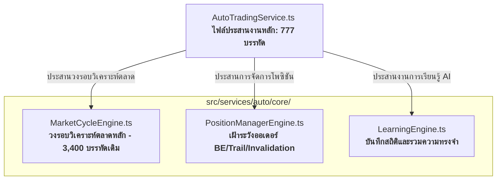

# Deep Decoupling of AutoTradingService (V26.27)

> **บันทึกความคืบหน้าการรีแฟคเตอร์เชิงลึก (Deep Refactoring Phase 3)**  
> **เป้าหมาย:** สลายความหนาแน่นของไฟล์ประสานงานหลัก `autoTradingService.ts` จาก 5,429 บรรทัด ให้เหลือต่ำกว่า 1,000 บรรทัด โดยแยก 4 เมธอดการทำงานขนาดมหึมาออกเป็นเครื่องยนต์ย่อย (Sub-Engines) 3 ตัว พร้อมคงความเข้ากันได้ย้อนหลัง 100% (Zero Breaking Changes)

---

## 🛠️ ความเป็นมาและความท้าทาย
ก่อนการรีแฟคเตอร์ในรอบนี้ ไฟล์ `autoTradingService.ts` ทำหน้าที่เป็น "สวิตช์บอร์ดขนาดยักษ์" ที่รวบรวมตรรกะทับซ้อนกันตั้งแต่การวิเคราะห์แท่งเทียน, การเรียกใช้ AI, การเฝ้าระวังและจัดการโพซิชัน (BE/Trail/Early Invalidation) ไปจนถึงการรวมหน่วยความจำ AI การมีโค้ดกว่า 5,400 บรรทัดในไฟล์เดียวนำมาซึ่งความเสี่ยงสูงในการเกิดบั๊กระหว่างพัฒนาและทดสอบยาก

การปรับปรุงครั้งนี้เป็นก้าวสำคัญตามแผนงาน **Wave 3: Scale & Refactor (Decoupling)** เพื่อแปลงระบบให้กลายเป็นสถาปัตยกรรมแบบ **Modular Micro-Engines** ที่แยกหน้าที่ชัดเจน (Single Responsibility Principle)

---

## 📐 สถาปัตยกรรมเครื่องยนต์ย่อย (The Sub-Engine Architecture)
ระบบถูกแยกการประมวลผลหลักออกเป็นเครื่องยนต์ย่อย 3 ตัวในไดเรกทอรี `src/services/auto/core/` ดังนี้:



### 1. MarketCycleEngine.ts (เครื่องยนต์วงรอบตลาด)
* **หน้าที่หลัก:** รับช่วงต่อการรันเมธอด `runCycle` 
* **การทำงานภายใน:**
  - โหลดและเตรียมข้อมูลแท่งเทียนหลายกรอบเวลา (Multi-Timeframe Loading)
  - คำนวณและสร้างแผนที่ราคา SMC Walls ผ่าน `priceMapBuilder`
  - วิเคราะห์ข่าวสารและทริกเกอร์ระบบป้องกันความเสี่ยง (Circuit Breaker)
  - ประเมินสัญญาณการเทรดผ่านตรรกะแบบ Deterministic และ V25 Playbooks
  - ตรวจสอบประตูกั้นการตัดสินใจ (Execution Gates) และส่งคำสั่งเทรดผ่าน `TradingExecutionService`

### 2. PositionManagerEngine.ts (เครื่องยนต์จัดการโพซิชัน)
* **หน้าที่หลัก:** รับช่วงต่อการรันเมธอด `runManage` และ `executeManagementPlan`
* **การทำงานภายใน:**
  - ตรวจสอบและดึงข้อมูลออเดอร์ที่กำลังเปิดอยู่จากโบรกเกอร์แบบ Real-time
  - คำนวณความเสี่ยงสะสมรายตัวและภาพรวมของพอร์ต (R-Value Metrics)
  - จัดการขยับจุดตัดขาดทุนเท่าทุน (Breakeven - BE) และการเลื่อนจุดตัดขาดทุนตามราคา (Trailing Stop - Trail)
  - ใช้กลไกปิดออเดอร์ก่อนกำหนดตามเวลา (Time Stop) หรือเมื่อเงื่อนไขสัญญาณล้มเหลว (Early Invalidation / Proof Failure)

### 3. LearningEngine.ts (เครื่องยนต์ประมวลการเรียนรู้ AI)
* **หน้าที่หลัก:** รับช่วงต่อการรันเมธอด `runLearn`
* **การทำงานภายใน:**
  - สรุปผลสัมฤทธิ์ของการเทรดรายวัน/รายรอบ และประมวลผลพฤติกรรมการตัดสินใจ
  - ส่งข้อมูลผลลัพธ์เข้าสู่กระบวนการรวมหน่วยความจำระยะยาว (Memory Consolidation) เพื่อเพิ่มขีดความสามารถให้ Gemini ในรอบถัดไป

---

## 🔄 การประสานงานและการเข้ากันได้ย้อนหลัง (Backward Compatibility)
เพื่อรักษาพฤติกรรมการเรียกใช้งานจากภายนอกคลาส `AutoTradingService` ไม่ให้เกิดผลกระทบ (Zero Breaking Changes) คลาสหลักยังคงมีเมธอดระดับสูงแบบเดิมทำหน้าที่เป็น **Wrapper/Delegator** ส่งมอบการประมวลผลไปยังเครื่องยนต์ย่อยโดยแนบปริบท `this` ไปด้วย เช่น:

```typescript
// ใน src/services/autoTradingService.ts
import { MarketCycleEngine } from './auto/core/MarketCycleEngine';
import { PositionManagerEngine } from './auto/core/PositionManagerEngine';
import { LearningEngine } from './auto/core/LearningEngine';

export class AutoTradingService {
  // ... properties และตัวจัดการสถานะ ...

  public async runCycle(traceId?: string): Promise<void> {
    return MarketCycleEngine.runCycle(this, traceId);
  }

  public async runManage(traceId?: string): Promise<void> {
    return PositionManagerEngine.runManage(this, traceId);
  }

  public async executeManagementPlan(plan: any, traceId?: string): Promise<void> {
    return PositionManagerEngine.executeManagementPlan(this, plan, traceId);
  }

  public async runLearn(traceId?: string): Promise<void> {
    return LearningEngine.runLearn(this, traceId);
  }
}
```

และเพื่อป้องกันการชนกันของความสัมพันธ์แบบวงกลม (Circular Dependency) เครื่องยนต์ย่อยจะนำเข้า Type ของคลาสหลักผ่านรูปแบบ `import type` เท่านั้น:
```typescript
import type { AutoTradingService } from '../../../autoTradingService';
```

---

## ⚡ ผลการตรวจสอบคุณภาพและความถูกต้อง (Verification Results)

1. **การคอมไพล์สำเร็จสมบูรณ์ (Build Verification):**
   * รันคำสั่ง `npm run build` เพื่อตรวจจับข้อผิดพลาด TypeScript ในระดับเข้มงวด ผลลัพธ์: **คอมไพล์ผ่าน 100% ไร้ข้อผิดพลาด**
2. **ยูนิตเทสผ่านครบถ้วน (Unit Tests Verification):**
   * รันการทดสอบด้วย `npm test` (Vitest) เพื่อตรวจตรรกะภายในทั้งหมดของระบบเทรดและเครื่องยนต์ช่วยตัดสินใจ ผลลัพธ์: **ผ่านการทดสอบ 103/103 เทสเคส (100% Success Rate)** โดยไม่มี Regression
3. **ระบบวิเคราะห์พอร์ตทำงานปกติ (Portfolio Analytics Verification):**
   * รันคำสั่ง `npm run analyze` เพื่อดึงข้อมูลประวัติการเทรด สถิติวินเรท และอัตราการบล็อคสัญญาณจาก SQLite DB ผลลัพธ์: **ดึงสถิติและสร้างรายงานได้อย่างรวดเร็วและถูกต้องสมบูรณ์**

---

## 🎯 สรุปความคุ้มค่าของการรีแฟคเตอร์ครั้งนี้
* **ขนาดไฟล์ประสานงานหลักลดลงถึง 85.6%:** จาก 5,429 บรรทัดเหลือเพียง **777 บรรทัด** เท่านั้น
* **โครงสร้างโค้ดสะอาดและอ่านง่ายขึ้นมหาศาล:** นักพัฒนาสามารถเข้าไปเจาะแก้ตรรกะวงรอบการวิเคราะห์ตลาดใน `MarketCycleEngine` หรือการจัดการออเดอร์ใน `PositionManagerEngine` ได้โดยไม่ต้องกลัวว่าจะไปกระทบส่วนอื่นๆ ในไฟล์ยักษ์แบบเดิม
* **ไม่มีผลข้างเคียงต่อระบบภายนอก:** ระบบ Frontend, Mobile Dashboard และส่วนประสานงานโบรกเกอร์ยังคงเรียกใช้งาน `AutoTradingService` ได้อย่างราบรื่นตามปกติ

---
**เชื่อมโยงบทความที่เกี่ยวข้อง:**
* [[12_AutoTrading_Remote_Engine]] — อธิบายสถาปัตยกรรม Auto Engine ดั้งเดิม
* [[55_UnifiedZoneExecutionQuality_V2625]] — ข้อมูลประตูกั้นการตัดสินใจแบบรวมศูนย์ก่อนการทำ Decoupling
* [[56_ModularCodebaseRefactoring_V2626]] — แผนภาพโมดูลย่อยและการย้าย Helpers รอบแรก
