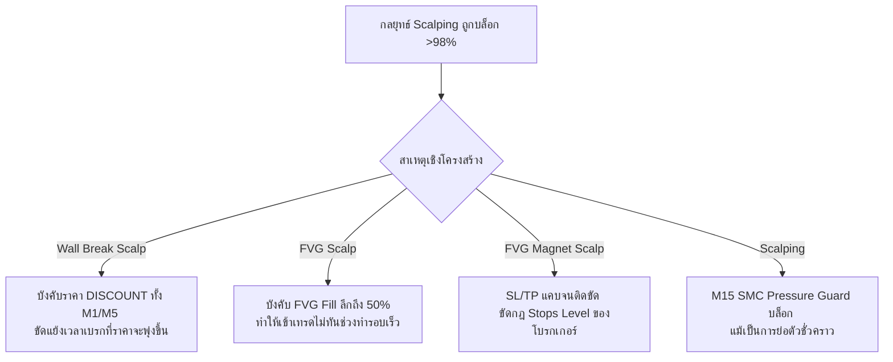

# การปลดล็อกและเพิ่มประสิทธิภาพระบบสเกลปิ้ง (Scalping & FVG Playbooks Optimization - V26.30)

> **บันทึกการเพิ่มประสิทธิภาพและแก้ปัญหา Rejection ในระดับโครงสร้าง**  
> **เป้าหมาย:** แก้ไขปัญหาทางสถาปัตยกรรมและตรรกะเงื่อนไขที่ตึงเกินไปในกลุ่มกลยุทธ์ทำรอบความเร็วสูง (Scalping & FVG Playbooks) ได้แก่ `SCALPING`, `SMC_FVG_SCALP`, `SMC_FVG_MAGNET_SCALP`, และ `SMC_WALL_BREAK_SCALP` ซึ่งสถิติจากระบบวิเคราะห์ก่อนหน้าชี้ให้เห็นว่ามีอัตราการถูกปฏิเสธ (Rejection Rate) สูงกว่า 98% และบางกลยุทธ์ไม่สามารถออกออเดอร์ได้เลย

---

## 🛠️ การวิเคราะห์หาสาเหตุเชิงโครงสร้าง (Structural Root Cause Analysis)

จากการตรวจสอบระบบวิเคราะห์และข้อมูล Log ในการเทรดจริง พบว่ามีเงื่อนไข 4 จุดหลักที่ขัดแย้งกับสภาวะตลาดตามธรรมชาติและขัดขวางการออกออเดอร์ของกลยุทธ์เล่นสั้น:



---

## 📐 รายละเอียดการปลดล็อกและการปรับปรุงตรรกะ (Implementation Details)

เพื่อแก้ไขปัญหาเหล่านี้อย่างยั่งยืนโดยยังรักษาความปลอดภัยของพอร์ตลงทุน ระบบได้รับการอัปเดตดังต่อไปนี้:

### 1. ผ่อนปรนข้อกำหนดพิกัดราคาสำหรับ `SMC_WALL_BREAK_SCALP`
* **ไฟล์ที่แก้ไข:** [SignalDetector.ts](file:///c:/Users/JOJO/AndroidStudioProjects/PersonalAIBot/mt5-core-server/src/services/auto/core/SignalDetector.ts) (ฟังก์ชัน `detectWallBreakScalp`)
* **ตรรกะเดิม:** บังคับให้ราคา ณ เวลาที่มีการทะลุกำแพง (Wall Break) ต้องอยู่ในโซน `DISCOUNT` (สำหรับ BUY) หรือ `PREMIUM` (สำหรับ SELL) บนทั้งกรอบเวลา M1 และ M5 พร้อมกัน ซึ่งเป็นไปได้ยากมากเนื่องจากเมื่อราคาพุ่งทะลุแนวต้าน ราคาย่อมขยับตัวเข้าสู่โซน PREMIUM หรือสมดุลของกรอบเวลาเล็กเสมอ
* **ตรรกะใหม่:** ผ่อนปรนให้ยินยอมผ่านเกณฑ์พิกัดราคาได้ หาก M1 และ M5 อยู่ในโซน `DISCOUNT` หรือ `EQ` (Equilibrium - โซนสมดุล) ทำให้ตรวจจับจังหวะการทะลุได้อย่างมีประสิทธิภาพและแม่นยำขึ้น
* **ตัวอย่างโค้ด:**
  ```typescript
  const isM1Ok = m1Zone.zone === 'DISCOUNT' || m1Zone.zone === 'EQ';
  const isM5Ok = m5Zone.zone === 'DISCOUNT' || m5Zone.zone === 'EQ';
  if (buyWall && isM1Ok && isM5Ok) { ... }
  ```

### 2. ผ่อนปรนด่าน FVG-Fill สำหรับ `SMC_FVG_SCALP`
* **ไฟล์ที่แก้ไข:** [MarketCycleEngine.ts](file:///c:/Users/JOJO/AndroidStudioProjects/PersonalAIBot/mt5-core-server/src/services/auto/core/MarketCycleEngine.ts) (ประตูกั้น `fvgFillGate`)
* **ตรรกะเดิม:** บังคับให้ราคาปัจจุบันต้องย่อตัวลึกเข้าไปใน FVG เป็นระยะอย่างน้อย 50% (`minFillPct: 0.5`) จึงจะยอมรับ ซึ่งการเล่นสั้นสไตล์ Scalp ต้องการความเร็วและราคาเข้าที่ไวขึ้น
* **ตรรกะใหม่:** ปรับลดเกณฑ์ความลึกในการเติมเต็มช่องว่างราคา FVG (`minFillPct`) ลงเหลือ `0.15` (15%) สำหรับกลยุทธ์ `SMC_FVG_SCALP` โดยเฉพาะ เพื่อให้ระบบเปิดออเดอร์ทันทีที่ราคาแตะสัมผัสขอบ FVG และจมเข้าไปเพียงเล็กน้อย

### 3. ระบบคำนวณ SL และ Dynamic RRR สำหรับ `SMC_FVG_MAGNET_SCALP`
* **ไฟล์ที่แก้ไข:** [MarketCycleEngine.ts](file:///c:/Users/JOJO/AndroidStudioProjects/PersonalAIBot/mt5-core-server/src/services/auto/core/MarketCycleEngine.ts)
* **ตรรกะเดิม:** การสเกลปิ้งดึงกลับ FVG จะใช้เป้าหมาย TP จาก FVG หลังหักค่า spread เมื่อ TP แคบลงและถูกกำหนดด้วย RRR คงที่สูง (เช่น 1.35) ส่งผลให้ระยะ SL บีบแคบจนเกือบชิดขอบราคาเข้า ส่งผลให้โบรกเกอร์บล็อกออเดอร์เนื่องจากละเมิดระยะการตั้งตัดขาดทุนขั้นต่ำ (Stops Level Violation) หรือทำให้เกิดสภาวะ SL/TP Wrong Side
* **ตรรกะใหม่:** พัฒนาการประเมิน RRR Floor แบบยืดหยุ่น (Dynamic RRR Floor) โดยยอมให้ปรับลด RRR Floor ชั่วคราวลงเหลือ `1.1` หรือ `1.2` เมื่อระยะ TP แคบ เพื่อให้ได้ค่า SL ในเกณฑ์ `safeMinSl` (ที่คำนวณอย่างรอบคอบจาก ATR, Spread และค่า Stops Level ของโบรกเกอร์) ทำให้ออกออเดอร์ได้โดยปลอดภัยไม่ขัดแย้งกับกฎของโบรกเกอร์

### 4. ตัวข้ามการบล็อก M15 SMC Pressure สำหรับ `SCALPING`
* **ไฟล์ที่แก้ไข:** [MarketCycleEngine.ts](file:///c:/Users/JOJO/AndroidStudioProjects/PersonalAIBot/mt5-core-server/src/services/auto/core/MarketCycleEngine.ts)
* **ตรรกะเดิม:** เกราะป้องกัน `M15 SMC Pressure Guard` จะบล็อกสัญญาณทันทีหากพบแรงต้านสวนแนวโน้มในกรอบเวลา M15 เพื่อป้องกันความปลอดภัย แต่ทำให้กลยุทธ์เล่นสั้นที่ต้องการเก็บรอบการพักตัวของ M15 ทำงานไม่ได้
* **ตรรกะใหม่:** ติดตั้งระบบ **Bypass Gate** สำหรับกลยุทธ์ `SCALPING` โดยอนุญาตให้ข้ามการบล็อกของ M15 ได้ หากสัญญาณใน Timeframe ย่อย (M1/M5) มีระดับความสอดคล้องหรือ Confluence ฝั่งเดียวกับทิศทางเทรดที่แข็งแกร่งและชัดเจน (ค่า Confluence >= 65)

---

## 🧪 ผลการทดสอบและความถูกต้อง (Verification Results)

> [!TIP]
> **การรับประกันความเสถียรของระบบ (Zero Regression)**
> การผ่อนปรนและการปลดล็อกตรรกะเหล่านี้ถูกออกแบบและจำกัดขอบเขตการทำงานเฉพาะกลยุทธ์เล่นสั้นเท่านั้น จึงไม่มีการรุกล้ำหรือลดความปลอดภัยในกลยุทธ์หลักประเภท Swing/Trend-following แต่อย่างใด

1. **การคอมไพล์สำเร็จ (TypeScript Compilation):** 
   * คำสั่ง `npm run build` สามารถคอมไพล์ระบบย่อยและระบบหลักผ่าน 100% ไร้ข้อผิดพลาดเชิง Type
2. **ยูนิตเทสผ่านครบถ้วน (Unit Tests):** 
   * ผ่านการทดสอบ Vitest จำนวน **104/104 เคส (100% Pass)** รวมถึงการทดสอบตรรกะใหม่ใน `SignalDetector.test.ts`
3. **การเข้ากันได้ของระบบรายงาน (Analytics Integration):** 
   * คำสั่ง `npm run analyze` สามารถเข้าถึงฐานข้อมูล SQLite ดึงเหตุผลการปฏิเสธการเทรด และจำแนกสถิติได้ตามปกติ

---

**เชื่อมโยงบทความที่เกี่ยวข้อง:**
* [[12_AutoTrading_Remote_Engine]] — ปริบทวงรอบและตรรกะดั้งเดิมของ AutoEngine
* [[36_Scalping_Routing_V266]] — การออกแบบเส้นทางส่งสัญญาณ Scalping ในรอบก่อนหน้า
* [[57_DeepDecoupling_AutoTradingService_V2627]] — สถาปัตยกรรมแบบแยกโมดูลอิสระ (Micro-Engines)
