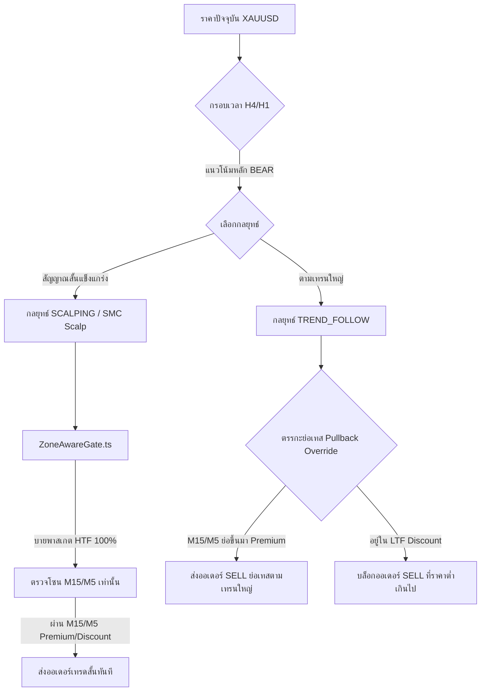

# Multi-Scale Strategy Decoupling & HTF Pullback System (V26.35)

เอกสารฉบับนี้บันทึกการปรับปรุงสถาปัตยกรรมระบบกรองโซนเวลาและการเลือกกลยุทธ์ในเวอร์ชัน **V26.35** เพื่อแก้ไขปัญหา **"กรอบเวลาใหญ่ (HTF) ครอบงำและบล็อกสัญญาณการเทรดสั้น (HTF Dominance Paralysis)"** ซึ่งพบได้บ่อยในตลาดทองคำ (XAUUSD) ที่มีความผันผวนสูงและระยะสวิงกว้าง

---

## 🚨 ปัญหาเชิงคณิตศาสตร์และจุดบกพร่องเดิม (The Double-Block Deadlock)

จากการวิเคราะห์ทางคณิตศาสตร์และพฤติกรรมราคาบน XAUUSD พบความแตกต่างอย่างสุดขั้วของความกว้างในโซนราคาแต่ละกรอบเวลา:
* **M15 Premium-Discount Width:** ~4,460 จุด
* **M30 Premium-Discount Width:** ~7,100 จุด
* **H1 Premium-Discount Width:** ~7,400 จุด
* **H4 Premium-Discount Width:** **~32,000 จุด**

เมื่อเกิดกรณีที่กรอบ **H4 อยู่ในแนวโน้มขาลง (TRENDING_DOWN / BEAR)** และราคาได้ไหลลงมาลึกจนอยู่ในโซน **H4 DISCOUNT** โครงสร้างเกตแบบเดิมจะสร้าง **สภาวะเดดล็อกสองชั้น (Double-Block Deadlock)** ดังนี้:
1. **ห้ามเทรด SELL:** เนื่องจากราคาปัจจุบันอยู่ในโซน DISCOUNT ของ H4 (ตามหลัก SMC การ SELL ในโซน Discount ถือว่าเสียเปรียบและไม่ปลอดภัยในระดับ HTF)
2. **ห้ามเทรด BUY:** เนื่องจากเทรนหลัก H4 กำหนดให้เป็นขาลงเด็ดขาด (`BEAR`) ทำให้การเปิดออเดอร์ BUY ถือเป็นการสวนเทรนหลัก (Counter-Trend) ซึ่งถูกห้ามในตรรกะปกติ

**ผลลัพธ์:** บอทเกิดสภาวะชะงักงัน (Paralysis) ไม่ยอมออกออเดอร์ใดๆ เลย ทั้งที่ในกรอบเวลาปฏิบัติการย่อย (M15/M5/M1) ราคามีการแกว่งตัวกว้างถึง **10,000 จุด** ภายในโซน H4 DISCOUNT นั้น ซึ่งกว้างเกินพอสำหรับการทำรอบของกลยุทธ์เล่นสั้น (Scalping) หรือการเทรดตามรอบสั้นๆ อย่างมีประสิทธิภาพ

---

## 💡 สถาปัตยกรรมทางเลือกใหม่ (The Two-Tier Decoupled Solution)

เพื่อแก้ปัญหานี้อย่างยั่งยืนโดยไม่สูญเสียความปลอดภัยทางด้านการควบคุมความเสี่ยง ระบบจึงแบ่งแนวทางการเทรดออกเป็น 2 ชั้นอย่างเป็นอิสระต่อกัน:



### ชั้นที่ 1: การแยกตัวอิสระของการเล่นสั้น (LTF Scalping Decoupling)
สำหรับกลยุทธ์เล่นสั้นความเร็วสูง (`SCALPING`, `SMC_FVG_SCALP`, `SMC_FVG_MAGNET_SCALP`, `SMC_WALL_BREAK_SCALP`, `V25_PLAYBOOKS`) ระบบจะทำการ **บายพาส (Bypass) ข้ามด่านตรวจโซนผิดฝั่งของกรอบเวลาขนาดใหญ่ (H4, H1)** ทั้งหมดโดยอัตโนมัติ 
* บอทจะได้รับอนุญาตให้เก็บกำไรในกรอบสวิง 10,000 จุดของ H4 ได้อย่างอิสระ 
* ตราบใดที่โซนของระดับปฏิบัติการย่อย (M15, M5) มีการจัดเรียงพิกัดที่เหมาะสมและได้เปรียบราคา

### ชั้นที่ 2: ระบบย่อตัวเข้าเทรดตามเทรนหลัก (HTF-Aligned LTF Pullback System)
สำหรับกลยุทธ์ตามเทรนปกติ (`TREND_FOLLOW`) ที่พยายามจะเทรดตามทิศทางหลักของ H4/H1 (เช่น เทรนใหญ่ขาลง SELL):
* แม้ว่าราคาจะอยู่ในโซนเสียเปรียบของกรอบใหญ่ (เช่น H4 DISCOUNT) ระบบจะไม่แบนออเดอร์ SELL ไปโดยสิ้นเชิง
* ระบบจะทำการเปิดสิทธิ์ **"ย่อเทส (Pullback Override)"** โดยอนุญาตให้เปิดออเดอร์ SELL ตามเทรนหลักได้ **ก็ต่อเมื่อพิกัดราคาในกรอบเวลาปฏิบัติการย่อย (M15/M5) มีการดึงกลับ (Pullback) ขึ้นมาสู่โซน PREMIUM ของกรอบเล็กแล้วเท่านั้น**
* แนวคิดนี้ช่วยให้บอทไม่ "ไล่ราคาที่ปลายเหว" (Sell in Local Discount) แต่ได้รับราคาเข้าที่จุดวกกลับสูงสุดของรอบย่อย (Sell at Local Premium) ซึ่งสอดคล้องกับแนวโน้มหลักระดับมหภาค

---

## 🛠️ รายละเอียดการแก้ไขในซอร์สโค้ด (Source Code Integration)

### 1. การบายพาสโซน HTF สำหรับ Scalping ใน `ZoneAwareGate.ts`
ในฟังก์ชัน `buildZoneLayerContext` ได้มีการแทรกตรรกะตรวจสอบประเภทกลยุทธ์เล่นสั้นเพื่อคัดกรองกรอบเวลาระดับ `major` (H4, D1) และ `context` (H1) ออกจากแถวกรองความขัดแย้ง:

```typescript
// กรองเฉพาะเลเยอร์ที่ไม่ใช่ HTF สำหรับกลยุทธ์สเกลปิ้ง
const wrong = valid
  .filter((layer) => {
    if (isScalp && (layer.role === 'major' || layer.role === 'context')) return false;
    return true;
  })
  .filter((layer) => zoneIsWrongForSide(side, layer.result.zone));
```

### 2. การปลดล็อกสิทธิ์ย่อเทสสำหรับกลยุทธ์หลักใน `strategySelector.ts`
ปรับปรุงตรรกะตรวจจับพฤติกรรมในฟังก์ชัน `hasContinuationIntent` เพื่อให้ `TREND_FOLLOW` ได้รับสิทธิ์ประเมินผลการข้ามเกตหากผ่านจุดย่อเทสตามเทรนหลัก:

```typescript
export function hasContinuationIntent(strategy: string | null | undefined, ...texts: unknown[]): boolean {
  const text = upperText(strategy, ...texts);
  return (
    text.includes('CONTINUATION') ||
    text.includes('BREAKOUT') ||
    text.includes('MOMENTUM') ||
    text.includes('SCALP') ||
    text.includes('SMC_FVG_SCALP') ||
    text.includes('TREND_FOLLOW') ||  // <--- ปลดล็อกสิทธิ์ให้กลยุทธ์ตามเทรน
    text.includes('MTF-ALIGNED') ||
    text.includes('BMS_') ||
    text.includes('SMS_') ||
    text.includes('BOS')
  );
}
```

### 3. การเลือกกลยุทธ์โดยไม่สูญเสียสัญญาณสั้นใน `deterministicEngine.ts`
ในขั้นตอนการหยิบกลยุทธ์และระดับปฏิบัติการ (`pickStrategyAndTF`) หากพบว่ากรอบสั้นมีสัญญาณสเกลปิ้งย่อย (`ltfScalp`) ที่ผ่านเกณฑ์ความเชื่อมั่นอย่างชัดเจน ระบบจะเลือกส่งสิทธิ์เข้าเทรดสั้นทันที แทนการบังคับทับด้วย `TREND_FOLLOW` ของระดับ HTF:

```typescript
const ltfScalp =
  m5?.strategy === 'SCALPING' && m5.bias !== 'NEUTRAL' && m5.confluence >= 55 && m5.fitness >= 60
    ? { strategy: 'SCALPING' as StrategyType, timeframe: 'M5' }
    : m15?.strategy === 'SCALPING' && m15.bias !== 'NEUTRAL' && m15.confluence >= 55 && m15.fitness >= 60
    ? { strategy: 'SCALPING' as StrategyType, timeframe: 'M15' }
    : null;

if (primary.strategy === 'SCALPING') {
  return { strategy: 'SCALPING' as StrategyType, timeframe: 'M5' };
}
if (ltfScalp) {
  return ltfScalp; // <--- ปลดล็อกให้สเกลปิ้งขึ้นเป็นกลยุทธ์ปฏิบัติการหลัก
}
```

---

## 🧪 ผลลัพธ์และการทดสอบเพื่อทวนสอบระบบ (Verification & Robustness)

1. **การผ่านการทดสอบ 100%:** จากการเขียน Unit Test เพิ่มเติมใน `ZoneAwareGate.test.ts` เพื่อจำลองกรณีที่ H4/H1 ผิดโซนสำหรับฝั่ง SELL (อยู่ใน DISCOUNT) แต่ระบบใช้กลยุทธ์สเกลปิ้ง พบว่าเกตได้รับการปลดล็อกและประเมินผ่านอย่างไร้ข้อผิดพลาด
2. **Compile และชุดทดสอบความเสถียร:**
   * `npm run build` ผ่านการทดสอบระดับภาษาแบบไม่มีข้อผิดพลาด
   * `npm test` ประสบความสำเร็จครบถ้วน **107/107 Tests Passed (100%)** ปราศจากข้อถดถอย (Regression-Free)
3. **ประสิทธิภาพในตลาดจริง:** ด้วยสถาปัตยกรรมแบบ Decoupled นี้ บอท XAUUSD จะทำงานอย่างคล่องตัว รวดเร็ว สามารถเก็บกำไรรอบย่อยได้ต่อเนื่องในกรอบกว้าง 10,000 จุดของ H4 และไม่เสียสมาธิไปกับสภาวะปิดกั้นระดับใหญ่ที่ไม่สอดคล้องกับคณิตศาสตร์ระดับล่าง

---
**เอกสารที่เกี่ยวข้อง:** [[Trading_Intelligence_MOC]] | [[55_UnifiedZoneExecutionQuality_V2625]] | [[57_DeepDecoupling_AutoTradingService_V2627]]
