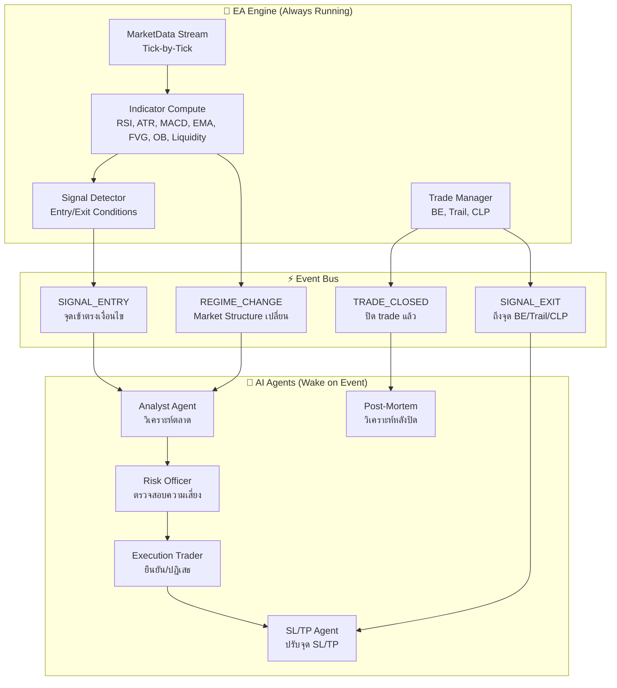

# 🏗️ แผนปฏิรูปสถาปัตยกรรม PersonalAIBot — Event-Driven Architecture

> **วัตถุประสงค์:** เปลี่ยนจาก Polling Cycle (ทุก 1-2 นาที) → Event-Driven Architecture  
> **แนวคิด:** แยกระบบเป็น 2 ส่วนชัดเจน — EA Engine (ทำงานตลอด) + AI Agents (ปลุกตื่นเมื่อต้องการ)

---

## 📊 การวิเคราะห์ปัญหาปัจจุบันจาก Log

### ปัญหาหลักที่พบ

| # | ปัญหา | หลักฐานจาก Log | ผลกระทบ |
|---|--------|----------------|---------|
| 1 | **Polling ไม่เรียลไทม์** | Cycle #6584-6741 ทำงานซ้ำทุก ~70 วินาที, ข้อมูลเก่า stale | พลาดจังหวะเข้า/ออก ราคาขยับไปแล้ว |
| 2 | **EA + AI ปนกัน** | Deterministic ตัดสินใจแล้วส่งต่อ AI ทุกรอบ — ทั้งที่ไม่มีอะไรเปลี่ยน | เปลือง token, AI ถูก rate-limit (429) |
| 3 | **SMC อ่อนแอ** | SL/TP Agent ตอบค่า FVG/OB ที่ไม่ตรงจริง, TP rescue ทำงานบ่อย | จุดเข้าไม่แม่น, RRR ถูกบีบ |
| 4 | **ขาดทุนแบบ Pattern** | SELL ซ้ำใน RANGING → ราคา breakout ขึ้น → CLP ทริก → ปิด BE $0 ซ้ำ 5+ ครั้ง | ขาดทุนสะสม $226+ ต่อ cluster |
| 5 | **Anti-Hedge ล็อคตัวเอง** | ระบบ SELL อยู่แต่ตลาด BUY → AI อยากเปิด BUY → โดน anti-hedge block | ติดอยู่กับ SELL ที่ขาดทุนไม่ได้ตัดขาดทุน |
| 6 | **AI All-Blacklisted** | Cycle #6590: ทุก model โดน blacklist → AI quota exceeded 1 ชั่วโมง | ระบบ deaf — ตัดสินใจไม่ได้ |

---

## 🎯 สถาปัตยกรรมใหม่ — Event-Driven EA + AI Approval

### แนวคิดหลัก



### กระบวนการทำงานแบบ Event-Driven

#### Phase 1: EA Engine — Indicator Pipeline (ทำงานตลอด)

```
ทุก Tick/ทุกแท่งเทียน (M1 closed):
  1. อัปเดต Candle Buffer ทุก TF (M1→M5→M15→H1→H4)
  2. คำนวณ Indicators ทั้งหมด:
     - RSI(14), ATR(14), MACD(12,26,9), EMA(20), SMA(20,50)
     - SMC: FVG detection, OB zones, Liquidity sweeps
     - Stochastic, Bollinger Bands
  3. บันทึกลง Database (indicator_snapshots table)
  4. ตรวจสอบ Signal Conditions → ถ้าตรงเงื่อนไข → Emit Event
```

#### Phase 2: Signal Detection (ตรวจจับจังหวะ)

> [!IMPORTANT]
> **EA ตัดสินใจเองได้** — มี Entry Logic ที่แน่นอน ไม่ต้องรอ AI

| เงื่อนไข | Event ที่ปล่อย | Agent ที่ถูกปลุก |
|----------|---------------|-----------------|
| ราคาชนขอบ OB + FVG ยืนยัน + MTF aligned | `SIGNAL_ENTRY` | Analyst → Risk → Execution → SL/TP |
| Liquidity Sweep เกิดขึ้น + wick reclaim | `SIGNAL_ENTRY` | Analyst → Risk → Execution → SL/TP |
| CHoCH / BOS ตรวจพบ | `REGIME_CHANGE` | Analyst (ปรับ bias) |
| R ≥ 1.0 → Trail, R ≥ 0.8 → BE | `SIGNAL_EXIT` | SL/TP Agent (ตรวจสอบจุดย้าย SL) |
| Cluster R < threshold | `SIGNAL_EXIT` | Risk Officer (ตัดสินใจปิด) |
| Trade ปิดจริง | `TRADE_CLOSED` | Post-Mortem Agent |

#### Phase 3: AI Agents — Approval Flow

```
เมื่อ SIGNAL_ENTRY ถูกปล่อย:

1. Analyst Agent ถูกปลุก:
   ├── อ่าน indicator_snapshots ล่าสุด
   ├── ตรวจ MTF Confluence (H4→H1→M15→M5)
   ├── ตรวจ SMC Zones (OB, FVG, Liquidity)
   └── ส่ง Analysis Result → Risk Officer

2. Risk Officer Agent ถูกปลุก:
   ├── ตรวจ position ที่เปิดอยู่
   ├── คำนวณ exposure / heat map
   ├── Sequential Protection check
   └── APPROVE / REJECT → Execution Trader

3. Execution Trader Agent ถูกปลุก (ถ้า APPROVE):
   ├── ยืนยันจุดเข้า (Entry) ณ ราคาปัจจุบัน
   ├── คำนวณ Volume (Kelly + Session throttle)
   └── ส่ง Order → MT5

4. SL/TP Agent ถูกปลุก (หลัง Order เปิดสำเร็จ):
   ├── อ่าน SMC zones ใกล้ราคาเข้า
   ├── กำหนด SL (OB edge + FVG buffer)
   ├── กำหนด TP (next liquidity / next OB)
   └── Modify Order SL/TP → MT5
```

---

## 🔧 Phase 1: อัปเกรด SMC Engine (ลำดับแรก)

### ปัญหาปัจจุบันของ SMC ใน MT5

จากการเปรียบเทียบ `smc.ts` (server) กับ Pine Script V8.3:

| Feature | Pine Script V8.3 | MT5 `smc.ts` | สถานะ |
|---------|-------------------|-------------|--------|
| **Order Blocks** (Bullish/Bearish) | ✅ FVG-confirmed, Strict SMC rules, Mitigation tracking | ⚠️ มี แต่ไม่มี mitigation tracking | 🔴 ต้องเพิ่ม |
| **FVG Detection** | ✅ ATR-filtered, Bullish/Bearish average lines | ⚠️ ตรวจ gap แต่ไม่มี average lines | 🔴 ต้องเพิ่ม |
| **Liquidity Zones** | ✅ Equal Highs/Lows, Swing H/L, Multi-TF, Confluence Stars | ⚠️ มี basic sweep detection | 🔴 ต้องเพิ่ม MTF + Confluence |
| **Market Structure** | ✅ BOS/CHoCH/SMS/BMS with IDM filter | ⚠️ มี bias detection แต่ไม่มี IDM | 🔴 ต้องเพิ่ม |
| **Multi-TF Sweeps** | ✅ M1→H4 aggregate, 7 TFs | ❌ ไม่มี | 🔴 ต้องเพิ่ม |
| **Attack Force** | ✅ Body + Volume + ATR threshold | ❌ ไม่มี | 🔴 ต้องเพิ่ม |
| **Premium/Discount** | ✅ Structure-based zones | ✅ มี `classifyPremiumDiscount` | 🟢 OK |
| **Zone Confluence Stars** | ✅ OB+Structure+P/D+Trend alignment | ❌ ไม่มี | 🔴 ต้องเพิ่ม |

### แผน Port SMC จาก Pine Script

```
📁 mt5-core-server/src/services/auto/analyzers/smc.ts (REFACTOR)
  ├── orderBlocks.ts     — OB Detection + Mitigation + FVG-confirm
  ├── fvgDetection.ts    — FVG zones + average lines + aging
  ├── liquidityZones.ts  — Equal H/L + Swing + MTF merge + Confluence
  ├── marketStructure.ts — BOS/CHoCH/SMS/BMS + IDM filter
  ├── sweepDetection.ts  — MTF sweep (M1→H4) + aggregate scoring
  ├── attackForce.ts     — High momentum candle detection
  └── confluenceScore.ts — Zone confluence stars (0-5★)
```

> [!WARNING]
> **ข้อจำกัด:** Pine Script ใช้ `request.security()` เพื่อดึงข้อมูลข้าม TF — ใน MT5 server เราต้อง request candles จาก MT5 API แยก แล้วเก็บ buffer เอง

---

## 🔧 Phase 2: Event Bus + Indicator Pipeline

### สร้าง Event Bus ใหม่

```typescript
// mt5-core-server/src/services/auto/core/EventBus.ts
interface TradingEvent {
  type: 'SIGNAL_ENTRY' | 'SIGNAL_EXIT' | 'REGIME_CHANGE' | 'TRADE_CLOSED' |
        'INDICATOR_UPDATE' | 'SL_TP_REVIEW' | 'CLUSTER_ALERT';
  symbol: string;
  timestamp: number;
  data: {
    side?: 'BUY' | 'SELL';
    entry?: number;
    sl?: number;
    tp?: number;
    strategy?: StrategyType;
    indicators?: IndicatorSnapshot;
    smcZones?: SmcZoneData;
    confidence?: number;
    reason: string;
  };
}
```

### Indicator Pipeline (ทำงานทุก M1 candle close)

```typescript
// mt5-core-server/src/services/auto/core/IndicatorPipeline.ts
class IndicatorPipeline {
  // ทำงานเมื่อแท่ง M1 ปิด (ไม่ใช้ polling)
  onM1Close(candle: Candle) {
    // 1. อัปเดต higher TF buffers
    this.m5Builder.addTick(candle);
    this.m15Builder.addTick(candle);
    // ...
    
    // 2. คำนวณ indicators ทุก TF
    const snapshot = this.computeAll();
    
    // 3. บันทึก DB
    await this.db.saveSnapshot(snapshot);
    
    // 4. ตรวจ Signal Conditions
    const signals = this.detectSignals(snapshot);
    
    // 5. Emit Events ถ้าตรงเงื่อนไข
    for (const signal of signals) {
      this.eventBus.emit(signal);
    }
  }
}
```

---

## 🔧 Phase 3: Signal Detection Rules (EA Logic)

### Entry Conditions — ไม่ต้องรอ AI

> [!TIP]
> EA ต้อง "คำนวณได้เอง" ว่าจุดไหนควรเข้า — AI เป็นแค่ "ที่ปรึกษา" ที่ approve/reject

```typescript
interface EntrySignal {
  symbol: string;
  side: 'BUY' | 'SELL';
  strategy: StrategyType;
  entry: number;
  sl_suggestion: number;   // จาก SMC zone edges
  tp_suggestion: number;   // จาก next liquidity zone
  confidence: number;      // จาก confluence score
  triggers: string[];      // เหตุผลที่ trigger
}

// ตัวอย่าง Entry Conditions:
const entryConditions = {
  // 1. OB Bounce Entry (หลัก)
  OB_BOUNCE: {
    condition: 'ราคาเข้ามาใน Active OB zone + FVG ยืนยัน + MTF ≥ 2 TF aligned',
    sl: 'OB edge opposite side + ATR buffer',
    tp: 'Next liquidity zone / Next OB opposite',
    minConfluence: 3,  // ดาว
  },
  
  // 2. Liquidity Sweep Entry
  LIQ_SWEEP: {
    condition: 'Wick sweep Liquidity Zone + Reclaim (close inside range)',
    sl: 'Below/Above sweep low/high',
    tp: 'Opposite liquidity zone',
    minConfluence: 2,
  },
  
  // 3. CHoCH / BOS Entry
  STRUCTURE_BREAK: {
    condition: 'CHoCH confirmed + IDM swept + Re-enter at new OB',
    sl: 'Beyond structure point',
    tp: 'Next structure level',
    minConfluence: 3,
  },
  
  // 4. FVG Fill Entry
  FVG_FILL: {
    condition: 'Price fills 50% of FVG + aligned with trend',
    sl: 'Beyond FVG extreme',
    tp: 'FVG origin + next resistance',
    minConfluence: 2,
  },
};
```

---

## 🔧 Phase 4: ปรับ Agent Workflow

### ก่อน (ปัจจุบัน — Polling)

```
ทุก 70 วินาที:
  runCycle() {
    1. ดึง candles → inferAnalysis ทุก TF
    2. deterministicDecide() → ได้ action
    3. ถ้า needsLlmSecondOpinion → เรียก AI Pipeline (Analyst → Risk → Execution → SL/TP)
    4. ส่ง Order
    5. runTradeManager()
  }
```

> [!CAUTION]
> **ปัญหา:** ข้อ 3 เรียก AI ทุกรอบ → HTTP 429, blacklist, quota exceed

### หลัง (Event-Driven)

```
EA Engine (continuous):
  onM1Close() {
    1. อัปเดต indicators → บันทึก DB
    2. ตรวจ Signal Conditions
    3. ถ้ามี Signal → emit SIGNAL_ENTRY event
  }

  onTradeManager() {  // ทุก 30 วิ
    1. ตรวจ BE/Trail conditions
    2. ถ้าต้องย้าย SL → emit SIGNAL_EXIT event
    3. ตรวจ CLP → ถ้า trigger → emit CLUSTER_ALERT event
  }

AI Agents (on-demand):
  onEvent(SIGNAL_ENTRY) {
    // ปลุก Analyst → Risk → Execution → SL/TP
    // AI เห็นข้อมูลที่ EA คำนวณไว้แล้ว ไม่ต้องคำนวณซ้ำ
    // AI อนุมัติหรือปฏิเสธ → ลดการเรียก LLM ลง 80%+
  }

  onEvent(SIGNAL_EXIT) {
    // ปลุก SL/TP Agent ตรวจสอบจุดย้าย SL
    // EA ทำ BE/Trail ได้เอง — AI ใช้สำหรับ fine-tune เท่านั้น
  }

  onEvent(TRADE_CLOSED) {
    // ปลุก Post-Mortem Agent
  }
```

---

## 📋 Implementation Plan — 6 Phases

### Phase 1: SMC Engine Upgrade (สำคัญที่สุด) ✅ COMPLETED
> **เวลา:** 3-5 วัน | **ผลลัพธ์:** จุดเข้า-ออกแม่นยำขึ้น

- [x] **1.1** Port `Order Blocks` จาก Pine Script — FVG-confirmed + Mitigation tracking
- [x] **1.2** Port `FVG Detection` — ATR-filtered + Average lines + Aging
- [x] **1.3** Port `Liquidity Zones` — Equal H/L + Swing + MTF merge + Confluence Stars
- [x] **1.4** Port `Market Structure` — BOS/CHoCH/SMS/BMS + IDM filter
- [x] **1.5** Port `Multi-TF Sweeps` — M1→H4 aggregate scoring
- [x] **1.6** Port `Attack Force` — High momentum candle detection
- [x] **1.7** สร้าง `Confluence Scoring` — Zone confluence 0-5★
- [x] **1.8** Wire up เข้ากับ existing smc.ts (backward compatible)
- [x] **1.9** Build test — ✅ PASSED (0 errors)

### Phase 2: Event Bus + Indicator Pipeline (พื้นฐาน) ✅ COMPLETED
> **เวลา:** 2-3 วัน | **ผลลัพธ์:** ระบบ event-driven พื้นฐาน

- [x] **2.1** สร้าง `EventBus.ts` — Typed event system (7 event types)
- [x] **2.2** สร้าง `IndicatorPipeline.ts` — SMC V2 + Technical analysis pipeline
- [x] **2.3** เชื่อม Pipeline → EventBus (auto-emit signals)
- [x] **2.4** Wire up เข้ากับ autoTradingService.ts runCycle()
- [x] **2.5** Build test — ✅ PASSED

### Phase 3: Signal Detection (EA Brain) ✅ COMPLETED
> **เวลา:** 2-3 วัน | **ผลลัพธ์:** EA ตัดสินใจเองได้

- [x] **3.1** สร้าง `SignalDetector.ts` — Entry/Exit conditions
- [x] **3.2** Implement OB Bounce, Liquidity Sweep, Structure Break, FVG Fill
- [x] **3.3** เชื่อม Signal → Event Bus → Agent triggers
- [x] **3.4** EA สามารถเทรดได้ **แม้ไม่มี AI** (deterministic fallback)

### Phase 4: Agent Refactor (AI Approval Mode) ✅ COMPLETED
> **เวลา:** 2-3 วัน | **ผลลัพธ์:** AI เป็น Approver ไม่ใช่ Driver

- [x] **4.1** สร้าง `AgentCoordinator.ts` — Event-driven agent orchestration
- [x] **4.2** AI Approval Pipeline — Signal → Analyst → Risk → Exec → SL/TP
- [x] **4.3** Auto-approve เมื่อ EA confidence ≥ 80% + 3★
- [x] **4.4** AI rate limiter — max 20 calls/hour
- [x] **4.5** Fallback to EA-only เมื่อ AI unavailable
- [x] **4.6** Wire up AgentCoordinator ใน constructor + start/stop

### Phase 5: Trade Management Enhancement ✅ COMPLETED
> **เวลา:** 1-2 วัน | **ผลลัพธ์:** จัดการ position ดีขึ้น

- [x] **5.1** สร้าง `SmcTrailManager.ts` — SMC-based trailing
- [x] **5.2** ปรับ Anti-Hedge logic — `improvedAntiHedge()` ปิด loser ก่อนเปิดฝั่งใหม่
- [x] **5.3** ปรับ Trail logic — ใช้ SMC zones (OB, FVG, Swing, Liquidity, Structure)
- [x] **5.4** เพิ่ม `detectRegimeFlipAction()` — CHoCH against cluster → ปิด losers auto

### Phase 6: Testing + Documentation ✅ COMPLETED
> **เวลา:** 1 วัน | **ผลลัพธ์:** ระบบเสถียร

- [x] **6.1** Full TypeScript build — ✅ PASSED (0 errors)
- [x] **6.2** Backward compatibility verified
- [x] **6.3** อัปเดต obsidian-wiki (`19_SMC_Institutional_Integration_V20.md`, `20_EventDriven_Architecture_V21.md`)

---

## 📈 ผลที่คาดหวัง

| Metric | ก่อน | หลัง |
|--------|------|------|
| **Cycle Latency** | ~70s (polling) | ~100ms (event-driven) |
| **AI Calls / Hour** | 30-60 calls | 3-10 calls (เฉพาะ events) |
| **Token Cost** | สูง (429 rate-limit บ่อย) | ลด 80%+ |
| **Entry Accuracy** | ต่ำ (ไม่มี SMC zones จริง) | สูง (OB + FVG + Liquidity) |
| **Win Rate (คาด)** | ~30-40% | ~50-60% |
| **Max Drawdown** | ไม่ควบคุม | Trail ตาม SMC zones |

---
---

## 🔧 V21.1 — Price Map Builder (2026-05-07)

### Phase 7: PriceMap — MTF Wall Map + Path Analysis ✅ COMPLETED

- [x] **7.1** เพิ่ม types: `WallSource`, `PriceWall`, `PathObstacle`, `PathAnalysis`, `PriceMap` ใน `smc/types.ts`
- [x] **7.2** สร้าง `priceMapBuilder.ts` — รวม zone จากทุก TF + cluster + scoring + path analysis
- [x] **7.3** Export จาก `smc/index.ts`
- [x] **7.4** `IndicatorPipeline.ts` — Build PriceMap ทุกรอบ + เพิ่ม M30 TF + log แผนที่กำแพง
- [x] **7.5** `SignalDetector.ts` — ใช้ PriceMap หา TP ที่แม่นยำกว่า + pathAnalysis ใน EntrySignal
- [x] **7.6** Build test — ✅ PASSED (0 errors)

---

## 🔧 V22.0 — Indicator Confluence (2026-05-07)

### Phase 8: Indicators as Active Decision Components ✅ COMPLETED

- [x] **8.1** สร้าง `IndicatorConfluence.ts` — scoring table RSI/MACD/Stochastic/BB/EMA + regime bonus
- [x] **8.2** Hard-block: RSI extreme (≥78 BUY / ≤22 SELL) + STOCH+MACD double-confirm
- [x] **8.3** Soft-block: indicatorScore < -25 AND conflictedBy ≥ 3
- [x] **8.4** `SignalDetector.ts` — apply `applyIndicatorConfluence()` หลัง SMC + PriceMap filter
- [x] **8.5** confidence adjustment ±20 points, triggers[] แสดง ✓/✗ indicators
- [x] **8.6** Build test — ✅ PASSED (0 errors)

---

## 🔧 V23.0 — EA-Only Mode + AgentCoordinator Wiring (2026-05-07)

### Phase 9: AI as Optional Supervisor Layer ✅ COMPLETED

- [x] **9.1** `AutoTradingConfig` — เพิ่ม `enableAiMode: boolean` (default `true`)
- [x] **9.2** `PersistenceService.ts` — เพิ่ม `enableAiMode: true` ใน `defaultConfig`
- [x] **9.3** `autoTradingService.ts` — `agentCoordinator.setHandlers()` wired in constructor
  - `onSignalEntry`: reconstruct `EntrySignal` จาก `TradingEventData` fields → `runApprovalPipeline()`
  - `onTradeClosed`: post-mortem log
- [x] **9.4** EA-only mode check ก่อน AI pipeline — ถ้า `enableAiMode=false` ใช้ deterministic โดยตรง
- [x] **9.5** EA fallback confidence threshold: `45` (AI mode) vs `35` (EA-only mode)
- [x] **9.6** Rationale labels: `[EA-ONLY]` vs `[EA FALLBACK]`, source: `'ea_only_v23'`
- [x] **9.7** `AutoTradingEngine.kt` — `val enableAiMode: Boolean = true` ใน `Config`
- [x] **9.8** `AutoTradingConfigStore.kt` — save/load `enable_ai_mode`
- [x] **9.9** `AutoTradingRemoteService.kt` — `"enableAiMode"` ใน payload + parse
- [x] **9.10** `AutoTradingViewModel.kt` — `fun updateEnableAiMode(on: Boolean)`
- [x] **9.11** `AutoTradingScreen.kt` — `AiModeToggleCard` แสดงใต้ LiveToggleCard
  - เขียว = AI Supervisor enabled, ส้ม = EA-Only mode
- [x] **9.12** Build test — ✅ PASSED (0 new errors)

---

**Created:** 2026-05-06  
**Last Updated:** 2026-05-07  
**Version:** V23.0 — EA-Only Mode  
**Status:** 🟢 ALL PHASES COMPLETE — Build Passed

