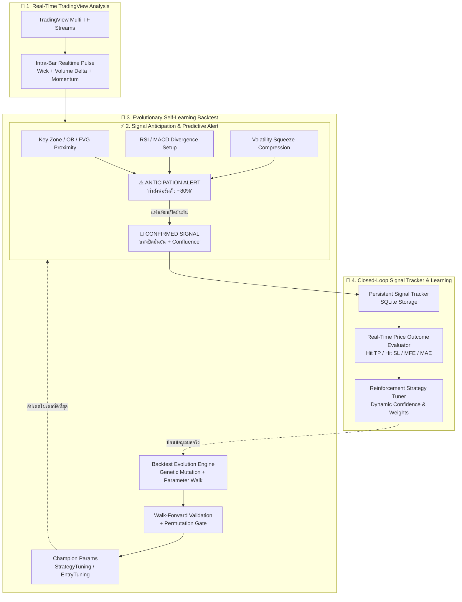

# 📱 แผนงานยกระดับ Mobile AI Trading Intelligence (PersonalAIBot)

> **วันที่บันทึก:** 2026-09-04  
> **เป้าหมาย:** พัฒนาระบบอัจฉริยะบนแอปมือถือ (Compose Multiplatform) ให้วิเคราะห์เรียลไทม์, คาดการณ์สัญญาณล่วงหน้า, มี Backtest วิวัฒนาการตัวเอง, และมีวงจรติดตามผลพร้อมปรับกลยุทธ์จากผลกำไร/ขาดทุนอัตโนมัติ  
> **ขอบเขต:** `composeApp` (Android / KMP)

---

## 🎯 4 เสาหลักของการพัฒนา (The 4 Core Pillars)

---

## 📋 รายละเอียดการทำงานแต่ละส่วน

### เสาที่ 1: การวิเคราะห์ข้อมูลแบบเรียลไทม์จาก TradingView (Real-time TradingView Pipeline)
- **Intra-Bar Real-time Pulse**: วิเคราะห์แท่งเทียนปัจจุบันที่ยังไม่ปิด (`bar n-1`) ระดับ M1/M5 ตรวจสอบแรงซื้อขาย (Volume Delta), การปฏิเสธราคาจากไส้เทียน (Wick Rejection), และ Dynamic Price Momentum
- **Live Multi-TF Confluence Fusion**: ขยาย `TradingViewSignalIntelligence.kt` ให้ประเมินผลคะแนน Confluence ทั้ง M15, M30, H1, H4 แบบเรียลไทม์ ไม่ต้องพึ่งพา Server MT5

### เสาที่ 2: การแจ้งเตือน Signal และการคาดการณ์ Signal ล่วงหน้า (Anticipation / Pre-Signal Alert)
- **ระบบแจ้งเตือน 2 สเต็ป (Dual-State Alerting)**:
  1. `ANTICIPATION` (เตือนล่วงหน้า):
     - ราคาเข้าใกล้ Key Level / Active OB / FVG ในระยะ $\le 0.5 \times \text{ATR}$
     - เกิด Liquidity Sweep บน M1/M5 หรือ RSI Divergence ฟอร์มตัว
     - แจ้งเตือนข้อความ/เสียง: *"⚠️ [คาดการณ์ BUY] XAUUSD กำลังทดสอบแนวรับ OB ... รอแท่งคอนเฟิร์ม"*
  2. `CONFIRMED` (สัญญาณยืนยัน):
     - เกิดขึ้นเมื่อแท่งปิดสมบูรณ์ พร้อมระบุ Entry, SL, TP, RRR ชัดเจน
- **พารามิเตอร์ที่ส่งออกใน Alert Provider**:
  - `signal_stage`: `"ANTICIPATION"` | `"CONFIRMED"`
  - `signal_anticipation_desc`: รายละเอียดการคาดการณ์และสิ่งที่ต้องรอ

### เสาที่ 3: ระบบ Backtest ที่เรียนรู้และพัฒนาตัวเองได้ (Self-Learning & Evolutionary Backtest)
- **Genetic Parameter Evolution**: ต่อยอด `BacktestEvolution.kt` และ `AdaptiveOptimizer.kt` ให้วิวัฒนาการทั้ง Entry Params และ SL/TP Multipliers
- **Regime-Adaptive Gene Pool**: คัดเลือกยีนที่ชนะในแต่ละ Regime (Trending, Ranging, Volatile)
- **Auto-Promotion into StrategyTuning**: เมื่อยีนผ่าน Walk-Forward Out-of-Sample และ Overfitting Gate จะบันทึกลง SQLite `StrategyTuning` และ `EntryTuning` อัตโนมัติ

### เสาที่ 4: ระบบติดตามผล Signal และเรียนรู้จากกำไร/ขาดทุน (Closed-Loop Learning Feedback)
- **Persistent Signal Tracking (`SignalTrackingRecord`)**:
  - สร้างตาราง SQLite สำหรับบันทึกทุกสัญญาณที่ Alert ส่งออกไป
  - มี Background Evaluator ตรวจราคาตลาดจริง ติดตามว่าชน TP, ชน SL หรือหมดเวลา พร้อมคำนวณ MFE (กำไรสูงสุดระหว่างทาง) และ MAE (ลากขาดทุนสูงสุด)
- **Reinforcement Strategy Auto-Tuning**:
  - เก็บสถิติ Win Rate, Profit Factor, และ Average R รายกลยุทธ์
  - **Dynamic Weighting**: ปรับเพิ่มคะแนนความมั่นใจ (Confidence Boost) ให้กลยุทธ์ที่กำลังชนะ และลดคะแนน/ระงับชั่วคราว (Soft-Freeze) สำหรับกลยุทธ์ที่แพ้ติดกันในสภาวะตลาดปัจจุบัน

---

## 🗓️ แผนการดำเนินการ (Execution Phases)

- [ ] **Phase 1: Signal Anticipation & Predictive Alert Engine**
  - เพิ่มการตรวจจับ Pre-Signal ใน `SignalAlertProvider.kt`
  - รองรับ Keyzone Proximity, RSI Divergence Setup, Intra-bar Wick Sweep
  - ส่งออกสถานะ `signal_stage` ("ANTICIPATION" / "CONFIRMED")
- [ ] **Phase 2: Persistent Signal Outcome Tracker (ฐานข้อมูล + ตัวประเมินผล)**
  - เพิ่ม Table ใน `JarvisDatabase.sq` (`SignalTrackingRecord`)
  - สร้าง `SignalOutcomeTracker.kt` บันทึกและตรวจเช็คผลลัพธ์ (Hit TP / Hit SL / MFE / MAE)
- [ ] **Phase 3: Closed-Loop Strategy Auto-Tuning (Reinforcement Feedback)**
  - คำนวณ Performance Score รายกลยุทธ์
  - ปรับน้ำหนักการคัดเลือกสัญญาณใน `StrategyConfirmationGate` และ `SignalAlertProvider`
- [ ] **Phase 4: Real-time TradingView Fast Pulse & UI Integration**
  - แสดงสถานะ Anticipation / Live Confluence บนหน้าจอแชท และ Trading Screen
