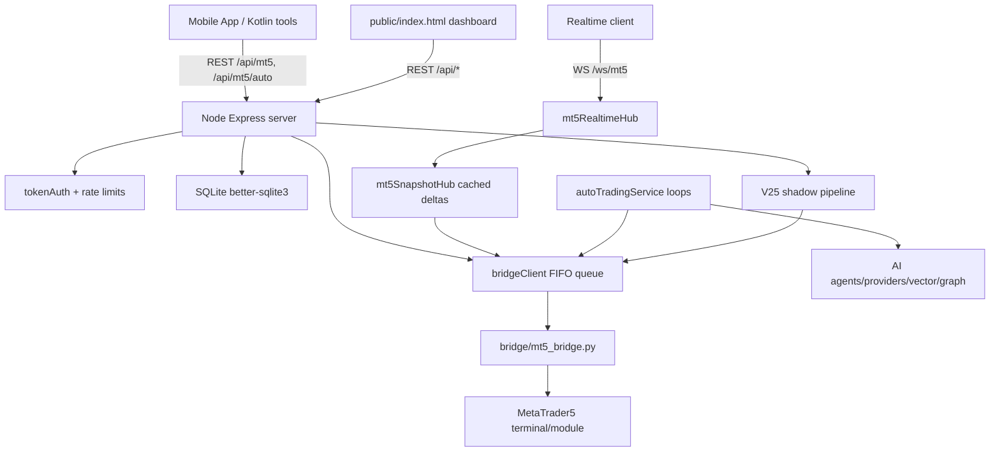
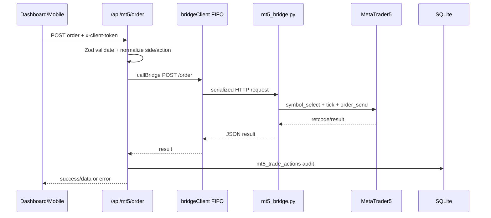
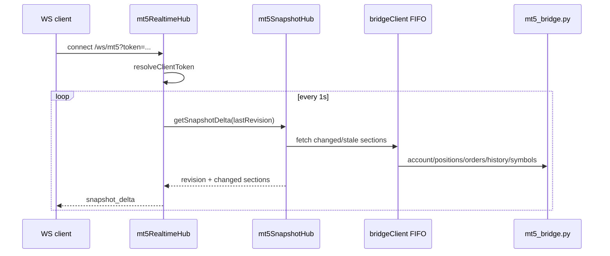
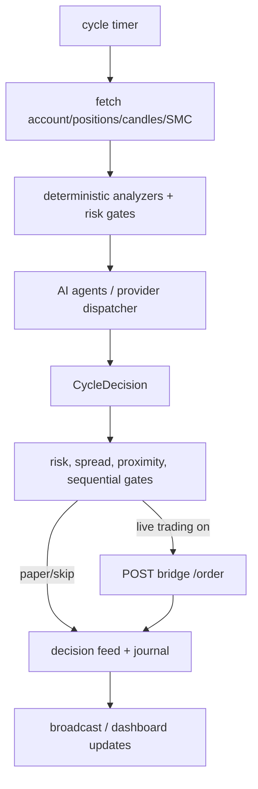

# mt5-core-server Deep Analysis - 2026-05-12

## Executive Summary

`mt5-core-server` is not only an MT5 HTTP proxy. It is a trading operations hub with five responsibilities:

1. Serve REST APIs and a web dashboard.
2. Authenticate mobile/web clients with admin and client token flows.
3. Supervise and serialize access to the Python MT5 bridge.
4. Run an auto-trading engine with deterministic filters, AI agents, model fallback, memory, journal, and management loops.
5. Provide realtime state delivery through WebSocket and the V25 shadow real-time wall engine.

The strongest parts are the explicit token model, bridge FIFO queue, snapshot caching/delta model, SQLite persistence, and modular V25/auto service direction. The main risks are complexity concentration in `autoTradingService.ts`, one global bridge queue shared by all API/UI/engine workloads, dashboard-side bulk trade actions, broad bridge CORS, query-token support for WebSocket, and mixed legacy/generated files in source folders.

## Runtime Topology

## Server Layer

Entry point: `mt5-core-server/src/index.ts`

Boot sequence:
- Loads config and required secrets from env.
- Calls `ensureBridgeReady()` before starting Express.
- Initializes SQLite schema with `initDb()`.
- Sets trace-id middleware, Pino request logging, CORS, JSON body limit, general rate limit.
- Serves static dashboard from `dist/public` runtime path (`../public` from compiled `dist/index.js`).
- Mounts routes:
  - `/health`: public liveness/readiness/metrics.
  - `/api/auth`: auth and pairing.
  - `/api/mt5/auto`: client-token protected auto-trading API.
  - `/api/mt5`: client-token protected MT5 API.
  - `/api/v25`: client-token protected V25 diagnostics.
- Handles WebSocket upgrade only for `/ws/mt5`.
- Starts V25 shadow from env or persisted UI config.
- Stops V25 and auto-trading on SIGINT/SIGTERM.

Security controls:
- `ADMIN_TOKEN`, `TOKEN_PEPPER`, and `DB_ENCRYPTION_KEY` are mandatory and reject insecure defaults.
- Client tokens are random, pepper-hashed in DB, can expire, and usage is logged.
- Mutation endpoints use a stricter per-IP + token rate limiter.
- Health endpoints are intentionally public.

Data model:
- MT5 operation audit: `mt5_trade_actions`, `mt5_snapshots`, `mt5_tracking_state`, `mt5_candle_cache`.
- Auth: `api_tokens`, `api_token_usage`, `pairing_requests`.
- Auto-trading: config/runtime/journal/management journal/decision feed.
- AI memory/ranking: `knowledge_nodes`, `knowledge_edges`, `ai_model_stats`, `ai_model_agent_stats`.

## Web Layer

Main asset: `mt5-core-server/public/index.html`

It is a single-file operational dashboard with:
- Client-token login flow through admin token token-creation.
- Auto-trading overview, start/stop/halt/run-once/learn commands.
- Open position table with manual modify, close, bulk close, and break-even actions.
- Account/risk analytics.
- Symbol browser using `/symbols-meta`, `/ticks`, `/market-watch`, `/symbols/deselect`.
- Provider/API-key management and per-agent model selection.
- Device pairing approval/rejection UI.

Dashboard polling:
- `refreshSnapshot()` calls `/api/mt5/auto/snapshot` and related endpoints.
- Snapshot polling interval is 30 seconds after boot.
- Symbol tick polling is every 3 seconds for visible symbols.
- Pairing requests refresh every 60 seconds.

Realtime:
- `mt5RealtimeHub.ts` exposes `/ws/mt5`, authenticates by client token, and pushes `snapshot_delta` messages.
- Hub polls `getSnapshotDelta()` every 1 second while at least one client is connected.
- Snapshot sections have different refresh intervals:
  - account/positions/orders: 1 second
  - history: 3 seconds
  - symbols: 15 seconds
- `mt5SnapshotHub.ts` deduplicates concurrent snapshot refreshes by `limit` and computes a short revision hash.

## MT5 API Layer

Main route: `mt5-core-server/src/routes/mt5.ts`

Read APIs:
- `/clients`, `/account`, `/positions`, `/symbols`, `/symbols-meta`, `/symbol-search`, `/ticks`, `/market-watch`, `/orders`, `/history`, `/snapshot`, `/candles`, `/tracking/state`, `/trade-actions`, `/analyze`.

Mutation APIs:
- `/clients/start`, `/clients/stop`.
- `/order`, `/close`, `/modify`.
- `/tracking/run-once`.
- `/symbols/deselect`.

Important behavior:
- Request validation uses Zod for order/close/modify/tracking/client actions.
- The route forwards to multiple bridge path aliases for backward compatibility.
- Trade actions are recorded in `mt5_trade_actions`.
- Snapshots are saved in `mt5_snapshots`.
- Candles are cached incrementally in `mt5_candle_cache`; requested count is adjusted from the last cached candle time.
- Symbol metadata is cached in memory for 5 minutes.
- Tick browsing caps requests to 32 symbols and caches ticks for 1.5 seconds.

## Python Bridge / MT5 Layer

Main bridge: `mt5-core-server/bridge/mt5_bridge.py`

Bridge characteristics:
- Uses Python `HTTPServer` and `BaseHTTPRequestHandler`.
- Calls the MetaTrader5 Python module directly.
- Caches MT5 initialization state:
  - OK TTL: 30 seconds.
  - Fail retry TTL: 3 seconds.
- Wraps all MT5 operations in `_MT5_OPS_LOCK`.
- Node also serializes all bridge calls through `bridgeClient.ts`, so there is a double safety layer.

Bridge GET endpoints:
- `/health`
- `/account`
- `/symbols`
- `/symbols-meta`
- `/symbol-search`
- `/positions`
- `/orders`
- `/history`
- `/symbol_info`
- `/market-watch`
- `/candles` or `/rates`
- `/smc`

Bridge POST endpoints:
- `/order`
- `/close`
- `/modify`, `/position/modify`, `/positions/modify`
- `/ticks_lite`
- `/symbols/select`, `/symbol_select`
- `/snapshots_bulk`

Execution behavior:
- `send_order()` resolves/selects symbol, reads current tick, chooses BUY at ask or SELL at bid, and sends `TRADE_ACTION_DEAL`.
- It tries filling modes based on broker symbol info, falling back IOC -> FOK -> RETURN.
- `close_position()` locates by ticket or symbol, sends the opposite market order.
- `modify_position()` uses `TRADE_ACTION_SLTP` to update SL/TP.

## Auto-Trading Layer

Main legacy orchestrator: `mt5-core-server/src/services/autoTradingService.ts`

Public control surface:
- `snapshot()`
- `updateConfig()`
- `start()`
- `stop()`
- `runOnce()`
- `learnNow()`
- `getDecisionFeed()`
- `getDecisionJournal()`
- `getManagementJournal()`
- `getPerformanceAnalytics()`
- `runDeepAnalysis()`

Loops:
- Cycle loop: market scan and decision generation.
- Manage loop: open position protection, break-even/trailing/close/hedge/scale-in logic.
- Learn loop: post-mortem, memory, model stats.

Modular system:
- `auto/agents`: Analyst, RiskOfficer, ExecutionTrader, SL/TP Analyst, PostMortem.
- `auto/analyzers`: technical, SMC, news, session, levels, breakout, mean reversion, etc.
- `auto/core`: persistence, market data, execution, management, proximity gate, model ranker, event bus.
- `auto/providers`: Gemini/OpenAI/Claude/OpenRouter/Ollama/Minimax/native dispatch.
- `auto/v25`: tick gateway, micro wall, wall state machine, playbooks, candidate selector.

V25 state:
- V25 is currently a shadow/diagnostic pipeline.
- It can boot from env (`V25_SHADOW=true`) or UI config (`adaptive.v25.enabled`).
- It produces diagnostics via `/api/v25/health`, `/api/v25/ticks/:symbol`, `/api/v25/state/:symbol`, `/api/v25/candidates/:symbol`.
- It does not appear to place orders directly yet; execution handoff is still a future integration point.

## Key Data Flows

### Manual Order

### Realtime Snapshot

### Auto-Trading Cycle

## Strengths

- Clear protected API boundary: client token for MT5/auto/V25, admin token for sensitive auth management.
- Bridge access is intentionally serialized, reducing MT5 module race risk.
- Snapshot delta model avoids forcing clients to fetch full state every time.
- SQLite schema captures config, runtime, trades, management actions, decision feed, tokens, usage, and model performance.
- Provider abstraction and per-agent model ranking are already in place.
- V25 is isolated as a shadow engine, reducing blast radius while developing real-time logic.
- Python bridge has practical broker compatibility logic for filling modes and symbol resolution.

## Risks And Improvement Targets

1. `autoTradingService.ts` is too large and carries too much responsibility.
   - Risk: difficult to reason about changes, high regression probability.
   - Direction: continue extracting cycle, management, learning, execution, and journal review into `auto/core/*`.

2. One FIFO bridge queue is shared by everything.
   - Risk: dashboard symbol browsing, realtime snapshots, V25 polling, manual commands, and auto-trading can block each other.
   - Direction: add priority lanes or operation classes. Manual trade mutations and risk-management commands should outrank dashboard tick browsing.

3. Web dashboard can trigger bulk close/break-even from client-side loops.
   - Risk: many sequential bridge calls, partial completion, poor recoverability.
   - Direction: add server-side bulk endpoints with one audited transaction plan and per-ticket result report.

4. WebSocket accepts token from query string.
   - Risk: tokens can leak via logs/history/proxies.
   - Direction: prefer `Sec-WebSocket-Protocol` or short-lived WS tickets; keep query token only for local dev.

5. Python bridge CORS is wildcard.
   - Risk: if exposed beyond localhost, it allows direct browser calls.
   - Direction: bind to `127.0.0.1` by default, require bridge token validation in Python, and avoid direct browser exposure.

6. Source folder contains patch/reject/temp files.
   - Risk: build tools or humans can confuse active source with failed patch artifacts.
   - Direction: move `autoTrading.ts.orig/.rej/.patch/.oHkf5Zy` out of `src`.

7. Error responses in `autoTrading.ts` hide the concrete message and only return `error_code`.
   - Risk: dashboard/debug sessions lose useful diagnostics.
   - Direction: return sanitized `message` in development and structured details for known safe errors.

8. V25 hot reload updates symbols but not gateway timing options.
   - Risk: UI changes to poll/stale settings may not actually apply until restart.
   - Direction: add a `reconfigure()` method to `TickGateway` or restart only the gateway cleanly.

9. `mt5Clients.ts` scans `C:\` by default on Windows.
   - Risk: slow scans and unnecessary disk traversal.
   - Direction: require `MT5_SCAN_ROOTS` or cap search roots to Program Files/AppData unless explicitly enabled.

10. Some comments/docs appear mojibake in terminal output.
    - Risk: Thai documentation may be hard to maintain if encoding is inconsistent.
    - Direction: normalize files to UTF-8 and keep editor/toolchain encoding fixed.

## Suggested Next Development Order

1. Add bridge queue priority and metrics for queue length/wait time.
2. Add server-side bulk close/break-even endpoints.
3. Extract `runCycle`, `runManage`, and `detectAndReviewClosedTrades` out of `autoTradingService.ts`.
4. Harden Python bridge auth and remove wildcard assumptions for non-local use.
5. Clean source artifacts and add a repository hygiene rule.
6. Finish `recordSlTpAccuracy()` and connect it to `ai_model_agent_stats.sl_tp_score`.
7. Add V25 execution handoff behind an explicit safety gate.
8. Add backtest/replay mode that uses the same analyzer/agent/risk interfaces without touching live MT5.
