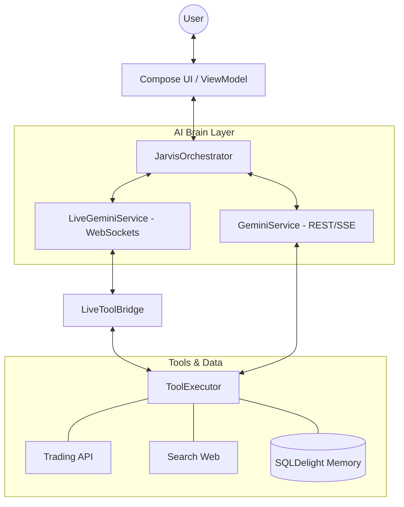

# 🤖 Personal AI Bot & Trading Agent On Mobile

[](https://kotlinlang.org/)
[](https://www.jetbrains.com/lp/compose-multiplatform/)
[](https://ai.google.dev/)
[](LICENSE)

**JARVIS** (PersonalAIBot) คือระบบผู้ช่วย AI ส่วนบุคคลระดับสูงที่สร้างขึ้นด้วย **Kotlin Multiplatform (KMP)** ออกแบบมาเพื่อเป็นทั้งเพื่อนคู่คิดและนักวิเคราะห์การเงินอัจฉริยะ ขับเคลื่อนด้วยพลังของ **Google Gemini 2.0/2.5/3.1**

---

## 🚀 Key Features (ความสามารถหลัก)

### 🎙️ 1. Live Voice Mode (ระบบสั่งการด้วยเสียงแบบ Real-time)
สัมผัสประสบการณ์การคุยกับ AI แบบไร้รอยต่อด้วย **Gemini Live API**:
- **Low Latency**: ตอบโต้ด้วยความเร็วสูงเหมือนคุยกับมนุษย์
- **Native Audio Flow**: ระบบจัดการ PCM Audio 16kHz พร้อม AEC (Acoustic Echo Cancellation) และ Noise Suppression
- **Voice-First Design**: เน้นการพูดคุยเป็นหลัก โดยมีระบบ Chat UI คอยซัพพอร์ตข้อมูลภาพประกอบ

### 📊 2. Agentic Financial Analysis (นักวิเคราะห์หุ้นอัจฉริยะ)
JARVIS ไม่เพียงแค่ตอบคำถาม แต่เขาสามารถ **"คิดและวางแผน"** การหาข้อมูลได้เอง:
- **Multi-round Orchestration**: วนลูปเรียกใช้ Tools อัตโนมัติ (เช่น Snapshot ตลาด -> เจาะลึกราคาหุ้นเด่น -> วิเคราะห์ TA) จนกว่าจะได้คำตอบที่สมบูรณ์ที่สุด
- **Proactive Execution**: ค้นหาข้อมูลเชิงลึกเพิ่มทันทีหากพบสัญญาณที่น่าสนใจในตลาด
- **Professional Reporting**: จัดทำรายงานที่อ่านง่าย มีตารางข้อมูล และบทสรุปเชิงลึก

### 🧠 3. Long-term Memory (ความจำระยะยาว)
ระบบจดจำข้อเท็จจริงและความต้องการของผู้ใช้:
- **Fact Storage**: บันทึกข้อมูลสำคัญลงในฐานข้อมูล SQLDelight
- **Recursive Recall**: ค้นหาและดึงความจำที่เกี่ยวข้องมาใช้ในการสนทนาอัตโนมัติ

---

## 🛠️ Performance Tools (เครื่องมือที่รองรับ)

JARVIS มาพร้อมกับชุดเครื่องมือ (Tools) มากกว่า 15 ชนิด:
- **Finance**: `trading_market_snapshot`, `trading_technical_analysis`, `trading_sentiment`, `trading_news`, `trading_combined`
- **Utilities**: `search_web` (Google Search), `calculate`, `translate_text`, `summarize_text`
- **Memory**: `remember_fact`, `recall_memory`

---

## 🧠 Intelligence System (ระบบสมองกล)

JARVIS ใช้สถาปัตยกรรม **Dual-Brain Orchestration** เพื่อมอบประสบการณ์ที่ดีที่สุดในแต่ละโหมด:

### 1. Chat Mode: Recursive Reasoning
ในโหมดแชทตัวอักษร JARVIS จะใช้ลูปการคิดแบบโต้ตอบ (Recursive Loop):
- **Tool Detection**: วิเคราะห์เจตนา (Intent) ของผู้ใช้เพื่อเลือกใช้เครื่องมือที่เหมาะสม
- **Data Reflection**: เมื่อได้รับข้อมูลจาก Tool แล้ว AI จะนำมาวิเคราะห์ต่อ หากข้อมูลยังไม่เพียงพอ ระบบจะเรียก Tool เพิ่มเติมโดยอัตโนมัติ (รองรับสูงสุด 5 รอบ)
- **Final Analysis**: รวบรวมข้อมูลทั้งหมดเพื่อสรุปและจัดทำรายงานในรูปแบบตารางและ Markdown ที่สวยงาม

### 2. Live Mode: Low-Latency Bidi-Stream
ในโหมดเสียง JARVIS จะทำงานผ่าน **Bidi-streaming WebSocket**:
- **Real-time Audio**: ใช้พลังของ Gemini 2.0/3.1 Flash สำหรับการโต้ตอบด้วยเสียงที่รวดเร็ว ( latency ต่ำกว่า 1 วินาที)
- **Live Tool Bridge**: ระบบส่งต่อคำสั่งพิเศษจาก Live API ไปยังชุดเครื่องมือ (Tools) ในเครื่อง และส่งผลลัพธ์กลับไปยัง AI เพื่อให้มัน "รับรู้" ทันที

---

## 🧠 Cognitive & Memory Systems (ระบบความคิดและความจำ)

JARVIS มาพร้อมกับสถาปัตยกรรมหน่วยความจำที่ซับซ้อนเลียนแบบการทำงานของสมองมนุษย์ แบ่งออกเป็น **4 เลเยอร์สำคัญ**:

### 1. 📂 4-Layer Memory Architecture
- **Layer 1: Core Memory (ความจำหลัก)**: เก็บข้อมูลพื้นฐานที่ JARVIS ต้องจำเกี่ยวกับคุณเสมอ (เช่น ชื่อ, อาชีพ, ความสนใจ) ข้อมูลส่วนนี้จะถูกใส่เข้าไปในทุกการสนทนาเพื่อให้ AI เข้าใจบริบทความเป็นคุณ
- **Layer 2: Working Memory (ความจำชั่วคราว)**: จัดเก็บประวัติการสนทนาล่าสุด เพื่อให้การพูดคุยมีความต่อเนื่องและลื่นไหล
- **Layer 3: Archival Memory (คลังความจำระยะยาว)**: เก็บรักษาข้อเท็จจริง (Facts) ที่เคยเกิดขึ้นในอดีต พร้อมระบบจัดเรียงตาม **"ระดับความสำคัญ" (Importance Score)**
- **Layer 4: GraphRAG (โครงข่ายความรู้)**: เชื่อมโยงข้อมูลต่างๆ เข้าด้วยกันในรูปแบบ Node และ Edge (Knowledge Graph) ทำให้ AI สามารถเข้าใจความสัมพันธ์เชิงเหตุและผลที่ซับซ้อนได้

### 2. 🌙 Sleep Cycle: The Dream Engine (ระบบหลับฝัน)
นวัตกรรมที่ทำให้ JARVIS เหนือกว่าแชทบอททั่วไป คือระบบ **"การรวมข้อมูลขณะพัก" (Consolidation Phase)**:
- **Knowledge Extraction**: เมื่อถึงเวลา "หลับ" JARVIS จะนำประวัติการสนทนาที่ยาวเหยียดมาวิเคราะห์และสกัดเอา "แก่นความรู้" ออกมา
- **Dreaming Logic**: AI จะทำการย้ายข้อมูลจาก Working Memory ไปยัง Archival Memory และสร้างความสัมพันธ์ใหม่ๆ ลงใน Knowledge Graph (เหมือนสมองมนุษย์ที่เรียบเรียงความจำขณะฝัน)
- **Data Compaction**: ช่วยให้เจตจำนงและความรู้เดิมไม่สูญหายไป แม้จะมีการลบประวัติการสนทนาเก่าๆ ออกเพื่อประหยัดพื้นที่และรักษาความเร็วนั่นเอง

---

## 🏗️ Technical Architecture (โครงสร้างสถาปัตยกรรม)



### Technology Deep Dive

| Layer | Technologies & Innovation |
| :--- | :--- |
| **AI Models** | `gemini-2.0-flash-exp`, `gemini-1.5-flash`, `gemini-3.1-flash` |
| **Voice UI** | รองรับโปรไฟล์เสียงมากกว่า **30 รูปแบบ** (เช่น Aoede, Puck, Charon) แยกเพศและบุคลิกได้ |
| **Audio Engine** | ระบบจัดการ PCM 16kHz พร้อมเปิดใช้งาน **Hardware AEC** และ **NoiseSuppression** |
| **Networking** | Ktor Client พร้อมฟีเจอร์ WebSockets สำหรับ Real-time Bidi-streaming |
| **Design** | **JarvisTheme**: ระบบ Dynamic Color ที่ใช้ค่า HSL เพื่อสร้างโทนสี Carbon/Cyan ที่พรีเมียม |

### 📂 Directory Structure (รายละเอียดโครงสร้าง)
- `/ai`: ส่วนควบคุมสมองกล (Orchestrator, Bridge logic สำหรับเชื่อมต่อ Live API เข้ากับ Tools)
- `/data`: ชั้นสื่อสารกับ AI (Gemini Services, WebSocket Frame Handler)
- `/tools`: ชุดทักษะของ AI (Financial API, Indicator Calculators, Long-term Memory)
- `/ui`: ส่วนแสดงผล (Material 3, Custom Components, Theme System)

---

---

## ⚙️ Setup & Installation

### Prerequisites
- Android Studio Iguana หรือเวอร์ชันใหม่กว่า
- [Google AI Studio API Key](https://aistudio.google.com/app/apikey)

### Steps
1. **Clone the repository**
   ```bash
   git clone https://github.com/your-username/PersonalAIBot.git
   ```
2. **Setup API Key**
   เปิดแอปขึ้นมาแล้วเข้าไปที่เมนู **Settings** จากนั้นนำ API Key จาก Google AI Studio มาใส่ให้เรียบร้อย
3. **Build & Run**
   เลือก Target เป็น Android หรือ iOS แล้วกด Run ได้เลย!

---

## 🔮 Future Roadmap
- [ ] Hardening iOS Native Audio implementation.
- [ ] Integration with advanced charting libraries for Technical Analysis.
- [ ] Custom Voice Profiles (Voice cloning support).
- [ ] Visual Intent (ใช้กล้องมือถือร่วมกับการสนทนาในโหมด Live).

---

## 📄 License
Disclaimer: โปรเจคนี้สร้างขึ้นเพื่อการศึกษาและการใช้งานส่วนบุคคล ข้อมูลจากการวิเคราะห์ทางการเงินไม่ใช่คำแนะนำในการลงทุน (Financial Advice) โปรดใช้วิจารณญาณในการตัดสินใจ

---
*Created with ❤️ by Antigravity (Advanced AI Coding Assistant)*