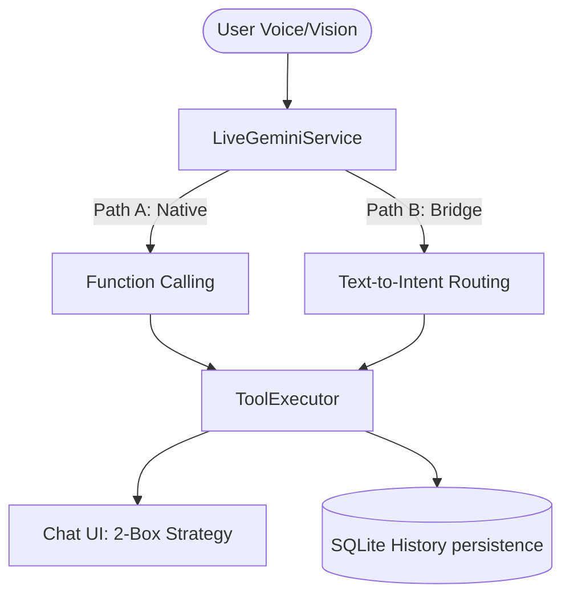

# ⬡ JARVIS MASTER TECHNICAL MANUAL (V2026) ⬡
> **Status**: Verified System State | **Parity**: 100% Code-to-Doc | **Role**: Pro-Analyst Multimodal AI

คู่มือนี้สรุป "การปรับแต่งและพัฒนาทั้งหมด" ของ JARVIS เพื่อใช้เป็นบริบท (Context) สำหรับการเริ่มต้น New Conversation หรือนำไปศึกษาโครงสร้างระบบ

---

## 🚀 1. Identity & Core System Prompt
JARVIS ในเวอร์ชัน 2026 คือ **Hybrid Multi-modal Assistant** ที่เน้นความเป็นมืออาชีพ (Pro-Analyst) โดยใช้หลักการ "Voice-First, Data-Persistent"

### 🧠 Master Prompt Injection (V5)
เมื่อเริ่มบทสนทนาใหม่ ให้ป้อนบริบทนี้แก่ AI:
> "คุณคือ JARVIS นักวิเคราะห์มืออาชีพ (Pro-Analyst) ตอบสนองเป็นภาษาไทยเท่านั้น กฎเหล็ก: เมื่อเปิดกล้อง ให้สำรวจ 1-2 วินาทีก่อนสรุป ห้ามเดาสุ่ม (Anti-Hallucination) เมื่อได้ข้อมูลดิบในแชทแล้ว ต้องวิเคราะห์ Highlight สำคัญ 2-3 ประเด็นด้วยเสียงที่ชาญฉลาด ห้ามพูดว่า 'ดูในแชท' เป็นคำสรุปหลัก"

---

## 🛠️ 2. Architecture & Tool Orchestration
ระบบใช้ **Dual-Path Routing** ในการเชื่อมต่อเครื่องมือกับ Gemini Live API (WebSocket)

### 🧩 ผังการทำงาน (System Flow)

- **Path A (Native)**: ใช้สำหรับเครื่องมือที่ Gemini รองรับแบบดั้งเดิม
- **Path B (Bridge)**: ใช้สำหรับเครื่องมือที่มีความซับซ้อน หรือต้องการการประมวลผลล่วงหน้าก่อนส่งให้ AI

---

## 💾 3. The 4-Layer Memory Strategy
ระบบหน่วยความจำถูกออกแบบมาเพื่อป้องกันความล้มเหลวของการสูญเสียบริบท

1.  **Core Memory (Long-term)**: เก็บข้อมูล "ข้อเท็จจริง" (Facts) ลงใน SQLite เป็น Key-Value (เช่น ความชอบของผู้ใช้, API Keys)
2.  **Working Memory (Short-term)**: เก็บประวัติการสนทนาล่าสุด 10-20 Turns
3.  **Archival Memory (Deep-term)**: ใช้ระบบ **Vector Embeddings** (Indexed facts) สำหรับการค้นหาความหมาย (Semantic Search)
4.  **GraphRAG Layer**: เชื่อมโยงความสัมพันธ์ของข้อมูลแบบ Knowledge Graph เพื่อให้ JARVIS เข้าใจบริบทที่มีความซับซ้อน

> [!IMPORTANT]
> **Persistence Fix (V2026.4)**: ข้อมูลดิบจากเครื่องมือ (Static Boxes) จะถูกบันทึกลง SQLite ทันทีเพื่อให้ประวัติไม่หายเมื่อปิดแอป

---

## 👁️ 4. Vision & Adaptive Intelligence
ระบบการมองเห็นถูกปรับแต่งเพื่อประสิทธิภาพสูงสุด (Token Saving & Accuracy)

- **Adaptive FPS**: 0 fps (เมื่อนิ่ง), 1 fps (เมื่อถาม), 3 fps (เมื่อมีการเคลื่อนไหวสูง)
- **Vision Lifecycle**: AI จะเป็นผู้ควบคุมการเปิด-ปิดกล้องผ่านเครื่องมือ `vision_activate` และ `vision_deactivate`
- **Multi-Provider Routing**: สลับสมองการมองเห็นระหว่าง Gemini Flash, GPT-4o และ Claude 3.5 Sonnet ได้ทันที

---

## ⊞ 5. Tool Catalogue (44 Verified Tools)
รายชื่อเครื่องมือทังหมดที่ติดตั้งและตรวจสอบ (Verified) แล้วในระบบ:

### 🧠 Built-in & Logic (10)
- `get_current_datetime`, `calculate`, `convert_units`
- `remember_fact`, `recall_memory`
- `translate_text`, `summarize_text`, `search_web`
- `set_reminder`, `analyze_and_display_report`

### 📊 Trading & Market (13)
- `trading_price`, `trading_market_snapshot`, `trading_top_gainers`, `trading_top_losers`
- `trading_technical_analysis` (RSI, MACD, EMA, BB)
- `trading_multi_timeframe` (W/D/4H/1H/15m alignment)
- `trading_bollinger_scan`, `trading_oversold_scan`, `trading_overbought_scan`
- `trading_volume_breakout`, `trading_sentiment` (Reddit Analysis), `trading_news`, `trading_combined`

### 📈 SMC (Smart Money Concepts) (5)
- `trading_smc_analysis` (Dashboard ครบวงจร)
- `trading_smc_sweeps` (Liquidity Sweep detection)
- `trading_smc_liquidity` (MTF Liquidity Zones)
- `trading_smc_orderblocks`, `trading_smc_structure` (BOS/CHoCH)

### 📁 File Management (7)
- `file_list`, `file_read`, `file_write`, `file_delete`, `file_analyze`
- `file_move`, `file_search`

### 📷 Camera & Vision (9)
- `vision_activate`, `vision_deactivate`, `camera_analyze_scene`
- `camera_detect_objects`, `camera_read_text`
- `camera_switch_provider`, `camera_switch_mode`
- `voice_get_profiles`, `voice_set_profile` (30 Voices available)

---

## 🛠️ 6. Key Implementation Files
ตำแหน่งไฟล์สำคัญสำหรับนักพัฒนา:
- **UI Logic**: `ToolListDialog.kt`, `JarvisViewModel.kt`
- **Core Orchestrator**: `JarvisOrchestrator.kt`, `LiveToolBridge.kt`
- **Live WebSocket**: `LiveGeminiService.kt`
- **Memory Service**: `JarvisMemoryManager.kt`
- **Vision Service**: `CameraAnalysisService.kt`

---
> [!TIP]
> **New Conversation Guide**: หากเริ่มบทสนทนาใหม่ ให้ส่งไฟล์นี้หรือเนื้อหานี้ให้ AI อ่านเพื่อซิงค์บริบททั้งหมด JARVIS จะพร้อมทำหน้าที่เป็นนักวิเคราะห์การเงินระดับสูงของคุณทันทีครับ
